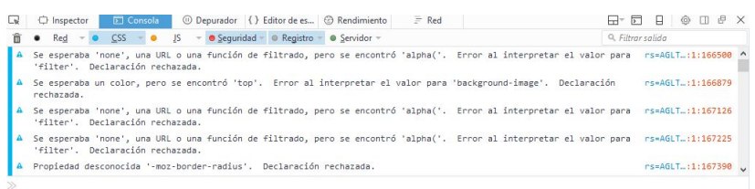

## 2. Consola web

La mayoría de los navegadores incorporan de manera nativa herramientas para facilitar el desarrollo, entra la que destacamos la “Consola Web”. Asimismo, también mediante ampliaciones (extensiones, plugins, etc.) se amplían características para facilitar el desarrollo y la depuración de código.

{ width="800" style="display:block;margin:auto" }

!!! tip "En Firefox y Google Chrome, se puede acceder a la consola web pulsando la tecla **F12**"

Esta consola incluye varias pestañas:

- **Red**: registro de Peticiones HTTP.
- **CSS**: análisis y errores CSS.
- **JS**: análisis y errores Javascript.
- **Seguridad**: registra advertencias o fallos de seguridad.
- **Registro**: registra mensajes enviados al objeto “window.console”.
- **Servidor**: registrar mensajes recibidos del servidor Web.
