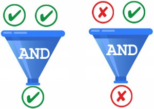
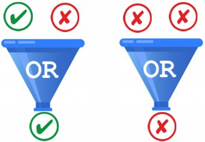

# 7. Operadores

Combinando variables y valores, se pueden formular expresiones más complejas. Estas expresiones son una parte clave en la creación de programas y para crearlar se utilizan los llamados **operadores**.

## 7.1 Operadores de asignación

Los **operadores de asignación** se utilizan para asignar valores a las variables. Algunos de ellos, además de asignar el valor, también incluyen operaciones (Ejemplo += asigna y suma).

|    Operador      | Descripción                                                                                  |
| ---------------- | ---------------------------------------------------------------------------------------------|
| `=`              | Asigna a la variable de la parte izquierda el valor de la parte derecha                      |
| `+=`             | Suma los operandos izquierdo y derecho y asigna el resultado al operando izquierdo           |
| `-=`             | Resta el operando derecho del operando izquierdo y asigna el resultado al operando izquierdo |
| `*=`             | Multiplica ambos operandos y asigna el resultado al operando izquierdo                       |
| `/=`             | Divide ambos operandos y asigna el resultado al operando izquierdo                           |

??? example "Ejemplo: Operador asignación"
    ```javascript
    let total = 20, precio = 5, cad = "Casa"; 
    total += 5;        /* Suma 5 a total  */
    total *= precio    /* total se multiplica por precio */
    cad += 's'  ;      /* se añade la letra s a "Casa" */
    total /= 10;       /* total se divide por 10*/
    ```

## 7.2 Operadores aritméticos

Los **operadores aritméticos** se utilizan para realizar cálculos aritméticos:

|    Operador      | Descripción                             |
| ---------------- | ----------------------------------------|
| `+`              | Suma                                    |
| `-`              | Resta                                   |
| `*`              | Multiplicación                          |
| `/`              | División                                |
| `%`              | Calcula el resto de una división entera |


??? example "Ejemplo: Operador Suma +"
    ```javascript
    let peras= 10, manzanas = 5;
    let fruta = "Peras";
    let saludo = "Hola";
    let nombre = "       Pedro";
    console.log(saludo + nombre);       /* resultado       Hola Pedro*/ 
    console.log(peras + manzanas);      /* resultado:15 */
    console.log( peras + fruta);        /*resultado: 10 Peras
    ```

??? example "Ejemplo: Operador Resta -"
    ```javascript
    let num1 = 10, num2 = 8, res = 0;
    res = num1 - num2;     /*res contiene 2 */
    res = -res;            /*ahora res contiene -2*/
    ```

??? example "Ejemplo: Operador Multiplicación *"
    ```javascript
    let invitados = 10, gambas = 40;
    let racion, precio = 20, total; 
    let base = 2; potencia;
    let error;
    total = gambas * precio;        /*total: 800 */ 
    ```

??? example "Ejemplo: Operador División /"
    ```javascript
    var invitados = 10, gambas = 40;
    var racion, precio = 20, total; 
    var base = 2; potencia;
    var error;
    racion = gambas/invitados;       /*racion: 4 */
    error = gambas/0;                /* Infinity */
    potencia = 2**3;                 // 8, e elevado a 3 (1)
    ```

    1. Si usas el operador ** se toma como elevado a

??? example "Ejemplo: Operador Resto %"
    ```javascript
    let multiplo = 50, divisor = 4, resto;
    resto = multiplo % divisor;           /*resto contiene 2 */ 
    ```

## 7.3 Operadores unitarios

Además de los operadores aritméticos, también existen operadores aritméticos unitarios: incremento `++`, decremento `--` y la negación unitaria `-`.

Los operadores de incremento y disminución pueden estar tanto delante como detrás de una variable, con distintos matices en su ejecución. Estos operadores aumentan o disminuyen en 1, respectivamente, el valor de una variable.

|    Operador    | Descripción                                                                                                |
| ---------------| -----------------------------------------------------------------------------------------------------------|
| `y = ++x`      | Primero el incremento y después la asignación. x=6, y=6                                                    |
| `y = x++`      | Primero la asignación y después el incremento. x=6, y=5                                                    |
| `y = --x`      | Primero el decremento y después la asignación. x=4, y=4                                                    |
| `y = x--`      | Primero la asignación y después el decremento x=4, y=5                                                     |
| `y =-x`        | Se asigna a la variable “y” el valor negativo de “x”, pero el valor de la variable “x” no varía. x=5, y=-5 |

??? example "Ejemplo: Increment (++) y decremento (--)"
    ```javascript
    let indice = 5, cuenta;
    cuenta = ++indice;  //incrementa indice y luego se guarda en cuenta
    cuenta = indice++;  //Guarda 5 en cuenta y luego incrementa indice
    cuenta = -indice;   //Asigna el valor -5 en cuenta
    ```

## 7.4 Operadores de comparación

Son peradores utilizados para comparar dos valores entre sí. Como valor de retorno se obtiene siempre un valor booleano: **true** o **false**.

|    Operador    | Descripción                                                                                                             |
| ---------------| ------------------------------------------------------------------------------------------------------------------------|
| `===`          | Compara dos elementos, incluyendo su tipo interno. Si son de distinto tipo, no realiza conversión y devuelve *false* ya que siempre los considera diferentes. **Uso recomendado**                                                                                  |
| `!==`          | Compara dos elementos, incluyendo su tipo interno. Si son de distinto tipo, no realiza conversión y devuelve *true* ya que siempre los considera diferentes. **Uso recomendado**                                                                                  |
| `==`           | Devuelve el valor *true* cuando los dos operandos son iguales. Si los elementos son de distintos tipos, realiza una conversión. **No está recomendado su uso**                                                                                                 |
| `!=`           | Devuelve el valor *true* cuando los dos operandos son distintos. Si los elementos son de distintos tipos, realiza una conversión. **No está recomendado su uso**                                                                                                 |
| `>`            | Devuelve el valor *true* cuando el operando de la izquierda es mayor que el de la derecha.                              |
| `<`            | Devuelve el valor *true* cuando el operando de la izquierda es menor que el de la derecha.                              |
| `>=`           | Devuelve el valor *true* cuando el operando de la izquierda es mayor o igual que el de la derecha                       |
| `<=`           | Devuelve el valor *true* cuando el operando de la izquierda es menor o igual que el de la derecha                       |

??? example "Ejemplo: Operadores de comparación"
    ```javascript
    let a=4;b=5,c="5";
    console.log("El resultado de la expresión 'a==c' es igual a "+(a==c));
    console.log("El resultado de la expresión 'a===c' es igual a "+(a===c));
    console.log("El resultado de la expresión 'a!=c' es igual a "+(a!=c));
    console.log("El resultado de la expresión 'a!==c' es igual a "+(a!==c));
    console.log("El resultado de la expresión 'a==b' es igual a "+(a==b));
    console.log("El resultado de la expresión 'a!=b' es igual a "+(a!=b));
    console.log("El resultado de la expresión 'a>b' es igual a "+(a>b));
    console.log("El resultado de la expresión 'a<b' es igual a "+(a<b));
    console.log("El resultado de la expresión 'a>=b' es igual a "+(a>=b));
    console.log("El resultado de la expresión 'a<=b' es igual a "+(a<=b));
    ```

## 7.4 Operadores lógicos

Los operadores lógicos se utilizan para el procesamiento de los valores booleanos. A su vez el valor que devuelven también es booleano: true o false.

|    Operador    | Descripción                                                                                        |
| ---------------| ---------------------------------------------------------------------------------------------------|
| `&&` (AND)     | Y “lógico”. El valor devuelto es true cuando ambos operandos son verdaderos.                       |
| `||` (OR)      | O “lógico”. El valor devuelto es true cuando alguno de los operandos es verdadero o lo son los dos |
| `!`  (NOT)     | No “lógico”. Si el valor es true, devuelve false y si el valor es false, devuelve true.            |

### 7.4.1 Negación: !

Es el operador más simple de todos, se usa para invertir un valor de **true** a **false** o viceversa. Se usa con valores o con expresiones lógicas, invirtiendo su resultado. Es un operador con la mínima precedencia, por eso siempre es conveniente poner paréntesis a las expresiones que queramos negar con este operador. También se pude usar junto a los operadores de igualdad (==) e identidad (===) para invertirlos.

??? example "Ejemplo: Negación !"
    ```javascript
    let cierto = true;
    let falso = !cierto;
    console.log (5 > 4);     //true 
    console.log (!(5 > 4));   //false
    ```

### 7.4.2 AND lógico: &&

Se utiliza para concatenar comparaciones, es decir, para comprobar varias condiciones. El resultado sólo será **true** si **todas** las comparaciones o los operandos son true, en caso contrario el resultado será false. Es como un producto, si uno solo de los factores es 0 (false) el resultado es 0 (false)

{ width="400" style="display:block;margin:auto" }

??? example "Ejemplo: AND lógico - &&"
    ```javascript
    let op1 = 2, op2 = 50, op3 = 25;
    let comp;
    comp = (op1 > op2) && (op1 < op3);   //false
    comp = (op1 < op2) && (op1 < op3);   //true
    ```

### 7.4.3 OR lógico: ||

Se utiliza para concatenar comparaciones, es decir, para comprobar varias condiciones. El resultado será **true** si **alguna** de las comparaciones es true, en el caso que todas las comparaciones u operandos sean false, el resultado será false.

{ width="400" style="display:block;margin:auto" }

??? example "Ejemplo: OR lógico - ||"
    ```javascript
    let op1 = 2, op2 = 50, op3 = 25;
    let comp;
    comp = (op1 > op2) && (op1 < op3);   /*comp toma el valor true */
    ```

??? example "Ejemplo: OR, AND y Negación ||"
    ```javascript
    console.log("El resultado de la expresión 'false && false' es igual a " + (false && false));
    console.log("El resultado de la expresión 'false && true' es igual a " + (false && true));
    console.log("El resultado de la expresión 'true && false' es igual a " + (true && false));
    console.log("El resultado de la expresión 'true && true' es igual a " + (true && true));
    console.log("El resultado de la expresión 'false || false' es igual a " + (false || false));
    console.log("El resultado de la expresión 'false || true' es igual a " + (false || true));
    console.log("El resultado de la expresión 'true || false' es igual a " + (true || false));
    console.log("El resultado de la expresión 'true || true' es igual a " + (true || true));
    console.log("El resultado de la expresión '!false' es igual a " + (!false));
    ```