# 8. Estructuras de control

El orden en que se ejecutan las instrucciones de un programa es, por defecto, secuencial: se ejecutan instrucción tras instrucción.

De esta forma, un programa se escribirá como una sucesión de instrucciones o sentencias, utilizando un punto y coma para indicar el final de cada instrucción. Sin embargo, a veces es necesario alterar este orden de ejecución, y para ello se utilizan las instrucciones de **control de flujo**:
1. Condicionales
2. Selección
3. Bucles

## 8.1 Condicional if ... else simple

La sentencia condicional **if ... else ...** permite alterar la ejecución de instrucciones en función del resultado de una condición.

La sintáxis de la sentencia `if ... else ...` es:

!!! info "Sintaxis if ... else ..."
    ```javascript
    if (condición) {
        // bloque de instrucciones que se ejecutan si la condición se cumple
    }
    else{
        // bloque de instrucciones que se ejecutan si la condición no se cumple
    }
    ```

!!! warning "Bloque `else`"
    Es importante especificar que el bloque `else` es opcional y no es obligatorio usarlo siempre que se emplee una sentencia condicional.

??? example "Ejemplo 1"
    ```javascript
    let nota = 7;
    console.log("He realizado mi examen.");

    // Condición (si la nota es mayor o igual a 5) (1)
    if (nota >= 5) {
        console.log("¡Estoy aprobado!");
    }
    ```

    1. En este caso, como el valor de nota es superior o igual a 5, nos aparecerá en la consola el mensaje «¡Estoy aprobado!». Sin embargo, si modificamos en la primera línea el valor de nota a un valor inferior a 5, no nos aparecerá ese mensaje.

!!! tip "Uso de llaves `{}`"
    Cuando dentro de las llaves ({ }) sólo tenemos una línea, se pueden omitir dichas llaves. Aún así, es recomendable ponerlas siempre si tenemos dudas o no estamos seguros. Si no se especifican las llaves, el if se aplicará únicamente a la primera instrucción.

??? example "Ejemplo 2"
    ```javascript
    let nota = 7;
    console.log("He realizado mi examen. Mi resultado es el siguiente:");

    // Condición (si la nota es menor a 5) (1)
    if (nota < 5) {
        // Acción A: nota es menor que 5
        calificacion = "suspendido";
    } 
    else {
        // Acción B: Cualquier otro caso diferente a A (nota es mayor o igual que 5)
        calificacion = "aprobado";
    }

    console.log("Estoy", calificacion);
    ```

    1. En este ejemplo comprobaremos que podemos conseguir que se muestre el mensaje Estoy aprobado o Estoy suspendido dependiendo del valor que tenga la variable nota. La diferencia con el ejemplo anterior es que creamos una nueva variable que contendrá un valor determinado dependiendo de la condición del If.


??? example "Ejemplo 3"
    ```javascript
    let edadAna, edadLuis;

    // Usamos parseInt para convertir a entero
    edadAna=parseInt(prompt("Introduce la edad de Ana",""));
    edadLuis=parseInt(prompt("Introduce la edad de Luis",""));

    if (edadAna > edadLuis){
        console.log("Ana es mayor que Luis.");
        console.log("Ana tiene " + edadAna + " años y Luis " + edadLuis);
    }
    else{
        console.log("Ana es menor o de igual edad que Luis.");
        console.log("Ana tiene " + edadAna + " años y Luis " + edadLuis);
    }
    ```

??? example "Ejemplo 4"
    ```javascript
    let diaSem;
    diaSem=prompt("Introduce el día de la semana ", "");
    
    if (diaSem === "domingo") {
        console.log("Hoy es festivo");
    }
    else // Al no tener {}, es un "bloque de una instrucción"
        console.log("Hoy no es domingo, a descansar!!");
        console.log("Porque mañana hay que madrugar");
    ```

??? question "Ejercicio 1: Introducir un número e indicar si es par o impar. Un número es par si al dividirlo entre 2 el resto es igual a cero"
    ```javascript
        let numero; 

        numero=prompt("Introduce un número ", "");

        if (numero % 2 == 0){ 
            console.log("PAR");
        } 
        else {
            console.log("IMPAR");
        }
    ```

??? question "Ejercicio 2: Introducir el importe de una compra y aplicar un descuento del 20% si la compra supera los 50 euros. En el caso que la compra no supere los 50 euros no se aplicará ningún tipo de descuento. Finalmente, mostrar el precio con el descuento aplicado"
    ```javascript
        let compra; 
        let precio, dto; 
        let mensaje;

        compra=parseInt(prompt("Introduce la compra",""));

        if (totcompraal > 50){ 
            dto = compra*0.2
            precio = compra - dto;
            mensaje ="Total:  " + precio+ " Rebaja: " + dto;
        } 
        else {
            precio = compra; 
            mensaje= "Total: " + compra;
        }
        console.log(mensaje);
    ```

    ??? question "Ejercicio 3: Comprobar si un número está comprendido estre 1 y 5. Si lo está, mostrar 'SÍ', en caso contrario, mostrar 'NO'"
    ```javascript
        let numero; 

        numero=prompt("Introduce un número ", "");

        if ((numero>=1) && (numero <= 5)) {
            console.log("Aprobado");
        }
        else {
            console.log(mensaje);
        }
    ```

## 8.2 Condicional if ... else múltiple

Es posible que necesitemos crear un condicional múltiple con más de 2 condiciones, por ejemplo, para establecer la calificación específica. Para ello, podemos anidar varios if/else uno dentro de otro, de la siguiente forma:

??? example "Ejemplo 1"
    ```javascript
    let nota = 7;
    console.log("He realizado mi examen.");

    // Condición
    if (nota < 5) {
        calificacion = "Insuficiente";
    } else if (nota < 6) {
        calificación = "Suficiente";
    } else if (nota < 8) {
        calificacion = "Bien";
    } else if (nota <= 9) {
        calificacion = "Notable";
    } else {
        calificacion = "Sobresaliente";
    }

    console.log("He obtenido un", calificacion);
    ```

??? example "Ejemplo 2"
    ```javascript
    let edadAna, edadLuis;

    // Convertirmos a entero las cadenas
    edadAna=parseInt(prompt("Introduce la edad de Ana",""));
    edadLuis=parseInt(prompt("Introduce la edad de Luis",""));

    if (edadAna > edadLuis){
        console.log("Ana es mayor que Luis.");
    }
    else if (edadAna < edadLuis) {
        console.log("Ana es menor que Luis.");
    }else {
        console.log("Ana tiene la misma edad que Luis.");
    }
    console.log(" Ana tiene "+edadAna+" años y Luis "+ edadLuis);
    ```

??? question "Ejercicio 1: Averiguar si un número positivo es múltiplo de otro número positivo, o sea, que al dividirlos el resto es 0. "
    ```javascript
        let numero, divisor;

        numero=parseInt(prompt("Introduce número",""));
        divisor=parseInt(prompt("Introduce divisor",""));

        if (divisor > 0 && numero > 0){
            if(numero % divisor == 0) {
                texto = numero + texto + " multiplo de "+divisor;
            }
        }
        else{
            texto = "Los dos números deben ser mayor que cero"
        }
        console.log(texto);
    ```


## 8.3 Selección múltiple

La sentencia `If` permite una ejecución condicional entre dos posibles caminos en la ejecución de un programa: si la condición era cierta se ejecuta un bloque y si no se ejecuta otro.

Cuando hay más posibilidades debíamos usar múltiples if..else anidados, complicando el código. Para estos casos en los que el programa deba tener más de dos alternativas se usa otra sentencia de control, la selección múltiple: `switch(condicion) ...case...default`. 

!!! info "Sintaxis switch(condicion) ...case...default"
    ```javascript
    switch (condición) {
       case 'valor_1' :
             ...
             break;
       case 'valor_2' :
             ...
             break;
       ...
       default :
             ...
    }
    ```

    + El argumento **condición** es una expresión que devuelve un valor concreto que se usa para elegir el camino (case) a seguir por el programa.
    + La instrucción **break** pone fin al bloque y hace que el programa salte a la instrucción siguiente a la sentencia switch(), si se omite el programa continuaría con la siguiente instrucción.
    + La sección de **default** es opcional, su finalidad es ejecutar algún código cuando ninguna de las condiciones se cumpla.
    + Como se puede observar no se usan **llaves**, aquí no se necesitan: la condición y el break ponen límites al bloque perfectamtne reconocibles.

??? example "Ejemplo 1: Script que dá los "buenos días" en el idioma indicado"
    ```javascript
    let idioma="castellano"
    switch (idioma) {
       case 'castellano' :
             console.log("Buenos días");
             break;
       case 'ingles' :
             console.log("Good Morning");
             break;
       case 'francés' :
             console.log("Bonjour");
             break;
       case 'alemán' :
             console.log("Guten Morgen");
             break; 
      default :
             error('Idioma no presente');
    }
    ```

??? example "Ejemplo 2: Script que convierta notas en niveles. Para las notas inferiores a 5 se mostrará 'Suspenso', entre 5 y 6 se  mostrará 'Aprobado', entre 7 y 8 se mostrará 'Notable, y entre 9 y 10 se mostrará 'Sobresaliente'"
    ```javascript
    let nivel, nota;
    switch (nota){
        case 1:  case 2:  case 3: case 4:
            nivel = "suspenso";
            break;
        case 5:           
        case 6:
            nivel = "aprobado";
            break;
        case 7:
        case 8:
            nivel = "notable";
            break;
        case 9: case10:
            nivel = "sobresaliente";
            break;
        default:
            nivel = "Nota inválilda";
    }
    ```

??? example "Ejemplo 3: Script que especifica si el día de la semana introducido es laborable o no"
    ```javascript
    let dia = prompt("Introduce un día de la semana: ");
    let laborable;
    switch (dia){
        case "lunes":  
        case "martes":
        case "miercoles":
        case "jueves":
        case "viernes":
            laborable = true;
            break;
        case "sabado":           
        case "domingo":
            laborable = false;
            break;
        default:
            console.log("Error: día incorrecto");
    }

    if(laborable) {
        console.log("El día es laborable");
    }
    else {
        console.log("El día NO es laborable");
    }
    ```

## 8.4 Bucles

Si queremos repetir un bloque de instrucciones varias veces en un programa javascript, podríamos escribir el bloque varias veces, pero si queremos repetirlo un número variable de veces esa solución no es viable.

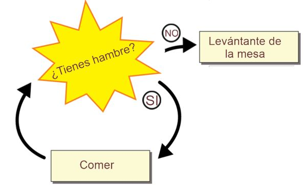{ width="400" style="display:block;margin:auto" }

Para soluciones este problema existen ciertas estructuras de repetición llamadas `bucles`. Un bucle permite ejecutar repetidas veces un bloque de instrucciones (cuerpo del bucle) hasta que se cumpla una determinada condición, en cuyo caso se acaba la repetición y el programa continúa con su flujo normal (a cada una de las repeticiones del bucle se le conoce como `iteración`).

Existen tres construcciones para estas estructuras de repetición:

   + Bucle **for**
   + Bucle **while**
   + Bucle **do-while**

### 8.4.1 Bucle `for`

El bucle for es un bucle controlado por contador. Este tipo de bucle tiene las siguientes características: 

  + Se ejecuta un número determinado de veces.
  + Utiliza una variable contadora que controla las iteraciones del bucle.

!!! info "Sintaxis bucle `for`"
    ```javascript
    for (Inicialización del índice; Condición de prueba; Modificación del índice){
        // ...instrucciones...
    }
    ```

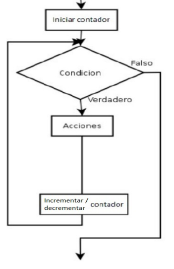{ width="300" style="display:block;margin:auto" }

El funcionamiento de la estructura **for** es la siguiente:

  1. Se ejecuta la instrucción de inicialización, que solo se ejecuta una vez.
  2. Se comprueba la condición.
  3. Si la condición se cumple, se ejecutan las instrucciones. Si la condición no se cumple, se abandona el for y la ejecución continúa en las líneas de código que siguen posteriores al bucle.
  4. Tras la ejecución de las instrucciones, se ejecuta la instrucción de incremento / decremento y se vuelve al paso 2.

??? example "Ejemplo 1: Mostrar los número del 1 al 10"
    ```javascript
    let i;
    for (i=1;i<=10;i++) {
        console.log(i);
    }
    console.log("Se han escrito los números del 1 al 10");
    ```

??? example "Ejemplo 2: Mostrar los número pares del 2 al 30"
    ```javascript
    let i;
    for (i=2;i<=30;i+=2) {
        console.log(i);
    }
    console.log("Se han escrito los números pares del 2 al 30");
    ```

#### Ejercicios Bucle `for`

??? note "Ejercicios estructura `for`"

    !!! question "Ejercicio 1"
        Realizar un programa que muestre por pantalla los 20 primeros números naturales (1, 2, 3... 20) empleando la estructura **for**.

        ??? tip "Solución"
            ```javascript
            for (let i = 1; i <= 20; i++) {
                console.log(i);
            }
            ```

    !!! question "Ejercicio 2"
        Escribir un programa que muestre en pantalla los números enteros del 1 al 100 de 2 en 2 empleando la estructura **for**.

        ??? tip "Solución"
            ```javascript
            for (let i = 1; i <= 100; i += 2) {
                console.log(i);
            }
            ```

    !!! question "Ejercicio 3"
        Escribir un programa que muestre en pantalla los números enteros del 100 al 1 empleando la estructura **for**.

        ??? tip "Solución"
            ```javascript
            for (let i = 100; i >= 1; i--) {
                console.log(i);
            }
            ```

    !!! question "Ejercicio 4"
        Realizar un programa que muestre los números desde el 1 hasta un número N que se introducirá por teclado empleando la estructura **for**.

        ??? tip "Solución"
            ```javascript
            let N = parseInt(prompt("Introduce un número:"));

            for (let i = 1; i <= N; i++) {
                console.log(i);
            }
            ```

        !!! question "Ejercicio 5"
            Realizar un programa que muestre los números pares comprendidos entre el 1 y el 200 utilizando un contador que sume de 1 en 1.

            ??? tip "Solución"
                ```javascript
                for (let i = 1; i <= 200; i++) {
                    if (i % 2 === 0) {
                        console.log(i);
                    }
                }
                ```

        !!! question "Ejercicio 6"
            Realizar un programa que lea un número positivo N y calcule su factorial N!.
            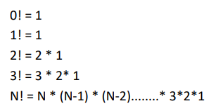{ width="200" style="display:block;margin:auto" }

            ??? tip "Solución"
                ```javascript
                let N = parseInt(prompt("Introduce un número positivo:"));
                let factorial = 1;

                for (let i = 1; i <= N; i++) {
                    factorial *= i;
                }

                console.log("El factorial es: " + factorial);
                ```

        !!! question "Ejercicio 7"
            Crear un programa que muestre los números del 100 al 200 que sean divisibles entre 7 y 3.

            **NOTA**: Un número ’a’ es divisible entre un número ‘b’, si el resto de ‘a’ entre ‘b’ es cero.

            ??? tip "Solución"
                ```javascript
                for (let i = 100; i <= 200; i++) {
                    if (i % 7 === 0 && i % 3 === 0) {
                        console.log(i);
                    }
                }
                ```

        !!! question "Ejercicio 8"
            Crear un programa que muestre la serie: 5, 10, 15, 20, 25, … El programa preguntará primero cuantos números se desea mostrar y después mostrará la serie correspondiente.
            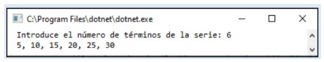{ width="500" style="display:block;margin:auto" }

            ??? tip "Solución"
                ```javascript
                let cantidad = parseInt(prompt("¿Cuántos números quieres mostrar?"));

                for (let i = 1; i <= cantidad; i++) {
                    console.log(i * 5);
                }
                ```

        !!! question "Ejercicio 9"
            Realizar un programa que calcule la suma y el producto de los 10 primeros números naturales.

            ??? tip "Solución"
                ```javascript
                let suma = 0;
                let producto = 1;

                for (let i = 1; i <= 10; i++) {
                    suma += i;
                    producto *= i;
                }

                console.log("Suma: " + suma);
                console.log("Producto: " + producto);
                ```

        !!! question "Ejercicio 10"
            Realizar un programa que sume los números pares e impares entre 100 y 200, y luego muestra por pantalla ambas sumas

            ??? tip "Solución"
                ```javascript
                let sumaPares = 0;
                let sumaImpares = 0;

                for (let i = 100; i <= 200; i++) {
                    if (i % 2 === 0) {
                        sumaPares += i;
                    } else {
                        sumaImpares += i;
                    }
                }

                console.log("Suma de pares: " + sumaPares);
                console.log("Suma de impares: " + sumaImpares);
                ```

        !!! question "Ejercicio 11"
            Realizar un programa que lea 10 números e indique cuántos son positivos y negativos.

            ??? tip "Solución"
                ```javascript
                let positivos = 0;
                let negativos = 0;

                for (let i = 1; i <= 10; i++) {
                    let num = parseFloat(prompt("Introduce un número:"));

                    if (num >= 0) {
                        positivos++;
                    } else {
                        negativos++;
                    }
                }

                console.log("Positivos: " + positivos);
                console.log("Negativos: " + negativos);
                ```

        !!! question "Ejercicio 12"
            Realizar una aplicación que pida 15 números enteros y muestre su suma total.

            ??? tip "Solución"
                ```javascript
                let suma = 0;

                for (let i = 1; i <= 15; i++) {
                    let num = parseInt(prompt("Introduce un número:"));
                    suma += num;
                }

                console.log("La suma total es: " + suma);
                ```

        !!! question "Ejercicio 13"
            Imprimir los múltiplos de 3 desde el valor 3 hasta un número introducido por teclado.

            ??? tip "Solución"
                ```javascript
                let N = parseInt(prompt("Introduce un número:"));

                for (let i = 3; i <= N; i += 3) {
                    console.log(i);
                }
                ```


### 8.4.2 Bucle `while`

El bucle **while** permite ejecutar el bloque de instrucciones mientras se cumple una condición. La condición se comprueba **ANTES** de empezar a ejecutar el bloque de instrucciones, por lo que si se evalúa a false en la primera iteración, el bloque de acciones no se ejecuta ninguna vez, es decir, este bucle permite ejecutar las instrucciones **cero o más veces**.

!!! info "Sintaxis bucle `while`"
    ```javascript
    while (condición){
        //...instrucciones...
    }
    ```

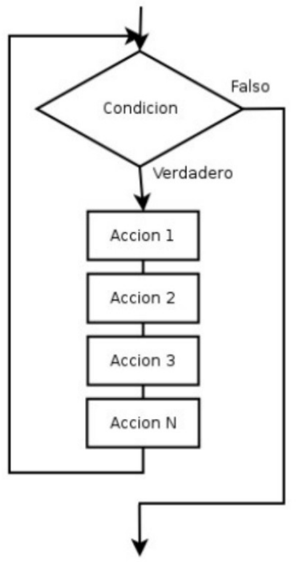{ width="300" style="display:block;margin:auto" }

El funcionamiento de la estructura **while** es el siguiente:

 1. Se evalúa la condición lógica.
 2. Si la condición se cumple, ejecuta las instrucciones, sino el programa abandona la sentencia while.
 3. Tras ejecutar las instrucciones, se vuelve al paso 1.

??? example "Ejemplo 1: Mostrar los número del 1 al 10"
    ```javascript
    let i = 1;

    while (i <= 10) {
        console.log(i);
        i++;
    }
    ```

??? example "Ejemplo 2: Mostrar los número pares de 0 a 30"
    ```javascript
    let i = 2;

    while (i <= 30) {
        console.log(i);
        i+=2;
    }
    ```

??? example "Ejemplo 3: Mostrar la tabla de multiplicar del número 10"
    ```javascript
    let numero = 10, contador = 0;

    while (contador <= numero) {
        console.log(numero + " x " + contador + " = " + (numero * contador));
        contador++;
    }
    ```


### 8.4.3 Bucle `do-while`

El bucle **do-while** permite ejecutar el bloque de instrucciones mientras se cumple una condición. La condición se comprueba **DESPUÉS** de ejecutar bloque de instrucciones de la primera iteración, por lo que el **bloque de instrucciones se ejecuta al menos una vez**.

!!! info "Sintaxis bucle `do-while`"
    ```javascript
    do {
        //...instrucciones...
    }
    while (condiciones);
    ```

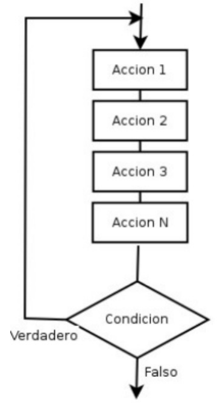{ width="300" style="display:block;margin:auto" }

El funcionamiento de la estructura **do-while** es el siguiente:

1. El cuerpo del bucle se ejecuta.
2. Se evalúa la condición, si ésta se cumple, se vuelve al paso 1, sino se cumple, el programa abandona la sentencia do-while.

??? example "Ejemplo 1: Mostrar los número naturales (1,2,3,4,5,...) hasta el número introducido por teclado"
    ```javascript
    let num = parseInt(prompt("Dime un número entero:"));
    let contador = 1;

    do {
        console.log("Número: " + contador);
        contador++;
    } 
    while (contador <= numero);
    ```

??? example "Ejemplo 2: Preguntar una clave hasta que se introduzca la correcta"
    ```javascript
    let auxclave;

    do {
        auxclave=prompt("introduce la clave ");
    } 
    while (auxclave !== "1a2b3c4d5");

    console.log("Has acertado la clave");
    ```

??? example "Ejemplo 3: Aaveriguar si un número es primo, es decir, si solo es divisible por 1 y por si mismo (El número 2 no es primo)"
    ```javascript
    let num = parseInt(prompt("Dime un número entero:"));
    let primo = true, div = 2;

    do{
        if (num == 2 || num % div == 0){
            primo = false;
        }

        div++;
    }
    while (div < num);

    console.log(num + " ¿Es primo? " + primo)
    ```

#### Ejercicios Bucle `do-while`

??? note "Ejercicios estructura `do-while`"

    !!! question "Ejercicio 1"
        Crea un programa que escriba en pantalla los números del 1 al 10 usando **do-while**.

        ??? tip "Solución"
            ```javascript
            let i = 1;

            do {
                console.log(i);
                i++;
            } while (i <= 10);
            ```

    !!! question "Ejercicio 2"
        Escribir un programa que pida al usuario números y se detenga cuando el número introducido sea mayor a cero.

        ??? tip "Solución"
            ```javascript
            let numero;

            do {
                numero = parseFloat(prompt("Introduce un número:"));
            } while (numero <= 0);

            console.log("Se ha introducido un número mayor que cero");
            ```

    !!! question "Ejercicio 3"
        Realiza un programa que vaya pidiendo números hasta que se introduzca un numero negativo y nos diga cuantos números se han introducido, la media de los impares y el mayor de los pares. El número negativo sólo se utiliza para indicar el final de la introducción de datos pero no se incluye en el cómputo.

        ??? tip "Solución"
            ```javascript
            let numero;
            let contador = 0;
            let sumaImpares = 0;
            let contadorImpares = 0;
            let mayorPar = null;

            do {
                numero = parseInt(prompt("Introduce un número:"));

                if (numero >= 0) {
                    contador++;

                    if (numero % 2 !== 0) {
                        sumaImpares += numero;
                        contadorImpares++;
                    } else {
                        if (mayorPar === null || numero > mayorPar) {
                            mayorPar = numero;
                        }
                    }
                }

            } while (numero >= 0);

            let mediaImpares = contadorImpares > 0 ? sumaImpares / contadorImpares : 0;

            console.log("Cantidad de números: " + contador);
            console.log("Media de impares: " + mediaImpares);
            console.log("Mayor de los pares: " + mayorPar);
            ```

    !!! question "Ejercicio 4"
        Crea un programa que pida números positivos al usuario, los cuales vaya sumando hasta que se teclea un número negativo o cero. En ese momento se mostrará el resultado de la suma.
        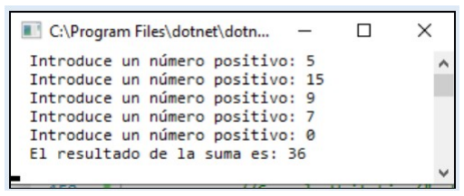{ width="400" style="display:block;margin:auto" }

        ??? tip "Solución"
            ```javascript
            let numero;
            let suma = 0;

            do {
                numero = parseFloat(prompt("Introduce un número positivo:"));

                if (numero > 0) {
                    suma += numero;
                }

            } while (numero > 0);

            console.log("La suma total es: " + suma);
            ```

    !!! question "Ejercicio 5"
        Crea un programa que pida al usuario su nombre y contraseña y le de tres oportunidades para introducir los datos correctos, que serán root y 1234. Si los datos introducidos son correctos se mostrará por pantalla “Bienvenido al sistema”. En caso contrario se mostrará un mensaje por pantalla indicando que se ha superado el número de intentos permitido. 
        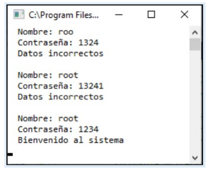{ width="300" style="display:block;margin:auto" }

        ??? tip "Solución"
            ```javascript
            let usuario, password;
            let intentos = 0;

            do {
                usuario = prompt("Introduce el usuario:");
                password = prompt("Introduce la contraseña:");
                intentos++;

                if (usuario === "root" && password === "1234") {
                    console.log("Bienvenido al sistema");
                    break;
                }

            } while (intentos < 3);

            if (intentos === 3 && !(usuario === "root" && password === "1234")) {
                console.log("Has superado el número de intentos");
            }
            ```

    !!! question "Ejercicio 6"
        Crea un programa que solicite números al usuario hasta que se hayan introducido 10 números o la suma de todos los números leídos sea mayor que 100. 

        A continuación, mostrar un mensaje indicando qué condición se ha cumplido (es decir, si se han introducido 10 números o si su suma es mayor que 100).
        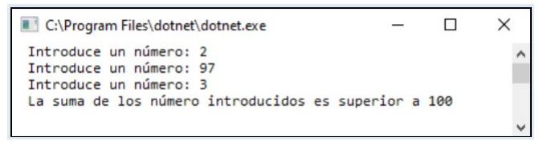{ width="500" style="display:block;margin:auto" }


        ??? tip "Solución"
            ```javascript
            let numero;
            let suma = 0;
            let contador = 0;

            do {
                numero = parseFloat(prompt("Introduce un número:"));
                suma += numero;
                contador++;

            } while (contador < 10 && suma <= 100);

            if (contador === 10) {
                console.log("Se han introducido 10 números");
            } else {
                console.log("La suma es mayor que 100");
            }
            ```


### 8.4.4 Bucle anidados

Un **bucle anidado** es un bucle que se encuentra incluido en el bloque de sentencias de otro bloque. Los bucles pueden tener cualquier nivel de anidamiento (un bucle dentro de otro bucle dentro de un tercero, etc.).

Al bucle que se encuentra dentro del otro se le puede denominar bucle interior o bucle interno. El otro bucle sería el bucle exterior o bucle externo.

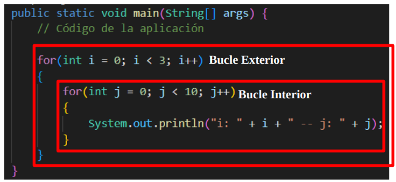{ width="500" style="display:block;margin:auto" }

??? info "En los bucles anidados es importante utilizar variables de control distintas, para no obtener resultados inesperados."

??? example "Ejemplo 1: Aaveriguar si un número es primo, es decir, si solo es divisible por 1 y por si mismo (El número 2 no es primo)"
    ```javascript
    let tabla, numero;

    for(tabla = 1; tabla <= 3; tabla++) {
        console.log("");

        for(numero = 0; numero <= 10; numero++)
        {
            console.log(tabla + " por " + numero + " es " + (tabla * numero));
        }
    }
    ```

#### Ejercicios Bucles anidados

??? note "Ejercicios bucles anidados"

    !!! question "Ejercicio 1"
        Crea un programa escriba 4 veces los números del 1 al 5, en una misma línea, usando **for**. 

        **Por ejemplo**: 12345123451234512345

        ??? tip "Solución"
            ```javascript
            let resultado = "";

            for (let i = 1; i <= 4; i++) {
                for (let j = 1; j <= 5; j++) {
                    resultado += j;
                }
            }

            console.log(resultado);
            ```

    !!! question "Ejercicio 2"
        Crea un programa que escriba 4 veces los números del 1 al 5 en una misma línea usando **while**.
        
        **Por ejemplo**: 12345123451234512345

        ??? tip "Solución"
            ```javascript
            let i = 1;
            let resultado = "";

            while (i <= 4) {
                let j = 1;

                while (j <= 5) {
                    resultado += j;
                    j++;
                }

                i++;
            }

            console.log(resultado);
            ```

    !!! question "Ejercicio 3"
        Crea un programa que pida al usuario el ancho (por ejemplo, 4) y el alto (por ejemplo, 3) y escriba un rectángulo formado por esa cantidad de asteriscos:
        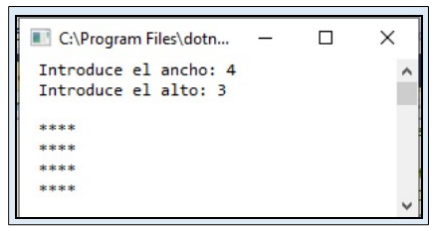{ width="300" style="display:block;margin:auto" }

        ??? tip "Solución"
            ```javascript
            let ancho = parseInt(prompt("Introduce el ancho:"));
            let alto = parseInt(prompt("Introduce el alto:"));

            for (let i = 1; i <= alto; i++) {
                let linea = "";

                for (let j = 1; j <= ancho; j++) {
                    linea += "*";
                }

                console.log(linea);
            }
            ```

    !!! question "Ejercicio 4"
        Realiza un programa que pida un número entero N entre 0 y 20 y luego muestre por pantalla los números desde 1 hasta N, uno en cada línea, repitiendo cada número tantas veces como su valor. 
        
        Ejemplo:
        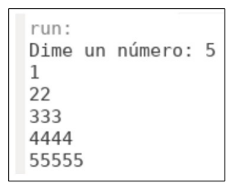{ width="200" style="display:block;margin:auto" }

        Ejemplo:

        ??? tip "Solución"
            ```javascript
            let N = parseInt(prompt("Introduce un número entre 0 y 20:"));

            for (let i = 1; i <= N; i++) {
                let linea = "";

                for (let j = 1; j <= i; j++) {
                    linea += i;
                }

                console.log(linea);
            }
            ```

    !!! question "Ejercicio 5"
        Crea un triángulo de asteriscos, que mostrará un asterisco en la primera fila, dos en la segunda, tres en la tercera y así sucesivamente, hasta llegar al tamaño indicado por el usuario.
        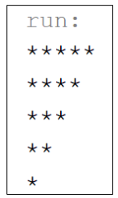{ width="100" style="display:block;margin:auto" }

        ??? tip "Solución"
            ```javascript
            let N = parseInt(prompt("Introduce el tamaño del triángulo:"));

            for (let i = 1; i <= N; i++) {
                let linea = "";

                for (let j = 1; j <= i; j++) {
                    linea += "*";
                }

                console.log(linea);
            }
            ```


### 8.4.5 Interrupción de bucles

¿Saltar o no saltar? he ahí la cuestión. En la gran mayoría de libros de programación y publicaciones de Internet, siempre se nos recomienda que prescindamos de sentencias de salto incondicional, también conocidas como interrupciones de bucles, es más, se
desaconseja su uso por provocar una mala estructuración del código y un incremento en la dificultad para el mantenimiento de los mismos. 

Pero JavaScript incorpora ciertas sentencias o estructuras de salto que es necesario conocer y que pueden sernos útiles en algunas partes de nuestros programas, principalmente en la estructura ‘switch’, aunque también se pueden emplear en las estructuras: for, while y do-while.

#### 8.4.5.1 Instrucción break

La instrucción `break` dentro de un bucle hace que este se interrumpa inmediatamente, aun cuando no se haya ejecutado todavía el bucle completo. Al llegar a dicha instrucción, el programa se sigue desarrollando inmediatamente a continuación del final del bucle.

??? example "Ejemplo 1: Programa que pregunte por una clave y permita únicamente tres respuestas incorrectas"
    ```javascript
    let auxclave = "";
    let numveces=0;

    //Mientras no introduzca la clave y no se pulse Cancelar
    auxclave = prompt("Introduce la clave ");

    while (auxclave !== "SuperClave"){
        numveces++;

        if (numveces === 3)
            break;

        auxclave = prompt("Introduce la clave ");
    }

    if (auxclave == "SuperClave"){
        console.log("La clave es correcta");
    }else{
        console.log("La clave no es correcta correcta");
    }
    ```

#### 8.4.5.2 Instrucción continue

La instrucción `continue` en un bucle permite volver la secuencia de ejecución a la cabecera del bucle, volviendo a ejecutar la condición en el caso de un bucle while, o a incrementar los índices en el caso de un bucle for, es decir, finaliza la interación actual y pasa a la siguiente iteración.

??? example "Ejemplo 1: Presentar todos los números pares del 0 al 50 excepto los que sean múltiplos de 3"
    ```javascript
    let i;
    for (i=2; i<=50; i+=2){
        if ((i%3) === 0)
            continue;

        console.log(i);
    }
    ```

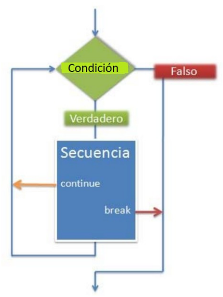{ width="300" style="display:block;margin:auto" }


## 8.5 Ejercicios

### 8.5.1 Ejercicios IF - 1

??? note "Ejercicios Condición if .. else"

    !!! question "Ejercicio 1"
        Escribe un programa que pide la edad por teclado y muestre el mensaje de “Eres mayor de edad” solo si lo somos.

        ??? tip "Solución"
            ```javascript
            let edad = parseInt(prompt("Introduce tu edad:"));

            if (edad >= 18) {
                console.log("Eres mayor de edad");
            }
            ```

    !!! question "Ejercicio 2"
        Escribir un programa que lea dos números, de forma que, si el primer número introducido es mayor o igual al segundo número introducido, se mostrará por pantalla la resta de ambos números.

        ??? tip "Solución"
            ```javascript
            let num1 = parseFloat(prompt("Introduce el primer número:"));
            let num2 = parseFloat(prompt("Introduce el segundo número:"));

            if (num1 >= num2) {
                console.log("La resta es: " + (num1 - num2));
            }
            ```

    !!! question "Ejercicio 3"
        Escribir un programa que pide la edad por teclado y muestre el mensaje de “eres mayor de edad” o el mensaje de “eres menor de edad” en función de la edad introducida.

        ??? tip "Solución"
            ```javascript
            let edad = parseInt(prompt("Introduce tu edad:"));

            if (edad >= 18) {
                console.log("Eres mayor de edad");
            } else {
                console.log("Eres menor de edad");
            }
            ```

    !!! question "Ejercicio 4"
        Escribir un programa que lee un número y diga si es positivo o negativo, consideraremos el cero como positivo.

        ??? tip "Solución"
            ```javascript
            let numero = parseFloat(prompt("Introduce un número:"));

            if (numero >= 0) {
                console.log("El número es positivo");
            } else {
                console.log("El número es negativo");
            }
            ```

    !!! question "Ejercicio 5"
        Escribir un programa que pida un número entero por teclado y muestre un mensaje indicando si el número es par o impar.

        ??? tip "Solución"
            ```javascript
            let numero = parseInt(prompt("Introduce un número entero:"));

            if (numero % 2 === 0) {
                console.log("El número es par");
            } else {
                console.log("El número es impar");
            }
            ```

    !!! question "Ejercicio 6"
        Escribir un programa que pida al usuario dos números enteros.
        Si el segundo número es distinto de cero, mostrará el resultado de dividir el primero entre el segundo.
        Si el segundo número es cero, mostrará un mensaje de error.

        ??? tip "Solución"
            ```javascript
            let num1 = parseFloat(prompt("Introduce el primer número:"));
            let num2 = parseFloat(prompt("Introduce el segundo número:"));

            if (num2 !== 0) {
                console.log("Resultado: " + (num1 / num2));
            } else {
                console.log("Error: No se puede dividir entre cero");
            }
            ```

    !!! question "Ejercicio 7"
        Escribir un programa que lea 2 números distintos y muestre el mayor.

        ??? tip "Solución"
            ```javascript
            let num1 = parseFloat(prompt("Introduce el primer número:"));
            let num2 = parseFloat(prompt("Introduce el segundo número:"));

            if (num1 > num2) {
                console.log("El mayor es: " + num1);
            } else {
                console.log("El mayor es: " + num2);
            }
            ```

### 8.5.2 Ejercicios IF - 2

??? note "Ejercicios Condición if .. else"

    ??? question "Proyecto"
        === "index.html"

            ```html
            <!DOCTYPE html>
            <html lang="es">
            <head>
                <meta charset="UTF-8">
                <title>Ejercicios con if</title>
            </head>
            <body>
                <h1>Ejercicios con if</h1>

                <!-- Ejercicio 1 -->
                <h3>Ejercicio 1. Crear un programa que lea el número introducido en la página html y diga si está entre 10 y 20.</h3><h4> 
                    - En caso que SÍ cumpla las condiciones mostra el mensaje: "Está entre 10 y 20". <br>
                    - En caso que NO cumpla las condiciones mostra el mensaje: "No está entre 10 y 20".</h4>
                </h3>
                <input type="number" id="num1">
                <button onclick="ejercicio1()">Comprobar</button>
                <p id="res1"></p>

                <!-- Ejercicio 2 -->
                <h3>Ejercicio 2. Crear un programa que lea el número introducido en la página html y diga si es el número es distinto de cero y, mayor o igual a cinco<h3>
                    <h4>
                        - En caso que SÍ cumpla las dos condiciones se mostrará el mensaje: "Cumple ambas condiciones".<br>
                        - En caso que NO cumpla las condiciones se mostrará el mensaje: "No cumple ambas condiciones".
                     </h4>
                <input type="number" id="num2">
                <button onclick="ejercicio2()">Comprobar</button>
                <p id="res2"></p>

                <!-- Ejercicio 3 -->
                <h3>Ejercicio 3. Crear un programa que lea el número introducido en la página html y diga si es el número es igual a cinco o igual a 10</h3>
                <h4>
                    - En caso que SÍ cumpla las dos condiciones se mostrará el mensaje: "Es 5 o 10". <br>
                    - En caso que NO cumpla las condiciones se mostrará el mensaje: "No es ni 5 ni 10".
                </h4>
                <input type="number" id="num3">
                <button onclick="ejercicio3()">Comprobar</button>
                <p id="res3"></p>

                <!-- Ejercicio 4 -->
                <h3>Ejercicio 4. Crear un programa que lea el número introducido en la página html y diga si está entre los número 5 y 10</h3>
                <h4>
                    - En caso que SÍ cumpla las dos condiciones se mostrará el mensaje: "Está entre 5 y 10". <br>
                    - En caso que NO cumpla las condiciones se mostrará el mensaje: "No entre 5 y 10".
                </h4>
                <input type="number" id="num4">
                <button onclick="ejercicio4()">Comprobar</button>
                <p id="res4"></p>

                <!-- Ejercicio 5 -->
                <h3>Ejercicio 5. Crear un programa que lea el número introducido en la página html y diga si es distinto a 50 o igual a 20</h3>
                <h4>
                    - En caso que SÍ cumpla las dos condiciones se mostrará el mensaje: "Está entre 5 y 10". <br>
                    - En caso que NO cumpla las condiciones se mostrará el mensaje: "No entre 5 y 10".
                </h4>
                <input type="number" id="num5">
                <button onclick="ejercicio5()">Comprobar</button>
                <p id="res5"></p>

                <!-- Ejercicio 6 -->
                <h3>Ejercicio 6. Crear un programa que adivine un número al azar</h3>
                <h4>
                    - Si el número introducido en mayor que el número al azar se mostrará: "My Alto". <br>
                    - Si el número introducido en menor que el número al azar se mostrará: "My Bajo". <br>
                    - Si el número introducido en igual que el número al azar se mostrará: "Correcto". <br>
                </h4>
                <input type="number" id="num6">
                <button onclick="ejercicio6()">Comprobar</button>
                <p id="res6"></p>

                <script src="app.js"></script>
            </body>
            </html>
            ```

        === "app.js"

            ```javascript
            // Ejercicio 1: ===
            function ejercicio1() {
                let num = Number(document.getElementById("num1").value);
                let resultado = "";

                // Implementar el código
                
                document.getElementById("res1").textContent = resultado;
            }

            // Ejercicio 2: !==
            function ejercicio2() {
                let num = Number(document.getElementById("num2").value);
                let resultado = "";

                // Implementar el código
                
                document.getElementById("res2").textContent = resultado;
            }

            // Ejercicio 3: >=
            function ejercicio3() {
                let edad = Number(document.getElementById("num3").value);
                let resultado = "";

                // Implementar el código
                
                document.getElementById("res3").textContent = resultado;
            }

            // Ejercicio 4: <=
            function ejercicio4() {
                let num = Number(document.getElementById("num4").value);
                let resultado = "";

                // Implementar el código
                
                document.getElementById("res4").textContent = resultado;
            }

            // Ejercicio 5: varias condiciones (>= y <=)
            function ejercicio5() {
                let num = Number(document.getElementById("num5").value);
                let resultado = "";

                // Implementar el código
                
                document.getElementById("res5").textContent = resultado;
            }

            // Ejercicio 5: varias condiciones (>= y <=)
            function ejercicio6() {
                let numeroAzar = Math.floor(Math.random() * 10) + 1;
                let num = Number(document.getElementById("num6").value);
                let resultado = "";

                // Implementar el código
                
                document.getElementById("res6").textContent = resultado;
            }
            ```

    !!! question "Ejercicio 1"
        Crear un programa que lea el número introducido en la página html y diga si está entre 10 y 20. 

        - En caso que **SÍ** cumpla las condiciones mostra el mensaje: "Está entre 10 y 20".
        - En caso que **NO** cumpla las condiciones mostra el mensaje: "Está entre 10 y 20".
        
        ??? tip "Solución"
            ```javascript
            if (num >= 10 && num <= 20) {
                resultado = "Está entre 10 y 20";
            } else {
                resultado = "NO está entre 10 y 20";
            }
            ```

    !!! question "Ejercicio 2"
        Crear un programa que lea el número introducido en la página html y diga si es el número es distinto de cero y, mayor o igual a cinco.
        
        - En caso que **SÍ** cumpla las dos condiciones se mostrará el mensaje: "Cumple ambas condiciones".
        - En caso que **NO** cumpla las condiciones se mostrará el mensaje: "No cumple ambas condiciones".

        ??? tip "Solución"
            ```javascript
            if (num !== 0 && num >= 5) {
                resultado = "Cumple ambas condiciones";
            } else {
                resultado = "No cumple ambas condiciones";
            }
            ```

    !!! question "Ejercicio 3"
        Crear un programa que lea el número introducido en la página html y diga si es el número es igual a cinco o igual a 10.

        - En caso que **SÍ** cumpla las dos condiciones se mostrará el mensaje: "Es 5 o 10".
        - En caso que **NO** cumpla las condiciones se mostrará el mensaje: "No es ni 5 ni 10".

        ??? tip "Solución"
            ```javascript
            if (num === 5 || num === 10) {
                resultado = "Es 5 o 10";
            } else {
                resultado = "No es ni 5 ni 10";
            }
            ```

    !!! question "Ejercicio 4"
        Crear un programa que lea el número introducido en la página html y diga si está entre los número 5 y 10.

        - En caso que **SÍ** cumpla las dos condiciones se mostrará el mensaje: "Está entre 5 y 10".
        - En caso que **NO** cumpla las condiciones se mostrará el mensaje: "No entre 5 y 10".

        ??? tip "Solución"
            ```javascript
            if (num >= 5 && num <= 10) {
                resultado = "Está entre 5 y 10";
            } else {
                resultado = "No entre 5 y 10";
            }
            ```

    !!! question "Ejercicio 5"
        Crear un programa que lea el número introducido en la página html y diga si es distinto a 50 o igual a 20.

        - En caso que **SÍ** cumpla las dos condiciones se mostrará el mensaje: "Está entre 5 y 10".
        - En caso que **NO** cumpla las condiciones se mostrará el mensaje: "No entre 5 y 10".

        ??? tip "Solución"
            ```javascript
            if (num !== 50 || num === 20) {
                resultado = "Es distinto a 50 o igual a 20";
            } else {
                resultado = "Es distinto a 50 o igual a 20";
            }
            ```


### 8.5.3 Ejercicios WHILE - 1

??? note "Ejercicios estructura `while`"

    ??? example "Proyecto"
        === "index.html"

            ```html
            <!DOCTYPE html>
            <html lang="es">

            <head>
                <meta charset="UTF-8">
                <script src="app.js" defer></script>
                <title>Ejercicios con while</title>
            </head>

            <body>

                <h1>Ejercicios con bucle while</h1>

                <!-- Ejercicio 1 -->
                <h3>Ejercicio 1. Crea un programa que escriba en pantalla los números del 1 al 10.</h3>
                <input type="number" id="num1">
                <button onclick="ej1()">Ejecutar</button>
                <p id="res1"></p>

                <!-- Ejercicio 2 -->
                <h3>Ejercicio 2. Crea un programa que escriba en pantalla los números del 1 al número introducido</h3>
                <input type="number" id="num2">
                <button onclick="ej2()">Ejecutar</button>
                <p id="res2"></p>

                <!-- Ejercicio 3 -->
                <h3>Ejercicio 3. Crea un programa que escriba en pantalla la suma desde el número 1 al número introducido</h3>
                <input type="number" id="num3">
                <button onclick="ej3()">Ejecutar</button>
                <p id="res3"></p>

                <!-- Ejercicio 4 -->
                <h3>Ejercicio 4. Crea un programa que escriba en pantalla los números hacia atrás del número introducido al 1. (De
                    forma descendiente)</h3>
                <input type="number" id="num4">
                <button onclick="ej4()">Ejecutar</button>
                <p id="res4"></p>

                <!-- Ejercicio 5 -->
                <h3>Ejercicio 5. Mostrar los número pares comenzando por el 2 hasta el número introducido por pantalla</h3>
                <input type="number" id="num5">
                <button onclick="ej5()">Ejecutar</button>
                <p id="res5"></p>

                <!-- Ejercicio 6 -->
                <h3>Ejercicio 6. Crear un juego en el que se tenga que adivinar un número entre 1 y 10. Se deberá introducir números
                    en el programa hasta que se acierte el número buscado.</h3>
                <h4>- Si no se encuentra el número buscado se mostrará el mensaje: Sigue buscando. <br>
                    - Si se encuentra el número buscado se mostrará el mensaje: ¡Enhorabuena!</h4>
                <input type="number" id="num6">
                <button onclick="ej6()">Ejecutar</button>
                <p id="res6"></p>
            </body>
            </html>
            ```

        === "app.js"

            ```javascript
            // Ejercicio 1
            function ej1() {
                let num = Number(document.getElementById("num1").value);
                let resultado = "";
                
                // Escribir el código

                document.getElementById("res1").textContent = resultado;
            }

            // Ejercicio 2
            function ej2() {
                let num = Number(document.getElementById("num2").value);
                let resultado = "";
                
                // Escribir el código

                document.getElementById("res2").textContent = resultado;
            }

            // Ejercicio 3
            function ej3() {
                let num = Number(document.getElementById("num3").value);
                let resultado = "";

                // Escribir el código

                document.getElementById("res2").textContent = resultado;
            }

            // Ejercicio 4
            function ej4() {
                let num = Number(document.getElementById("num4").value);
                let resultado = "";

                // Escribir código

                document.getElementById("res4").textContent = resultado;
            }

            // Ejercicio 5
            function ej5() {
                let num = Number(document.getElementById("num5").value);
                let i = 2;
                let resultado = "";

                // Escribir código

                document.getElementById("res5").textContent = resultado;
            }

              // Ejercicio 6
            function ej6() {
                let numeroBuscado = Math.floor(Math.random() * 10) + 1;
                let numInsertado = 0;
                let resultado = "";

                /*
                while (// Escribir el código) {
                    numInsertado = Number(document.getElementById("num6").value);

                    //Escribir el código
                }
                */
                document.getElementById("res6").textContent = resultado;
            }
            ```

    !!! question "Ejercicio 1"
        Crea un programa que escriba en pantalla los números del 1 al 10.

        ??? tip "Solución"
            ```javascript
            let i = 1;

            while (i <= 10) {
                resultado = resultado + i + " ";
                i++;
            }
            ```

    !!! question "Ejercicio 2"
        Crea un programa que escriba en pantalla los números del 1 al número introducido.

        ??? tip "Solución"
            ```javascript
            let i = 1;

            while (i <= num) {
                resultado = resultado + i + " ";
                i++;
            }
            ```

    !!! question "Ejercicio 3"
        Crea un programa que escriba en pantalla la suma desde el número 1 al número introducido.

        ??? tip "Solución"
            ```javascript
            let i = 1;
            let suma = 0;

            while (i <= num) {
                suma = suma + i;
                i++;
            }

            resultado = "Suma: " + suma;
            ```

    !!! question "Ejercicio 4"
        Crea un programa que escriba en pantalla los números hacia atrás del número introducido al 1. (De forma descendiente)

        ??? tip "Solución"
            ```javascript
            let i = 1;

            while (num >= i) {
                resultado = resultado + i + " ";
                i--;
            }
            ```

    !!! question "Ejercicio 5"
        Mostrar los número pares comenzando por el 2 hasta el número introducido por pantalla.

        ??? tip "Solución"
            ```javascript
            while (i <= num) {
                if (i % 2 === 0) {
                    resultado = resultado + i + " ";
                }
                i++;
            }
            ```

    !!! question "Ejercicio 6"
        Crear un juego en el que se tenga que adivinar un número entre 1 y 10. Se deberá introducir números en el programa hasta que se acierte el número buscado.

        - Si no se encuentra el número buscado se mostrará el mensaje: Sigue buscando.
        - Si se encuentra el número buscado se mostrará el mensaje: ¡Enhorabuena!

        ??? tip "Solución"
            ```javascript
            while (numInsertado !== numeroBuscado) {
                numInsertado = Number(document.getElementById("num6").value);

                if (numInsertado > numeroBuscado) {
                    resultado = "Muy alto";
                } 
                
                if (numInsertado < numeroBuscado) {
                    resultado = "Muy bajo";
                } 
                
                if(numInsertado === numeroBuscado) {
                    resultado = "¡Correcto!";
                }
            }
            ```

### 8.5.4 Ejercicios WHILE - 2

??? note "Ejercicios estructura `while`"

    ??? example "Proyecto"
        === "index.html"

            ```html
            <!DOCTYPE html>
            <html lang="es">

            <head>
                <meta charset="UTF-8">
                <script src="app.js" defer></script>
                <title>Ejercicios con while</title>
            </head>

            <body>

                <h1>Ejercicios con bucle while</h1>

                <!-- Ejercicio 1 -->
                <h3>Ejercicio 1. Crea un programa que escriba en pantalla los números del 1 al 10 menos el número 5</h3>
                <button onclick="ej1()">Ejecutar</button>
                <p id="res1"></p>

                <!-- Ejercicio 2 -->
                <h3>Ejercicio 2. Crea un programa que escriba en pantalla los números desde numero1 hasta numero2. Los números numero1 y numero2 son introducidos en pantalla.</h3>
                Número 1: <input type="number" id="num21"> <br>
                Número 2: <input type="number" id="num22">
                <button onclick="ej2()">Ejecutar</button>
                <p id="res2"></p>

                <!-- Ejercicio 3 -->
                <h3>Ejercicio 3. Crea un programa que recorra los números del 2 al 10 pero sólo debe escribir los número pares, es decir, se debe mostrar los números: 2 4 6 8 10 </h3>
                Número: <input type="number" id="num3">
                <button onclick="ej3()">Ejecutar</button>
                <p id="res3"></p>

                <!-- Ejercicio 4 -->
                <h3>Ejercicio 4. Crea un programa que escriba en pantalla los números desde numero2 hasta numero1. Los números numero2 y numero1 son introducidos en pantalla.</h3>
                Número 1: <input type="number" id="num41"> <br>
                Número 2: <input type="number" id="num42">
                <button onclick="ej4()">Ejecutar</button>
                <p id="res4"></p>
            </body>
            </html>
            ```

        === "app.js"

            ```javascript
            // Ejercicio 1
            function ej1() {
                let i = 1;
                let resultado = "";
                
                // Escribir el código

                document.getElementById("res1").textContent = resultado;
            }

            // Ejercicio 2
            function ej2() {
                let numero1 = Number(document.getElementById("num21").value);
                let numero2 = Number(document.getElementById("num22").value);
                let resultado = "";
                
                // Escribir el código

                document.getElementById("res2").textContent = resultado;
            }

            // Ejercicio 3
            function ej3() {
                let i = 2;
                let resultado = "";

                // Escribir el código

                document.getElementById("res2").textContent = resultado;
            }

            // Ejercicio 4
            function ej4() {
                let numero1 = Number(document.getElementById("num41").value);
                let numero2 = Number(document.getElementById("num42").value);
                let resultado = "";

                // Escribir código

                document.getElementById("res4").textContent = resultado;
            }
            ```

    !!! question "Ejercicio 1"
        Crea un programa que escriba en pantalla los números del 1 al 10 menos el número 5

        ??? tip "Solución"
            ```javascript
            while (i <= 10) {
                if (i !== 5) {
                    resultado = resultado + i + " ";
                }
                i = i + 1;
            }
            ```

    !!! question "Ejercicio 2"
        Crea un programa que escriba en pantalla los números desde numero1 hasta numero2. Los números numero1 y numero2 son introducidos en pantalla, además, número1 debe ser menor a numero2.

        ??? tip "Solución"
            ```javascript
            while (numero1 <= numero2) {
                resultado = resultado + numero1 + " ";
                numero1 = numero1 + 1;
            }
            ```

    !!! question "Ejercicio 3"
        Crea un programa que recorra los números del 2 al 10 pero sólo debe escribir los número pares, es decir, se debe mostrar los números: 2 4 6 8 10.

        ??? tip "Solución"
            ```javascript
            while (i <= 10) {
                if (i % 2 === 0) {
                    resultado = resultado + i + " ";
                }
                i = i + 1;
            }
            ```

    !!! question "Ejercicio 4"
        Crea un programa que escriba en pantalla los números desde numero2 hasta numero1. Los números numero2 y numero1 son introducidos en pantalla y además, numero2 debe ser mayor a número1.

        ??? tip "Solución"
            ```javascript
            while (numero2 >= numero1) {
                resultado = resultado + numero2 + " ";
                numero 2 = numero2 - 1;
            }
            ```

### 8.5.5 Ejercicios WHILE - 3

??? note "Ejercicios estructura `while`"

    ??? example "Proyecto"
        === "index.html"

            ```html
            <!DOCTYPE html>
            <html lang="es">

            <head>
                <meta charset="UTF-8">
                <script src="app.js" defer></script>
                <title>Ejercicios con ERRORES</title>
            </head>

            <body>

                <h1>Ejercicios con ERRORES</h1>

                <!-- Ejercicio 1 -->
                <h3>Ejercicio 1. Encuentra el error y corrígelo</h3>
                <button onclick="ej1()">Ejecutar</button>
                <p id="res1"></p>

                <!-- Ejercicio 2 -->
                <h3>Ejercicio 2. Encuentra el error y corrígelo</h3>
                <button onclick="ej2()">Ejecutar</button>
                <p id="res2"></p>

                <!-- Ejercicio 3 -->
                <h3>Ejercicio 3. Encuentra el error y corrígelo</h3>
                <button onclick="ej3()">Ejecutar</button>
                <p id="res3"></p>

                <!-- Ejercicio 4 -->
                <h3>Ejercicio 4. Encuentra el error y corrígelo</h3>
                <button onclick="ej4()">Ejecutar</button>
                <p id="res4"></p>

                <!-- Ejercicio 5 -->
                <h3>Ejercicio 5. Encuentra el error y corrígelo</h3>
                <button onclick="ej5()">Ejecutar</button>
                <p id="res5"></p>

                <!-- Ejercicio 6 -->
                <h3>Ejercicio 6. Encuentra el error y corrígelo</h3>
                <button onclick="ej6()">Ejecutar</button>
                <p id="res6"></p>

                <!-- Ejercicio 7 -->
                <h3>Ejercicio 7. Encuentra el error y corrígelo</h3>
                <button onclick="ej7()">Ejecutar</button>
                <p id="res7"></p>

                <!-- Ejercicio 8 -->
                <h3>Ejercicio 8. Encuentra el error y corrígelo</h3>
                <button onclick="ej8()">Ejecutar</button>
                <p id="res8"></p>
            </body>
            </html>
            ```

        === "app.js"

            ```javascript
            // Ejercicio 1
            function ej1() {
                let x = 5;
                let resultado = "";
                /*
                if x > 10 {
                    resultado = "Mayor que 10";
                }
                */
                document.getElementById("res1").textContent = resultado;
            }

            // Ejercicio 2
            function ej2() {
                let resultado = "";
                let n = 4;
                /*
                if (n % 2 = 0) {
                    resultado = "Es par";
                }
                */
                document.getElementById("res2").textContent = resultado;
            }

            // Ejercicio 3
            function ej3() {
                let resultado = "";
                let nombre = "Ana";
                /*
                if (nombre === "Ana") 
                    resultado = "Hola Ana";
                    resultado = resultado + " Bienvenida";
                }
                */
                document.getElementById("res3").textContent = resultado;
            }

            // Ejercicio 4
            function ej4() {
                let edad = 20;
                let resultado = "";
                /*
                if (edad >= 18) {
                    resultado = "Mayor de edad";
                } else
                    resultado = "Menor de edad";
                }
                */
                document.getElementById("res4").textContent = resultado;
            }

            // Ejercicio 5
            function ej5() {
                let i = 1;
                let resultado = "";
                /*
                while i <= 5 {
                    resultado = i;
                    i = i + 1;
                }
                */
                document.getElementById("res5").textContent = resultado;
            }

            // Ejercicio 6
            function ej6() {
                let n = 1;
                let suma = 0;
                /*
                while (n <= 10) {
                    suma = suma + n;
                }
                */
                document.getElementById("res6").textContent = suma;
            }

            // Ejercicio 7
            function ej7() {
                let num = 1;
                let resultado = "";
                /*
                while (num <= 10) 
                    resultado = resultado + num + " ";
                    num = num + 2;
                }
                */
                document.getElementById("res6").textContent = resultado;
            }

            // Ejercicio 8
            function ej8() {
                let num = 1;
                let resultado = "";
                /*
                while (val =< 100) {
                    resultado = resultado + num + " ";
                    val = val * 2;
                }
                */
                document.getElementById("res6").textContent = resultado;
            }
            ```

    !!! question "Ejercicio 1"
        Encuentra el error y corrígelo

        ??? tip "Solución"
            ```javascript
            if(x > 10) {
                    resultado = "Mayor que 10";
            }
            ```

    !!! question "Ejercicio 2"
        Encuentra el error y corrígelo

        ??? tip "Solución"
            ```javascript
            if (n % 2 === 0) {
                resultado = "Es par";
            }
            ```

    !!! question "Ejercicio 3"
        Encuentra el error y corrígelo

        ??? tip "Solución"
            ```javascript
            if (nombre === "Ana") {
                resultado = "Hola Ana";
                resultado = resultado + " Bienvenida";
            }

            resultado = "Suma: " + suma;
            ```

    !!! question "Ejercicio 4"
        Encuentra el error y corrígelo

        ??? tip "Solución"
            ```javascript
            if (edad >= 18) {
                resultado = "Mayor de edad";
            } else {
                resultado = "Menor de edad";
            }
            ```

    !!! question "Ejercicio 5"
        Encuentra el error y corrígelo

        ??? tip "Solución"
            ```javascript
            while(i <= 5) {
                resultado = i;
                i = i + 1;
            }
            ```

    !!! question "Ejercicio 6"
        Encuentra el error y corrígelo

        ??? tip "Solución"
            ```javascript
            while (n <= 10) {
                suma = suma + n;
                n = n + 1;
            }
            ```

    !!! question "Ejercicio 7"
        Encuentra el error y corrígelo

        ??? tip "Solución"
            ```javascript
            while (num <= 10) {
                resultado = resultado + num + " ";
                num = num + 2;
            }
            ```

    !!! question "Ejercicio 8"
        Encuentra el error y corrígelo

        ??? tip "Solución"
            ```javascript
            while (val <= 100) {
                resultado = resultado + num + " ";
                val = val * 2;
            }
            ```

### 8.5.6 Ejercicios WHILE-IF - 1

??? note "Ejercicios estructura WHILE-IF"

    ??? example "Proyecto"
        === "index.html"

            ```html
            <!DOCTYPE html>
            <html lang="es">

            <head>
                <meta charset="UTF-8">
                <script src="app.js" defer></script>
                <title>Ejercicios estructura WHILE-IF</title>
            </head>

            <body>

                <h1>Ejercicios estructura WHILE-IF</h1>

                <!-- Ejercicio 1 -->
                <h3>Ejercicio 1. Mostrar los número del 1 al 10 e indicar para cada número si es par o impar</h3>
                <h4>Ejemplo de ejecución: <br> 1 es impar <br> 2 es par</h4>
                <button onclick="ej1()">Ejecutar</button>
                <p id="res1"></p><br>

                <!-- Ejercicio 2 -->
                <h3>Ejercicio 2. Mostrar solo los números del 1 al 20 divisibles por 3. Un número es divisible por 3 cuando el 'resto' es igual a cero. Operación 'resto': %</h3>
                <button onclick="ej2()">Ejecutar</button>
                <p id="res2"></p><br>

                <!-- Ejercicio 3 -->
                <h3>Ejercicio 3. Mostrar los números del 1 al 10 excepto el 6</h3>
                <button onclick="ej3()">Ejecutar</button>
                <p id="res3"></p><br>

                <!-- Ejercicio 4 -->
                <h3>Ejercicio 4. Mostrar solo los números impares del 1 al 10 que no sean pares</h3>
                <button onclick="ej4()">Ejecutar</button>
                <p id="res4"></p><br>

                <!-- Ejercicio 5 -->
                <h3>Ejercicio 5. Comprobar el número de rondas y el número de puntos introducidos por teclado. Si el número de rondas es igual a 5 y el número de puntos es igual o igual a 21 se debe mostrar el mensaje: "Has ganado", en caso contrario, se mostrará el mensaje: "!Sigue intengándolo¡"</h3>
                Ronda: <input type="number" id="num51"><br>
                Puntos: <input type="number" id="num52">
                <button onclick="ej5()">Ejecutar</button>
                <p id="res5"></p><br>

                <!-- Ejercicio 6 -->
                <h3>Ejercicio 6. Recorrer los número del 1 al 10 y mostrar el mensaje: "3 es un número especial" o "7 es un número especial" cuando se llegue a los número 3 y 7. <br>Para otro número, sólo se mostrará el número</h3>
                <h4>Por ejemplo: <br>
                    1 <br>
                    2 <br>
                    3 es un número especial</h4>
                <button onclick="ej6()">Ejecutar</button>
                <p id="res6"></p>
            </body>
            </html>
            ```

        === "app.js"

            ```javascript
            // Ejercicio 1
            function ej1() {
                let resultado = "";
                let i = 1;

                // Implementar código

                document.getElementById("res1").textContent = resultado;
            }

            // Ejercicio 2
            function ej2() {
                let resultado = "";
                let i = 1;

                // Implementar código

                document.getElementById("res2").textContent = resultado;
            }

            // Ejercicio 3
            function ej3() {
                let resultado = "";
                let i = 1;

                // Implementar código

                document.getElementById("res3").textContent = resultado;
            }

            // Ejercicio 4
            function ej4() {
                let i = 1;
                let resultado = "";
                
                // Implementar código

                document.getElementById("res4").textContent = resultado;
            }

            // Ejercicio 5
            function ej5() {
                let ronda = Number(document.getElementById("num51").value);
                let puntos = Number(document.getElementById("num52").value);
                let resultado = "";
                
                // Implementar código

                document.getElementById("res5").textContent = resultado;
            }

            // Ejercicio 6
            function ej6() {
                let i = 1;
                let resultado = "";
                
                // Implementar código

                document.getElementById("res6").textContent = suma;
            }
            ```

    !!! question "Ejercicio 1"
        Mostrar los número del 1 al 10 e indicar para cada número si es par o impar

        ??? tip "Solución"
            ```javascript
            while (i <= 10) {
                if (i % 2 === 0) {
                    resultado = resultado + i + " es par -" + " -- ";
                } else {
                    resultado = resultado + i + " es impar -" + " -- " ;
                }
                i = i + 1;
            }
            ```

    !!! question "Ejercicio 2"
        Contar solo los números del 1 al 20 divisibles por 3. Un número es divisible por 3 cuando el 'resto' es igual a cero. Operación 'resto': %

        ??? tip "Solución"
            ```javascript
            while (i <= 20) {
                if (i % 3 === 0) {
                    resultado = resultado + i + " ";
                }
                i = i + 1;
            }
            ```

    !!! question "Ejercicio 3"
        Mostrar los números del 1 al 10 excepto el 6

        ??? tip "Solución"
            ```javascript
            while (i <= 10) {
                if (i !== 6) {
                    resultado = resultado + i + " ";
                }

                i = i + 1;
            }
            ```

    !!! question "Ejercicio 4"
        Ejercicio 4. Mostrar solo los números impares del 1 al 10 que no sean pares

        ??? tip "Solución"
            ```javascript
            while (i <= 10) {
                if (i % 2 !== 0) {
                    resultado = resultado + i + " ";
                }
                i = i + 1;
            }
            ```

    !!! question "Ejercicio 5"
        Comprobar el número de rondas y el número de puntos introducidos por teclado. Si el número de rondas es igual a 5 y el número de puntos es igual o igual a 21 se debe mostrar el mensaje: "Has ganado", en caso contrario, se mostrará el mensaje: "!Sigue intengándolo¡"

        ??? tip "Solución"
            ```javascript
            if (ronda === 5 && puntos >= 21) {
                resultado = "!Has ganado¡";
            }
            else {
                resultado = "!Sigue intengándolo¡";
            }
            ```

    !!! question "Ejercicio 6"
        Recorrer los número del 1 al 10 y mostrar el mensaje: "3 es un número especial" o "7 es un número especial" cuando se llegue a los número 3 y 7. Para otro número, sólo se mostrará el número

        ??? tip "Solución"
            ```javascript
            while (i <= 10) {
                if (i === 3 || i === 7) {
                    resultado = resultado + i + " es un número especial" + " -- ";
                } else {
                    resultado = resultado + i + " -- ";
                }
                i = i + 1;
            }
            ```

### 8.5.7 Ejercicios WHILE-IF - 2

??? note "Ejercicios estructura WHILE-IF"

    ??? example "Proyecto"
        === "index.html"

            ```html
            <!DOCTYPE html>
            <html lang="es">

            <head>
                <meta charset="UTF-8">
                <script src="app.js" defer></script>
                <title>Ejercicios estructura WHILE-IF</title>
            </head>

            <body>

                <h1>Ejercicios estructura WHILE-IF</h1>

                <!-- Ejercicio 1 -->
                <h3>Ejercicio 1. Sumar los número pares del 1 al 20</h3>
                <button onclick="ej1()">Ejecutar</button>
                <p id="res1"></p><br>

                <!-- Ejercicio 2 -->
                <h3>Ejercicio 2. Recorrer los número del 1 al 10 y mostrar los número entre el 5 y el 8</h3>
                <button onclick="ej2()">Ejecutar</button>
                <p id="res2"></p><br>

                <!-- Ejercicio 3 -->
                <h3>Ejercicio 3. Recorrer la temperatura desde el número introducido por teclado hasta los 40 grados y clasificar los grados en agradable o extrema. La temperatura se debe incrementar de 5 en 5 grados:<br> - Una temperatura es agradable si está entre 18 y 26 <br> - Una temperatura es extrema si es menor a 5 grados o mayor a 35 grados.</h3>
                Grados: <input type="number" id="num3">
                <button onclick="ej3()">Ejecutar</button>
                <p id="res3"></p><br>

                <!-- Ejercicio 4 -->
                <h3>Ejercicio 4. Recorrer desde el número 1 hasta el número introducido por teclado. Mostrar todos los número por pantalla, pero añadir la palabra 'especial' junto al primer y último número</h3>
                <h4>Por ejemplo: <br>
                    1 - Especial<br>
                    2 <br>
                    3 </h4>
                Número: <input type="number" id="num4">
                <button onclick="ej4()">Ejecutar</button>
                <p id="res4"></p><br>

                <!-- Ejercicio 5 -->
                <h3>Ejercicio 5. Mostrar la calificación de un examen por nota. El programa se repetirá 5 veces y la nota se obtendrá de forma aleatoria.</h3><h4> - Si la nota es menor a 5 se mostrará 'Suspenso' <br> - Si la nota es mayor/igual a 5 y menor a 7 se mostrará 'Aprobado'.<br> - Si la nota es mayor/igual a 7 y menor a 9 se mostrará 'Notable'.<br> - Si la nota es mayor/igual a 9 y menor/igual a 10 se mostrará 'Sobresaliente'</h4>
                Nota: <input type="number" id="num5">
                <button onclick="ej5()">Ejecutar</button>
                <p id="res5"></p><br>
            </body>
            </html>
            ```

        === "app.js"

            ```javascript
            // Ejercicio 1
            function ej1() {
                let suma = 0;
                let i = 1;

                /*
                while (// Añadir código) {
                    if (// Añadir código) {
                        suma = suma + i;
                    }
                    // Añadir código
                }
                */

                document.getElementById("res1").textContent = suma;
            }

            // Ejercicio 2
            function ej2() {
                let resultado = "";
                let i = 1;

                /*
                while (// Añadir código) {
                    if (// Añadir código) {
                        resultado = resultado + i + " ";
                    }
                    // Añadir código
                }
                */

                document.getElementById("res2").textContent = resultado;
            }

            // Ejercicio 3
            function ej3() {
                let temp = Number(document.getElementById("num3").value);
                let resultado = "";

                /*
                while (// Añadir código) {
                    if (temp >= 18 && temp <= 26) {
                        resultado = resultado + temp + "°C — agradable" + " -- ";
                    } 
                    
                    if (// Añadir código) {
                        // Añadir código
                    }

                    // Añadir código
                }
                */

                document.getElementById("res3").textContent = contador;
            }

            // Ejercicio 4
            function ej4() {
                let numero = Number(document.getElementById("num4").value);
                let i = 1;
                let resultado = "";
                
                // Implementar código

                document.getElementById("res4").textContent = resultado;
            }

            // Ejercicio 5
            function ej5() {
                let nota = Number(document.getElementById("num5").value);
                let i = 1;
                let resultado = "";
                
                /*
                while (// Añadir código) {
                    if (nota < 0 || nota < 5) {
                        resultado = resultado + nota + " — Suspenso";
                    } 
                    
                    if (nota >= 5 && nota < 7) {
                        resultado = resultado + nota + " — Aprobado";
                    } 
                    
                    // Añadir código
                }
                */

                document.getElementById("res5").textContent = resultado;
            }
            ```

    !!! question "Ejercicio 1"
        Sumar los número pares del 1 al 20

        ??? tip "Solución"
            ```javascript
            while (i <= 10) {
                if (i % === 0) {
                    suma = suma + i;
                }
                i = i + 1;
            }
            ```

    !!! question "Ejercicio 2"
        Recorrer los número del 1 al 10 y mostrar los número entre el 5 y el 8.

        ??? tip "Solución"
            ```javascript
            while (i <= 10) {
                if (i >= 5 && i <= 8) {
                    resultado = resultado + i + " ";
                }
                i = i + 1;
            }
            ```

    !!! question "Ejercicio 3"
        Recorrer la temperatura desde el número introducido por teclado hasta los 40 grados y clasificar los grados en agradable o extrema. La temperatura se debe incrementar de 5 en 5 grados.

        ??? tip "Solución"
            ```javascript
            while (temp <= 40) {
                if (temp >= 18 && temp <= 26) {
                    resultado = resultado + temp + "°C — agradable" + " -- ";
                } 
                
                if (temp < 5 || temp > 35) {
                    resultado = resultado + temp + "°C — temperatura extrema" + " -- ";
                }

                temp = temp + 5;
            }
            ```

    !!! question "Ejercicio 4"
        Recorrer desde el número 1 hasta el número introducido por teclado. Mostrar todos los número por pantalla, pero añadir la palabra 'especial' junto al primer y último número

        ??? tip "Solución"
            ```javascript
            while (i <= numero) {
                if (i === 1 || i === numero) {
                    resultado = resultado  + i + " ← especial" + " -- ";
                } else {
                    resultado = resultado  + i + " -- ";
                }
                i = i + 1;
            }
            ```

    !!! question "Ejercicio 5"
        Mostrar la calificación de un examen por nota.

        ??? tip "Solución"
            ```javascript
            while (i <= 5) {
                nota = Math.floor(Math.random() * 10) + 1;

                if (nota < 0 || nota < 5) {
                    resultado = resultado + nota + " — Suspenso";
                } 
                
                if (nota >= 5 && nota < 7) {
                    resultado = resultado + nota + " — Aprobado";
                } 
                
                if (nota >= 7 && nota < 9) {
                    resultado = resultado + nota + " — Notable";
                } 
                
                if (nota >= 9 && nota <= 10) { {
                    resultado = resultado + nota + " — Sobresaliente";
                }

                i = i + 1;
            }
            ```

### 8.5.8 Ejercicios WHILE-IF - 3

??? note "Ejercicios estructura WHILE-IF"

    ??? example "Proyecto"
        === "index.html"

            ```html
            <!DOCTYPE html>
            <html lang="es">

            <head>
                <meta charset="UTF-8">
                <script src="app.js" defer></script>
                <title>Ejercicios con ERRORES</title>
            </head>

            <body>

                <h1>Ejercicios con ERRORES WHILE-IF</h1>

                <!-- Ejercicio 1 -->
                <h3>Ejercicio 1. Encuentra el error y corrígelo</h3>
                <button onclick="ej1()">Ejecutar</button>
                <p id="res1"></p><br>

                <!-- Ejercicio 2 -->
                <h3>Ejercicio 2. Encuentra el error y corrígelo</h3>
                <button onclick="ej2()">Ejecutar</button>
                <p id="res2"></p><br>

                <!-- Ejercicio 3 -->
                <h3>Ejercicio 3. Encuentra el error y corrígelo</h3>
                <button onclick="ej3()">Ejecutar</button>
                <p id="res3"></p><br>

                <!-- Ejercicio 4 -->
                <h3>Ejercicio 4. Encuentra el error y corrígelo</h3>
                <button onclick="ej4()">Ejecutar</button>
                <p id="res4"></p><br>

                <!-- Ejercicio 5 -->
                <h3>Ejercicio 5. Encuentra el error y corrígelo</h4>
                <button onclick="ej5()">Ejecutar</button>
                <p id="res5"></p><br>

                <!-- Ejercicio 6 -->
                <h3>Ejercicio 6. Encuentra el error y corrígelo</h4>
                <button onclick="ej6()">Ejecutar</button>
                <p id="res6"></p><br>

                <!-- Ejercicio 7 -->
                <h3>Ejercicio 7. Encuentra el error y corrígelo</h4>
                <button onclick="ej7()">Ejecutar</button>
                <p id="res7"></p><br>

                <!-- Ejercicio 8 -->
                <h3>Ejercicio 8. Encuentra el error y corrígelo</h4>
                <button onclick="ej8()">Ejecutar</button>
                <p id="res8"></p><br>
            </body>
            </html>
            ```

        === "app.js"

            ```javascript
            // Ejercicio 1
            function ej1() {
                let num = 10;
                let resultado = "";

                /*
                while(num > 0) {
                    if(num = 5) {
                        resultado = "Es cinco";
                    }
                    num = num - 1;
                }
                */

                document.getElementById("res1").textContent = resultado;
            }

            // Ejercicio 2
            function ej2() {
                let resultado = "";
                let contador = 0;

                /*
                while(contador < 3) {
                    if(contador === 2) {
                        resultado = "Dos";
                    }
                }
                */

                document.getElementById("res2").textContent = resultado;
            }

            // Ejercicio 3
            function ej3() {
                let resultado = "";
                let i = 0;

                /*
                while(i < 5); {
                    resultado = resultado + i + " ";
                    i = i + 1;
                }
                */

                document.getElementById("res3").textContent = resultado;
            }

            // Ejercicio 4
            function ej4() {
                let i = 0;
                let resultado = "";
                
                /*
                while(i < 5) {
                    if(i % 2 === 0); {
                        resultado = resultado + i + " ";
                    }
                    i = i + 1;
                }
                */

                document.getElementById("res4").textContent = resultado;
            }

            // Ejercicio 5
            function ej5() {
                let i = 0;
                let resultado = "";
                
                /*
                while(i < 3) {
                    if(i == 1)
                        resultado = "Uno"
                        i = i + 1;
                }
                */

                document.getElementById("res5").textContent = resultado;
            }

            // Ejercicio 6
            function ej6() {
                let i = 0;
                let resultado = "";
                
                /*
                while(i < 5) {
                    if(i % 2 = 0) {
                        resultado = resultado + i + " Par" + "--";
                    }
                    i = i + 1;
                }
                */

                document.getElementById("res6").textContent = resultado;
            }

            // Ejercicio 7
            function ej7() {
                let i = 0;
                let resultado = "";
                
                /*
                while(i < 3)
                {
                    if i == 1 {
                        resultado = "Uno";
                    }
                    i = i + 1;
                }
                */

                document.getElementById("res7").textContent = resultado;
            }

            // Ejercicio 8
            function ej8() {
                let i = 0;
                let resultado = "";
                
                /*
                while(i < 3) {
                    if(i === 2) {
                        resultado = resultado + "Dos" + " ";
                    } 

                    if(i === 1)
                        resultado = resultado + "Uno" + " ";

                    if {
                        resultado = resultado + "Cero" + " ";
                    }

                    i = i + 1;
                }
                */

                document.getElementById("res8").textContent = resultado;
            }
            ```

    !!! question "Ejercicio 1"
        Encuentra el error y corrígelo

        ??? tip "Solución"
            ```javascript
            while(num > 0) {
                if(num === 5) {
                    resultado = "Es cinco";
                }
                num = num - 1;
            }
            ```

    !!! question "Ejercicio 2"
        Encuentra el error y corrígelo

        ??? tip "Solución"
            ```javascript
            while(contador < 3) {
                if(contador === 2) {
                    resultado = "Dos";
                }
                contador = contador + 1;
            }
            ```

    !!! question "Ejercicio 3"
        Encuentra el error y corrígelo

        ??? tip "Solución"
            ```javascript
            while(i < 5) {
                resultado = resultado + i + " ";
                i = i + 1;
            }
            ```

    !!! question "Ejercicio 4"
        Encuentra el error y corrígelo

        ??? tip "Solución"
            ```javascript
            while(i < 5) {
                if(i % 2 === 0) {
                    resultado = resultado + i + " ";
                }
                i = i + 1;
            }
            ```

    !!! question "Ejercicio 5"
        Encuentra el error y corrígelo

        ??? tip "Solución"
            ```javascript
            while(i < 3) {
                if(i == 1) {
                    resultado = "Uno"
                }
                i = i + 1;
            }
            ```

    !!! question "Ejercicio 6"
        Encuentra el error y corrígelo

        ??? tip "Solución"
            ```javascript
            while(i < 5) {
                if(i % 2 === 0) {
                    resultado = resultado + i + " Par" + "--";
                }
                i = i + 1;
            }
            ```

    !!! question "Ejercicio 7"
        Encuentra el error y corrígelo

        ??? tip "Solución"
            ```javascript
            while(i < 3)
            {
                if (i == 1) {
                    resultado = "Uno";
                }
                i = i + 1;
            }
            ```

    !!! question "Ejercicio 8"
        Encuentra el error y corrígelo

        ??? tip "Solución"
            ```javascript
            while(i < 3) {
                if(i === 2) {
                    resultado = resultado + "Dos" + " ";
                } 

                if(i === 1) {
                    resultado = resultado + "Uno" + " ";
                }

                if(i === 0) {
                    resultado = resultado + "Cero" + " ";
                }

                i = i + 1;
            }
            ```

<!--
### Ejercicios de depuración de código

??? note "Ejercicios de depuración de código"

    !!! question "Ejercicio 1"
        Indica el valor de las variables al ejecutar el siguiente fragmento de programa. Realiza una traza y posteriormente depura el código. 
        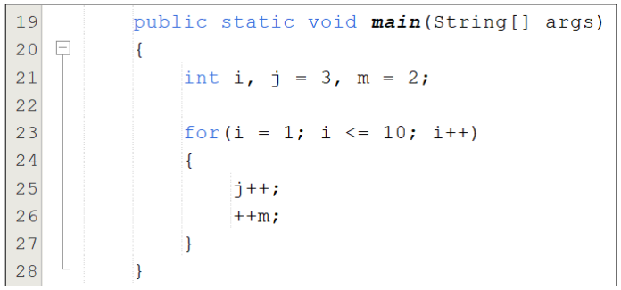{ width="400" style="display:block;margin:auto" }

    !!! question "Ejercicio 2"
        Indicar el valor de las variables al ejecutar el siguiente fragmento de programa. Realiza una traza y posteriormente depura el código.
        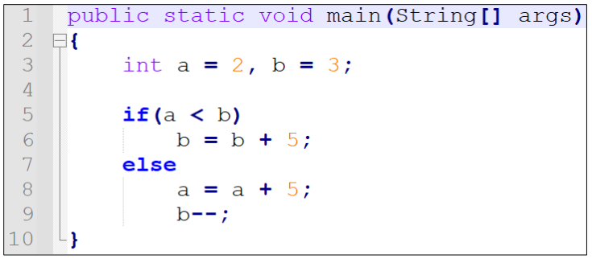{ width="400" style="display:block;margin:auto" }

    !!! question "Ejercicio 3"
        Indicar el valor de las variables al ejecutar el siguiente fragmento de programa. Realiza una traza y posteriormente depura el código.
        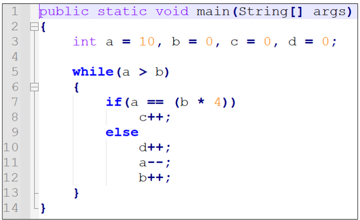{ width="400" style="display:block;margin:auto" }

    !!! question "Ejercicio 4"
        Indicar el valor de las variables al ejecutar el siguiente fragmento de programa. Realiza una traza y posteriormente depura el código.
        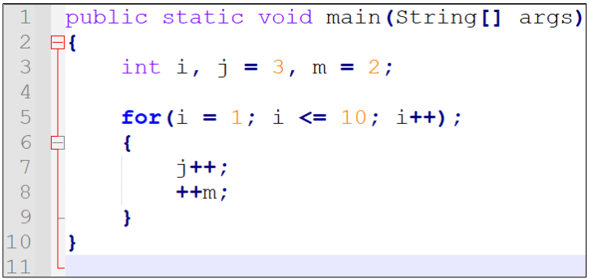{ width="400" style="display:block;margin:auto" }

    !!! question "Ejercicio 5"
        Indicar el valor de las variables al ejecutar el siguiente fragmento de programa. Realiza una traza y posteriormente depura el código.
        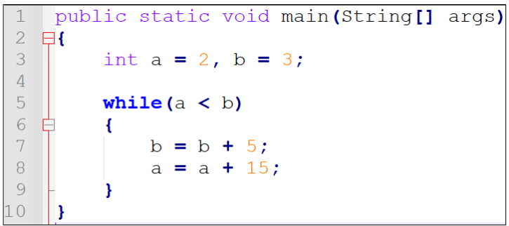{ width="400" style="display:block;margin:auto" }
-->

