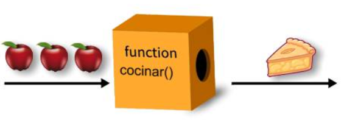

# 9. Funciones

Una **función** es un conjunto de instrucciones que se agrupan bajo un nombre. Se ejecuta solo cuando es llamada por su nombre en el código del programa. La llamada provoca la ejecución de las instrucciones que contiene.

Una función se puede ver como una caja negra a la que se le pasan datos y con esos datos hace tareas.

{ width="300" style="display:block;margin:auto" }

Las funciones son muy importantes por diversos motivos:

- Ayudan a estructurar los programas para hacer su código más comprensible y más fácil de modificar.
- Permiten repetir la ejecución de un conjunto de órdenes todas las veces que sea necesario sin necesidad de escribir de nuevo las instrucciones.

Una función consta de las siguientes partes básicas:

- Un nombre de función.
- Los parámetros pasados a la función separados por comas y entre paréntesis.
- Las llaves de inicio y final de la función.

!!! info "Sintaxis"
    ```javascript
    function nombrefuncion (parámetro1, parámetro2=valorPorDefecto...){
        // instrucciones
        
        //si la función devuelve algún valor añadimos:
        return valor;
    }
    ```

!!! info "IMPORTANTE"
    Opcionalmente la función puede finalizar con la palabra clave **return** seguida de un valor, este valor será el que devuelva la función al programa que la llame.

