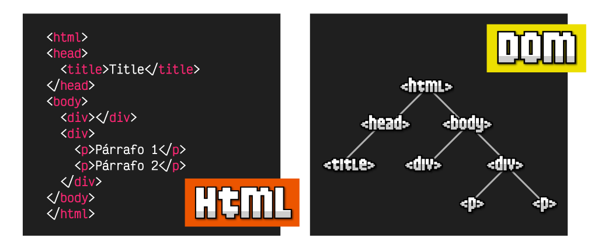
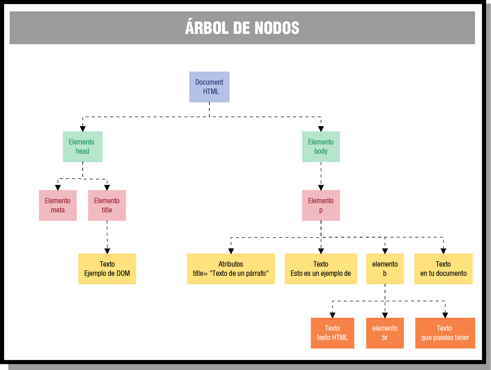

El Modelo de Objetos del Documento (DOM), permite ver el mismo documento HTML de otra manera, describiendo el contenido del documento como un árbol de nodos, sobre los que un programa de Javascript puede interactuar.

El DOM (Document Object Model) es una interfaz de programación (API) que permite a los scripts actualizar el contenido, la estructura y el estilo de un documento (HTML y XML) mientras este se está visualizando en el navegador.

A través del DOM los programas pueden acceder y modificar el contenido, estructura y estilo de los documentos HTML y XML, que es para lo que se diseñó principalmente. El responsable del DOM es el W3C.

El DOM transforma todos los documentos HTML en un conjunto de elementos, a los que llama nodos. En el HTML DOM cada nodo es un objeto. Estos nodos están conectados entre sí y representan los contenidos de la página web, y la relación que hay entre ellos. Cuando unimos todos estos nodos de forma jerárquica, obtenemos una estructura similar a un árbol, por lo que muchas veces se suele referenciar como árbol DOM, “árbol de nodos”, etc.

{ width="700" style="display:block;margin:auto" }

{ width="700" style="display:block;margin:auto" }