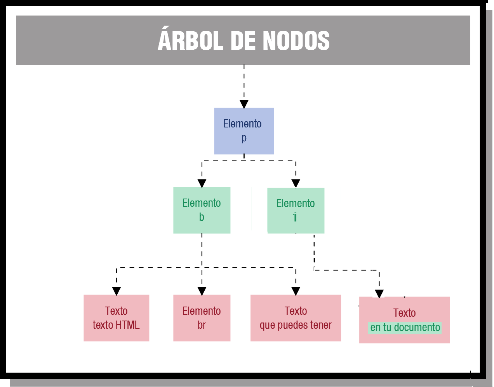

# 3. Buscar nodos en el DOM

Cuando ya se ha construido automáticamente el árbol de nodos del DOM, ya podemos comenzar a utilizar sus funciones para acceder a cualquier nodo del árbol. El acceder a un nodo del árbol, es lo equivalente a acceder a un fragmento de la página de nuestro documento. Así que, una vez que hemos accedido a esa parte del documento, ya podemos modificar valores, crear y añadir nuevos elementos, moverlos de sitio, etc.

Para acceder a un nodo específico lo podemos hacer empleando dos métodos: o bien a través de los nodos padre, o bien usando un método de acceso directo. A través de los nodos padre partiremos del nodo raíz e iremos accediendo a los nodos hijo, y así sucesivamente hasta llegar al elemento que deseemos. Y para el método de acceso directo, que por cierto es el método más utilizado, emplearemos funciones del DOM, que nos permiten ir directamente a un elemento sin tener que atravesar nodo a nodo.

Algo muy importante que tenemos que destacar es, que para que podamos acceder a todos los nodos de un árbol, el árbol tiene que estar completamente construido, es decir, cuando la página haya sido cargada por completo, en ese momento es cuando podremos acceder a cualquier elemento de dicha página.

Los métodos más comunes para encontrar nodos son:

- `getElementById(id)`: Encuentra un elemento por su ID.
- `getElementsByTagName(tag)`: Encuentra todos los elementos con un nombre de etiqueta específico.
- `getElementsByName(name)`: Encuentra todos los elementos con un nombre especificado.
- `querySelector(selector)`: Devuelve el primer elemento que coincide con un selector CSS o etiqueta HTML.
- `querySelectorAll(selector)`: Devuelve todos los elementos que coinciden con un selector CSS o etiqueta HTML.

## 3.1 Métodos más comunes

### 3.1.1 getElementById

La función `getElementById(identificados)` devuelve un elemento DOM del subárbol cuyo identificador sea el indicado en la cadena “identificador”.

??? example "Ejemplo 1: getElementById(identificador)"
    === "index.html"

        ```html
        <!DOCTYPE html>
        <html lang="es">
        <head>
            <meta charset="UTF-8">
            <title>Carrito de compra</title>
            <script src="app.js" defer></script>
            <style>
                body {
                    font-family: Arial;
                }

                .fila {
                    display: flex;
                    gap: 20px;
                    margin-bottom: 10px;
                }

                .col {
                    width: 120px;
                }

                .titulo {
                    font-weight: bold;
                }

                #total {
                    margin-top: 20px;
                    font-size: 18px;
                    font-weight: bold;
                }
            </style>
        </head>
        <body>

        <h2>Carrito de compra</h2>

        <!-- Cabecera -->
        <div class="fila titulo">
            <div class="col">Artículo</div>
            <div class="col">Cantidad</div>
            <div class="col">Precio (€)</div>
        </div>

        <!-- Producto 1 -->
        <div class="fila">
            <div class="col">Teclado</div>
            <div class="col"><input type="number" id="cantidad1" value="0"></div>
            <div class="col"><input type="number" id="precio1" value="20"></div>
        </div>

        <!-- Producto 2 -->
        <div class="fila">
            <div class="col">Ratón</div>
            <div class="col"><input type="number" id="cantidad2" value="0"></div>
            <div class="col"><input type="number" id="precio2" value="10"></div>
        </div>

        <!-- Producto 3 -->
        <div class="fila">
            <div class="col">Monitor</div>
            <div class="col"><input type="number" id="cantidad3" value="0"></div>
            <div class="col"><input type="number" id="precio3" value="150"></div>
        </div>

        <!-- Botón -->
        <button onclick="calcularTotal()">Calcular total</button>

        <!-- Resultado -->
        <div id="total">Total: 0 €</div>

        </body>
        </html>
        ```

    === "app.js"

        ```javascript
        function calcularTotal() {
            let myDiv = null;

            // Producto 1
            let elementC1 = document.getElementById("cantidad1");
            let elementP1 = document.getElementById("precio1");

            // Producto 2
            let elementC2 = document.getElementById("cantidad2");
            let elementP2 = document.getElementById("precio2");

            // Producto 3
            let elementC3 = document.getElementById("cantidad3");
            let elementP3 = document.getElementById("precio3");

            let cantidadC1 = parseInt(elementC1.value);
            let precioP1 = parseInt(elementP1.value);

            let cantidadC2 = parseInt(elementC2.value);
            let precioP2 = parseInt(elementP2.value);

            let cantidadC3 = parseInt(elementC3.value);
            let precioP3 = parseInt(elementP3.value);

            // Cálculo total
            let total = (cantidadC1 * precioP1) + (cantidadC2 * precioP2) + (cantidadC3 * precioP3);

            // Mostrar resultado
            document.getElementById("total").textContent = "Total: " + total + " €";
            
            myDiv = document.getElementById("total");
            console.log(myDiv.textContent);
        }
        ```
<!--
!!! example "Ejemplo 1: getElementById(identificador)"
    ```html
    <!DOCTYPE html>
    <html>
        <body>
            <h1>The Document Object</h1>
            <h2>The getElementById() Method</h2>
            <p id="demo"></p>
            <script>
                document.getElementById("demo").innerHTML = "Hello World";
            </script>
        </body>
    </html>
    ```
!!! example "Ejemplo 2: getElementById(identificador)"
    ```html
    <!DOCTYPE html>
    <html>
        <body>
            <h1>The Document Object</h1>
            <h2>The getElementById() Method</h2>
            <div id = "miDiv">
                <p id = "demo">Hello World</p>
            </div>
            <script>
                let myDiv = document.getElementById("miDiv");
                console.log("El html de miDiv es " + myDiv.innerHTML);
            </script>
        </body>
    </html>
    ```
-->

### 3.1.2 getElementsByTagName

La función `getElementsByTagName(etiqueta)` devuelve una array con todos los elementos DOM del subárbol cuya etiqueta HTML sea la indicada en la cadena **etiqueta**.

??? example "Ejemplo 1: getElementsByTagName(etiqueta)"
    === "index.html"

        ```html
        <!DOCTYPE html>
        <html>
            <body>
                <h1>DOM</h1>
                <script src="app.js" defer></script>
                <h2>Método getElementsByTagName()</h2>

                <div id = "miDiv">
                    <p>Una lista desordenada:</p>
                    <ul>
                        <li>Cafe</li>
                        <li>Tea</li>
                        <li>Leche</li>
                    </ul>

                    <p>El texto del segundo elemento li es:</p>
                    <p id="demo"></p>
                    <!-- Botón -->
                    <button onclick="metodogetElementsByTagName()">Ejecutar</button>
                </div>
            </body>
        </html>
        ```

    === "app.js"

        ```javascript
        function metodogetElementsByTagName() {
            let collection = document.getElementsByTagName("li");
            document.getElementById("demo").innerHTML = collection[1].innerHTML;

            let myDiv = document.getElementById("miDiv")
            let losP = myDiv.getElementsByTagName("p");
            let num = losP.length;
            console.log("Hay " + num + " <p> elementos en el elemento miDiv");
            console.log("En el primer P el HTML asociado es: " + losP[2].innerHTML);
        }
        ```

??? example "Ejemplo 2: getElementsByTagName(etiqueta)"
    === "index.html"

        ```html
        <!DOCTYPE html>
        <html lang="es">

        <head>
            <meta charset="UTF-8">
            <script src="app.js" defer></script>
            <title>Lista de compra</title>
        </head>

        <body>

            <h2>Lista de la compra</h2>

            <p>Pan: <input type="number" value="1.20"></p>
            <p>Leche: <input type="number" value="0.95"></p>
            <p>Huevos: <input type="number" value="2.50"></p>
            <p>Queso: <input type="number" value="3.10"></p>

            <button onclick="calcularTotal()">Calcular total</button>

            <p id="resultado">Total: 0 €</p>

        </body>

        </html>
        ```

    === "app.js"

        ```javascript
        function calcularTotal() {
            let total = 0;
            let i = 0;

            // Selecciona TODOS los input de la página
            let inputs = document.getElementsByTagName("input");

            // Recorremos todos los inputs
            while(i < inputs.length) {
                let valor = parseFloat(inputs[i].value);

                if(isNaN(valor)) {
                    valor = 0;
                }

                total = total + valor;

                i++;
            }

            document.getElementById("resultado").textContent = "Total: " + total + " €";
        }
        ```

<!--
!!! example "Ejemplo 1: getElementsByTagName(etiqueta)"
    ```html
    <!DOCTYPE html>
    <html>
        <body>
            <h1>The Document Object</h1>
            <h2>The getElementsByTagName() Method</h2>

            <p>An unordered list:</p>
            <ul>
                <li>Coffee</li>
                <li>Tea</li>
                <li>Milk</li>
            </ul>

            <p>The innerHTML of the second li element is:</p>
            <p id="demo"></p>

            <script>
                const collection = document.getElementsByTagName("li");
                document.getElementById("demo").innerHTML = collection[1].innerHTML;
            </script>
        </body>
    </html>
    ```

!!! example "Ejemplo 2: getElementsByTagName(etiqueta)"
    ```html
    <!DOCTYPE html>
    <html>
        <body>
            <h1>The Document Object</h1>
            <h2>The getElementsByTagName() Method</h2>

            <div id = "miDiv">
                <p>An unordered list:</p>
                <ul>
                    <li>Coffee</li>
                    <li>Tea</li>
                    <li>Milk</li>
                </ul>

                <p>The text of the second li element is:</p>
                <p>Tea</p>
            </div>

            <script>
                let myDiv = document.getElementById("miDiv")
                let losP = myDiv.getElementsByTagName("p");
                let num = losP.length;
                console.log("Hay " + num + " <p> elementos en el elemento miDiv");
                console.log("En el primer P el HTML asociado es " + losP[0].innerHTML);
            </script>
        </body>
    </html>
    ```
-->

### 3.1.3 getElementsByName

La función `getElementsByName(nombre)` devuelve una array con todos los elementos DOM del subárbol cuya atributo `name` sea el indicado en la cadena *nombre*.

??? example "Ejemplo 1: getElementsByName(nombre)"
    === "index.html"

        ```html
        <!DOCTYPE html>
        <html>
            <head>
                <meta charset="UTF-8">
                <script src="app.js" defer></script>
                <title>Método getElementsByName</title>
            </head>
            <body>
                <h1>Document Object Model</h1>
                <h2>Método getElementsByName</h2>

                <p>Nombre: <input name="fname" type="text" value="Michael"></p>
                <p>Nombre: <input name="fname" type="text" value="Doug"></p>

                <p>El nombre del primero elemento con el atributo name igual a "fname" es:</p>
                <button onclick="obtenerNombre()">Obtener Nombre</button>
                <p id="demo"></p>
            </body>
        </html>
        ```

    === "app.js"

        ```javascript
        function obtenerNombre() {
            let elements = document.getElementsByName("fname");
            document.getElementById("demo").innerHTML = elements[0].tagName;
        }
        ```

??? example "Ejemplo 2: getElementsByName(nombre)"
    === "index.html"

        ```html
        <!DOCTYPE html>
        <head>
            <meta charset="UTF-8">
            <script src="app.js" defer></script>
            <title>Método getElementsByName</title>
        </head>
        <html>
            <body>
                <h1>Document Object Model</h1>
                <h2>Método getElementsByName</h2>

                Gatos: <input name="animal" type="checkbox" value="Gatos">
                Baloncesto: <input name="deporte" type="checkbox" value="Baloncesto">
                Tenis: <input name="deporte" type="checkbox" value="Tenis">

                <button onclick="seleccionar()">Seleccionar</button>
            </body>
        </html>
        ```

    === "app.js"

        ```javascript
        function seleccionar() {
            let elementos = document.getElementsByName("deporte");
            let i = 0;

            // Todos los textbox que tengan de name deporte, los marcamos
            while(i < elementos.length) {
                if (elementos[i].type === "checkbox") {
                    elementos[i].checked = true;
                }

                i++;
            }
        }
        ```

### 3.1.4 querySelector

La función `querySelector(selector)` devuelve el primero elemento que coincida con el selector CSS o etiqueta HTML pasada por parámetro.

??? example "Ejemplo 1: querySelector(etiqueta)"
    === "index.html"

        ```html
        <!DOCTYPE html>
        <html>
            <head>
                <meta charset="UTF-8">
                <script src="app.js" defer></script>
                <title>Método querySelector</title>
            </head>
            <body>
                <h1>Document Object Model</h1>
                <h2>Método querySelector</h2>

                <h3>Añadir un color de fondo al primer elemento p:</h3>
                <p>Esto es un elemento p.</p>
                <p>Esto es un elemento p.</p>
                <button onclick="cambioColor()">Cambiar Color</button>
            </body>
        </html>
        ```

    === "app.js"

        ```javascript
        function cambioColor() {
            document.querySelector("p").style.backgroundColor = "red";
        }
        ```

??? example "Ejemplo 2: querySelector(selector)"
    === "index.html"

        ```html
        <!DOCTYPE html>
        <html>
            <head>
                <meta charset="UTF-8">
                <script src="app.js" defer></script>
                <title>Método querySelector</title>
            </head>
            <body>
                <h1>Document Object Model</h1>
                <h2>Método querySelector</h2>

                <h3>Añadir un color de fondo al primer elemento p:</h3>
                <p class="example">Esto es un elemento p.</p>
                <p class="example">Esto es un elemento p.</p>
                <button onclick="cambioColor()">Cambiar Color</button>
            </body>
        </html>
        ```

    === "app.js"

        ```javascript
        function cambioColor() {
            document.querySelector(".example").style.backgroundColor = "red";
        }
        ```

### 3.1.5 querySelectorAll

La función `querySelectorAll(selector)` todos los elementos que coincidan con el selector CSS o etiqueta HTML pasada por parámetro.

??? example "Ejemplo 1: querySelectorAll(selector)"
    === "index.html"

        ```html
        <!DOCTYPE html>
        <html>
            <head>
                <meta charset="UTF-8">
                <script src="app.js" defer></script>
                <title>Método querySelector</title>
            </head>
            <body>
                <h1>Document Object Model</h1>
                <h2>Método querySelector</h2>

                <p>Añade un color de fondo a todos los elementos con la clase class="example":</p>
                <h2 class="example">Un encabezado</h2>
                <p class="example">Un párrafo</p>
                <button onclick="cambioColor()">Cambiar Color</button>
            </body>
        </html>
        ```

    === "app.js"

        ```javascript
        function cambioColor() {
            let i = 0;
            let nodeList = document.querySelectorAll(".example");

            while(i < nodeList.length) {
                nodeList[i].style.backgroundColor = "red";

                i++;
            }
        }
        ```

## 3.2 Buscar nodos de tipo atributo

Para referenciar un atributo, como por ejemplo el atributo type=”text” del campo “apellidos”, emplearemos la colección **attributes**. Dependiendo del navegador, esta colección se podrá cubrir de diferentes maneras y podrán existir muchos pares en la colección, tantos como atributos tenga el elemento.

<!--
??? example "Ejemplo 1: Imprimir todos los atributos del elemento con id = "apellidos""
    === "index.html"

        ```html
        <!DOCTYPE html>
        <html>
            <head>
                <meta charset="UTF-8">
                <script src="app.js" defer></script>
                <title>Nodos de tipo Atributo</title>
            </head>
            <body>
                <input type="text" id="apellidos" name="apellidos" /> 
                <button onclick="mostrarAtributos()">Mostrar Atributos en Consola</button>
            </body>
        </html>
        ```

    === "app.js"

        ```javascript
        function mostrarAtributos() {
            let i = 0;
            let atributo;

            while(i < document.getElementById("apellidos").attributes.length) {
                console.log(atributo.nodeName + " -> " + atributo.nodeValue);
                i++;
            }
        }
        ```

??? example "Ejemplo 2: Modificar los valores de un atributo"
    === "index.html"

        ```html
        <!DOCTYPE html>
        <html>
            <head>
                <meta charset="UTF-8">
                <script src="app.js" defer></script>
                <title>Nodos de tipo Atributo</title>
            </head>
            <body>
                <input type="text" id="apellidos" name="apellidos" /> 
                <button onclick="cambiarTipo()">Cambiar tipo del Input</button>
                <button onclick="mostrarTipo()">Mostrar tipo del Input</button>
                <p id = "tipoInput"></p>
            </body>
        </html>
        ```

    === "app.js"

        ```javascript
        function cambiarTipo() {
            // En este caso hemos modificado el type del campo apellidos cambiándolo a tipo “password”.
            document.getElementById("apellidos").type="password";
        }

        function mostrarTipo() {
            let tipo;
            // En este caso hemos modificado el type del campo apellidos cambiándolo a tipo “password”.
            tipo = document.getElementById("apellidos").type;

            document.getElementById("tipoInput").textContent = tipo;
        }
        ```
-->
??? example "Ejemplo 1: Acceder atributos en input - radio"
    === "index.html"

        ```html
        <!DOCTYPE html>
        <html lang="es">
            <head>
                <meta charset="UTF-8">
                <title>Forma de pago</title>
            </head>
            <body>
                <h2>Forma de pago</h2>

                <input type="radio" name="pago" class="pago" value="tarjeta"> Tarjeta <br>
                <input type="radio" name="pago" class="pago" value="efectivo"> Efectivo <br>

                <button onclick="mostrar()">Mostrar selección</button>

                <p id="resultado"></p>
            </body>
        </html>
        ```

    === "app.js"

        ```javascript
        function mostrar() {
            let opciones;
            let seleccion = "";
            let i = 0;

            opciones = document.querySelectorAll(".pago");

            while(i < opciones.length)
            {
                if (opciones[i].checked) {
                    seleccion = opciones[i].value;
                }

                i++;
            }

            document.querySelector("#resultado").textContent = "Has elegido: " + seleccion;
        }
        ```

??? example "Ejemplo 2: Acceder atributos en input - checkbox"
    === "index.html"

        ```html
        <!DOCTYPE html>
        <html lang="es">
            <head>
                <meta charset="UTF-8">
                <script src="app.js" defer></script>
                <title>Aficiones</title>
            </head>
            <body>
                <h2>Selecciona tus aficiones</h2>

                <input type="checkbox" class="aficiones" value="leer"> Leer <br>
                <input type="checkbox" class="aficiones" value="deporte"> Deporte <br>
                <input type="checkbox" class="aficiones" value="cine"> Cine <br>

                <button onclick="mostrar()">Mostrar selección</button>

                <p id="resultado"></p>
            </body>
        </html>
        ```

    === "app.js"

        ```javascript
        function mostrar() {
            let mensaje = "Te gusta: ";
            let opciones;
            let i = 0;

            opciones = document.querySelectorAll(".aficiones");


            while(i < opciones.length) {

                if (opciones[i].checked) {
                    mensaje = mensaje + opciones[i].value + "; ";
                    
                }

                i++;
            }

            document.querySelector("#resultado").textContent = mensaje;
        }
        ```

??? example "Ejemplo 3: Acceder atributos en input - select"
    === "index.html"

        ```html
        <!DOCTYPE html>
        <html lang="es">
            <head>
                <meta charset="UTF-8">
                <script src="app.js" defer></script>
                <title>Seleccionar ciudad</title>
            </head>
            <body>
                <h2>Elige una ciudad</h2>

                <select id="ciudad">
                    <option value="madrid">Madrid</option>
                    <option value="barcelona">Barcelona</option>
                    <option value="valencia">Valencia</option>
                </select>

                <button onclick="mostrar()">Mostrar</button>

                <p id="resultado"></p>
            </body>
        </html>
        ```

    === "app.js"

        ```javascript
        function mostrar() {
            let i = 0;
            let seleccion = "";

            seleccion = document.querySelector("#ciudad").value;

            document.querySelector("#resultado").textContent = "Has elegido: " + seleccion;
        }
        ```        

## 3.3 Buscar nodos hijo

Para acceder a todos los elementos hijos de un nodo actual, se debe emplear el método `children`, que devuelve una lista de elementos (o etiquetas, no incluye comentarios ni nodos de texto).

!!! example "Ejemplo: Obtener los nodos hijo a partir de un nodo actual (children)"
    ```html
    <!DOCTYPE html>
    <html>
        <body>
            <p title="Texto de un párrafo">
                Esto es un ejemplo de 
                <b>
                    texto HTML
                    <br/> 
                    que puedes tener
                </b> 
                <i>
                    en tu documento.
                </i>
            </p>
        </body>
    </html>
    ```

Para poder referenciar el elemento `b` del nodo `p`, lo que haremos será utilizar la colección `children`. Con la colección `children` accederemos a los nodos hijo de un elemento, pero únicamente a los nodos de tipo elemento.

Aquí puedes ver una imagen del árbol para ese elemento en cuestión:

{ width="700" style="display:block;margin:auto" }

Y el código de JavaScript para mostrar una alerta con el contenido del elemento `b` sería:

!!! example "Ejemplo: Obtener los nodos hijo a partir de un nodo actual (children)"
    ```html
    <!DOCTYPE html>
    <html>
        <body>
            <p title="Nodos Hijos">
                Esto es un ejemplo de 
                <b>
                    texto HTML
                    <br/> 
                    que puedes tener
                </b> 
                <i>
                    en tu documento.
                </i>
            </p>

            <script>
                alert(document.getElementsByTagName("p")[0].children[0].textContent);
            </script>
        </body>
    </html>
    ```

- **children[0]**: selecciona el primer hijo de `<p>` que sería el elemento `<b>`.
- **children[1]**: selecciona el segundo hijo de `<p>` que sería el elemento `<i>`.
  
El tamaño máximo de lo que se puede almacenar en un nodo de texto, depende del navegador, por lo que muchas veces, si el texto es muy largo, tendremos que consultar varios nodos para ver todo el contenido.

## 3.4 Ejercicios

### 3.4.1 getElementById

!!! note "Ejercicios getElementById"

    ??? example "Ejercicio 1: Calculadora de gastos del hogar. Completar el fichero app.js para que al introducir todos los gatos muestre la suma de todos ellos."
                
        === "index.html"

            ```html
            <!DOCTYPE html>
            <html lang="es">

            <head>
                <meta charset="UTF-8">
                <script src="app.js" defer></script>
                <title>Gastos del hogar</title>
            </head>

            <body>
                <h2>Calculadora de gastos mensuales</h2>

                <p>Luz (€): <input type="number" id="luz"></p>
                <p>Agua (€): <input type="number" id="agua"></p>
                <p>Internet (€): <input type="number" id="internet"></p>
                <p>Supermercado (€): <input type="number" id="super"></p>

                <button onclick="calcularGastos()">Calcular total</button>

                <p id="resultado">Total: 0 €</p>
            </body>

            </html>
            ```
        === "app.js"

            ```javascript
            function calcularGastos() {
                // 1. Obtenemos el valor de la luz a partir del id = luz (getElementById)

                // 2. Obtenemos el valor del agua a partir del id = agua (getElementById)

                // 3. Obtenemos el valor del internet a partir del id = internet 

                // 4. Obtenemos el valor del super a partir del id = super 

                // 5. Sumamos todos los precios

                // 6. Mostramos el precio total en el elemento <p id = 'resultado'>
            }
            ```

        === "SOLUCIÓN"

            ```javascript
            function calcularGastos() {
                // 1. Obtenemos el valor de la luz a partir del id = luz (getElementById)
                let luz = parseFloat(document.getElementById("luz").value);

                // 2. Obtenemos el valor del agua a partir del id = agua (getElementById)
                let agua = parseFloat(document.getElementById("agua").value);

                // 3. Obtenemos el valor del internet a partir del id = internet 
                let internet = parseFloat(document.getElementById("internet").value);

                // 4. Obtenemos el valor del super a partir del id = super 
                let superm = parseFloat(document.getElementById("super").value);

                // 5. Sumamos todos los precios
                let total = luz + agua + internet + superm;

                // 6. Mostramos el precio total en el elemento <p id = 'resultado'>
                document.getElementById("resultado").textContent = "Total: " + total + " €";
            }
            ```

    ??? example "Ejercicio 2: Calculadora de propina en restaurante. Completar el fichero app.js para calcular la 'propina' y el 'total'. La 'propina' se calcula con la siguiente fórmula: cuenta * porcentaje / 100; El total se calcula con la siguiente fórmula: cuenta + propina"
                
        === "index.html"

            ```html
            <!DOCTYPE html>
            <html lang="es">

            <head>
                <meta charset="UTF-8">
                <script src="app.js" defer></script>
                <title>Propina</title>
            </head>

            <body>

                <h2>Calculadora de propina</h2>

                <p>Total de la cuenta (€): <input type="number" id="cuenta"></p>
                <p>Porcentaje de propina (%): <input type="number" id="propina" value="10"></p>

                <button onclick="calcularPropina()">Calcular</button>

                <p id="resultado">Propina: 0 €</p>
                <p id="totalFinal">Total a pagar: 0 €</p>

            </body>

            </html>
            ```
        === "app.js"

            ```javascript
            function calcularPropina() {
                // 1. Obtenemos el valor de cuenta

                // 2. Obtenemos el valor del porcentaje

                // 3. Calculamos la propina con la siguiente fórmula: cuenta * porcentaje / 100

                // 4. Obtenemos el total con la siguiente fórmula: cuenta + propina

                // 5. Mostramos en el elemento <p id = 'resultado'> la propina

                // 6. Mostramos en el elemento <p id = 'totalFinal'> el total.
            }
            ```

        === "SOLUCIÓN"

            ```javascript
            function calcularPropina() {
                // 1. Obtenemos el valor de cuenta
                let cuenta = parseFloat(document.getElementById("cuenta").value);

                // 2. Obtenemos el valor del porcentaje
                let porcentaje = parseFloat(document.getElementById("propina").value);

                // 3. Calculamos la propina con la siguiente fórmula: cuenta * porcentaje / 100
                let propina = cuenta * porcentaje / 100;

                //4. Obtenemos el total con la siguiente fórmula: cuenta + propina
                let total = cuenta + propina;

                // 5. Mostramos en el elemento <p id = 'resultado'> la propina
                document.getElementById("resultado").textContent = "Propina: " + propina + " €";

                // 6. Mostramos en el elemento <p id = 'totalFinal'> el total.
                document.getElementById("totalFinal").textContent = "Total a pagar: " + total + " €";
            }
            ```

    ??? example "Ejercicio 3: Calculadora de consumo de gasolina. Completar el fichero app.js para calcular los litros consumidos y coste total de un trayento en coche. Los **litros** se calculan con la siguiente fórmula: km * consumo / 100; El **coste total** se calcula con la siguiente fórmula: litros * precio."
                
        === "index.html"

            ```html
            <!DOCTYPE html>
            <html lang="es">

            <head>
                <meta charset="UTF-8">
                <script src="app.js" defer></script>
                <title>Consumo de gasolina</title>
            </head>

            <body>

                <h2>Calculadora de gasto en gasolina</h2>

                <p>Kilómetros recorridos: <input type="number" id="km"></p>
                <p>Consumo (litros cada 100 km): <input type="number" id="consumo"></p>
                <p>Precio gasolina (€/litro): <input type="number" id="precio"></p>

                <button onclick="calcularGasto()">Calcular gasto</button>

                <p id="litros">Litros consumidos: 0</p>
                <p id="resultado">Coste total: 0 €</p>

            </body>

            </html>
            ```
        === "app.js"

            ```javascript
            function calcularGasto() {
                // 1. Obtenemos el valor de los kilometros

                // 2. Obtenemos el valor del consumo

                // 3. Obtenemos el valor del precio gasolina

                // 4. Calculamos los litros con la siguiente fórmula: km * consumo / 100

                // 5. Calculamos el coste total con la siguiente fórmula: litros * precio

                // 6. Mostramos en el elemento <p id = 'litros'> los litros consumidos

                // 7. Mostramos en el elemento <p id = 'resultado'> el coste total
            }
            ```

        === "SOLUCIÓN"

            ```javascript
            function calcularGasto() {
                // 1. Obtenemos el valor de los kilometros
                let km = parseFloat(document.getElementById("km").value);

                // 2. Obtenemos el valor del consumo
                let consumo = parseFloat(document.getElementById("consumo").value);

                // 3. Obtenemos el valor del precio gasolina
                let precio = parseFloat(document.getElementById("precio").value);

                // 4. Calculamos los litros con la siguiente fórmula: km * consumo / 100
                let litros = (km * consumo) / 100;

                // 5. Calculamos el coste total con la siguiente fórmula: litros * precio
                let total = litros * precio;

                // 6. Mostramos en el elemento <p id = 'litros'> los litros consumidos
                document.getElementById("litros").textContent = 
                    "Litros consumidos: " + litros.toFixed(2);

                // 7. Mostramos en el elemento <p id = 'resultado'> el coste total
                document.getElementById("resultado").textContent = 
                    "Coste total: " + total.toFixed(2) + " €";
            }
            ```

### 3.4.2 getElementsByTagName

!!! note "Ejercicios getElementsByTagName"

    ??? example "Ejercicio 1: Cálculo de horas trabajadas. Completar el fichero app.js para que al introducir las horas trabajadas en cada uno de los días de la semana muestre la suma de todas ellas."
                
        === "index.html"

            ```html
            <!DOCTYPE html>
            <html lang="es">

            <head>
                <meta charset="UTF-8">
                <script src="app.js" defer></script>
                <title>Horas trabajadas</title>
            </head>

            <body>

                <h2>Control de horas semanales</h2>

                <p>Lunes: <input type="number"></p>
                <p>Martes: <input type="number"></p>
                <p>Miércoles: <input type="number"></p>
                <p>Jueves: <input type="number"></p>
                <p>Viernes: <input type="number"></p>

                <button onclick="calcularHoras()">Calcular total</button>

                <p id="resultado">Horas totales: 0</p>

            </body>

            </html>
            ```
        === "app.js"

            ```javascript
            function calcularHoras() {
                let total = 0, i = 0, horas = 0;

                // 1. Obtener todos los inputs a partir del nombre del tag = input (getElementsByTagName)

                // 2. Recorrer todos los inputs y sumar las horas de todos los días. Asignar la suma de las horas a la variable 'horas'

                // 3. Mostrar la suma de las horas en la etiqueta <p id='resultado'>
            }
            ```

        === "SOLUCIÓN"

            ```javascript
            function calcularHoras() {
                let total = 0, i = 0, horas = 0;

                // 1. Obtener todos los inputs a partir del nombre del tag = input (getElementsByTagName)
                let inputs = document.getElementsByTagName("input");

                // 2. Recorrer todos los inputs y sumar las horas de todos los días. Asignar la suma de las horas a la variable 'horas'
                while(i < inputs.length) {
                    horas = parseFloat(inputs[i].value);

                    total = total +  horas;

                    i++;
                }

                // 3. Mostrar la suma de las horas en la etiqueta <p id='resultado'>
                document.getElementById("resultado").textContent = "Horas totales: " + total;
            }
            ```

    ??? example "Ejercicio 2: Control horas extra. Completar el fichero app.js para que al introducir las horas trabajadas en cada uno de los días de la semana muestre la suma de todas ellas. Además, se debe indicar el mensaje '!Has hecho horas extra¡' si la suma de las horas es mayor/igual a 40 horas; o el mensaje '!No hay horas extra¡' si la suma de las horas es menor a 40 horas."
                
        === "index.html"

            ```html
            <!DOCTYPE html>
            <html lang="es">

            <head>
                <meta charset="UTF-8">
                <script src="app.js" defer></script>
                <title>Horas extra</title>
            </head>

            <body>

                <h2>Horas trabajadas</h2>

                <p>Día 1: <input type="number"></p>
                <p>Día 2: <input type="number"></p>
                <p>Día 3: <input type="number"></p>
                <p>Día 4: <input type="number"></p>
                <p>Día 5: <input type="number"></p>

                <button onclick="calcular()">Calcular</button>

                <p id="resultado"></p>
                <p id="extra"></p>

            </body>

            </html>
            ```
        === "app.js"

            ```javascript
            function calcular() {
                let total = 0, horas = 0, i = 0;

                // 1. Obtener todos los inputs a partir del nombre del tag = input (getElementsByTagName)

                // 2. Recorrer todos los inputs y sumar las horas de todos los días. Asignar la suma a la variable 'total'

                // 3. Mostrar la suma de las horas en la etiqueta <p id='resultado'>

                // 4. Si el total de horas el superior a 40 mostrar el mensaje: 'Has hecho horas extra', sino, mostrar 'No hay horas extra' en la etiqueta <p id = 'extra'>
            }
            ```

        === "SOLUCIÓN"

            ```javascript
            function calcular() {
                let total = 0, horas = 0, i = 0;

                // 1. Obtener todos los inputs a partir del nombre del tag = input (getElementsByTagName)
                let inputs = document.getElementsByTagName("input");

                // 2. Recorrer todos los inputs y sumar las horas de todos los días. Asignar la suma a la variable 'total'
                while(i < inputs.length) {
                    horas = parseFloat(inputs[i].value);

                    total = total +  horas;

                    i++;
                }

                // 3. Mostrar la suma de las horas en la etiqueta <p id='resultado'>
                document.getElementById("resultado").textContent = "Horas totales: " + total;

                // 4. Si el total de horas el superior a 40 mostrar el mensaje: 'Has hecho horas extra', sino, mostrar 'No hay horas extra' en la etiqueta <p id = 'extra'>
                if (total > 40) {
                    document.getElementById("extra").textContent = "Has hecho horas extra";
                } else {
                    document.getElementById("extra").textContent = "No hay horas extra";
                }
            }
            ```

    ??? example "Ejercicio 3: Cálculo de factura con IVA y descuento. Completar el fichero app.js para que calcule los siguientes valores: **Subtotal**: es la suma de todas las facturas; **IVA (21%)**: es el resultado de multiplicar el subtotal por el 0,21 (subtotal * 0,21); **Total**: se obtiene sumando el 'iva + subtotal'; **Descuento**: si el 'total' es mayor a 100 se decuenta el 10% del total (total - (total * 0,10))."
                
        === "index.html"

            ```html
            <!DOCTYPE html>
            <html lang="es">

            <head>
                <meta charset="UTF-8">
                <script src="app.js" defer></script>
                <title>Factura</title>
            </head>

            <body>

                <h2>Factura de productos</h2>

                <p>Producto 1 (€): <input type="number"></p>
                <p>Producto 2 (€): <input type="number"></p>
                <p>Producto 3 (€): <input type="number"></p>

                <button onclick="calcularFactura()">Calcular factura</button>

                <p id="subtotal">Subtotal: 0 €</p>
                <p id="iva">IVA (21%): 0 €</p>
                <p id="descuento"></p>
                <p id="total">Total: 0 €</p>

            </body>

            </html>
            ```
        === "app.js"

            ```javascript
            function calcularFactura() {
                let subtotal = 0, factura = 0, i = 0;
                let iva = 0, total = 0;

                // 1. Obtener todos los inputs a partir del nombre del tag = input (getElementsByTagName)

                // 2. Recorrer todos los inputs y sumar los precios. Guardar la suma en la variable subtotal.

                // 3. Calcular el iva aplicando la fórmula 'subtotal * 0.21' y guardar el resultado en una varibale llamada 'iva'

                // 4. Calcular el total con el iva aplicado aplicando la fórmula 'subtotal + iva'. Guardar el resultado en una varibale llamada 'total'.

                // 5. Si el total es mayor a 100, aplicar el 10% de descuento al total. Para ello aplicar la fórmula 'total - (total * 0,1)' y almacenar el resultado en la variable 'total'. 

                // 6. Mostrar el <p id = "subtotal"> la suma de todos los precios, es decir, mostrar la variable 'subtotal'.

                // 7. Mostrar en <p id = "iva"> el iva calculado, es decir, mostrar la variable 'iva'.

                // 8. Si el total es > a 100, mostrar en <p id = "descuento"> el mensaje: "Descuento aplicado + (total * 0.10)", en caso que total no sea mayor a 100, se debe mostrar el mensaje: 'Sin descuento'

                // 9. Mostrar en <p id = 'total'> el total.
            }
            ```

        === "SOLUCIÓN"

            ```javascript
            function calcularFactura() {
                let subtotal = 0, factura = 0, i = 0;
                let iva = 0, total = 0;

                // 1. Obtener todos los inputs a partir del nombre del tag = input (getElementsByTagName)
                let inputs = document.getElementsByTagName("input");

                // 2. Recorrer todos los inputs y sumar los precios. Guardar la suma en la variable subtotal.
                while(i < inputs.length) {
                    factura = parseFloat(inputs[i].value);

                    subtotal = subtotal + factura;

                    i++;
                }

                // 3. Calcular el iva aplicando la fórmula 'subtotal * 0.21' y guardar el resultado en una varibale llamada 'iva'
                iva = subtotal * 0.21;

                // 4. Calcular el total con el iva aplicado aplicando la fórmula 'subtotal + iva'. Guardar el resultado en una varibale llamada 'total'.
                total = subtotal + iva;

                // 5. Si el total es mayor a 100, aplicar el 10% de descuento al total. Para ello aplicar la fórmula 'total - (total * 0,1)' y almacenar el resultado en la variable 'total'. 
                if (total > 100) {
                    total = total - total * 0.10;
                }

                // 6. Mostrar el <p id = "subtotal"> la suma de todos los precios, es decir, mostrar la variable 'subtotal'.
                document.getElementById("subtotal").textContent = "Subtotal: " + subtotal.toFixed(2) + " €";

                // 7. Mostrar en <p id = "iva"> el iva calculado, es decir, mostrar la variable 'iva'.
                document.getElementById("iva").textContent = "IVA (21%): " + iva.toFixed(2) + " €";

                // 8. Si el total es > a 100, mostrar en <p id = "descuento"> el mensaje: "Descuento aplicado + (total * 0.10)", en caso que total no sea mayor a 100, se debe mostrar el mensaje: 'Sin descuento'
                if (descuento > 0) {
                    document.getElementById("descuento").textContent = "Descuento aplicado: -" + (total * 0.10) + " €";
                } else {
                    document.getElementById("descuento").textContent = "Sin descuento";
                }

                // 9. Mostrar en <p id = 'total'> el total.
                document.getElementById("total").textContent = "Total final: " + total.toFixed(2) + " €";
            }
            ```

    ??? example "Ejercicio 4: Cálculo de nómina sencilla (salario + extras). Completar el fichero app.js para que calcule los siguientes valores: Horas Totales: es la suma de todas las horas; Salario Base: es el resultado de multiplicar las horas totales por el precio/hora; Bonus: tomará el valor 50 si el total de horas es mayor a 40 horas, sino, tomará el valor cero; Extra Total a Cobrar: es la suma del total y el bonús."
                
        === "index.html"

            ```html
            <!DOCTYPE html>
            <html lang="es">

            <head>
                <meta charset="UTF-8">
                <script src="app.js" defer></script>
                <title>Nómina</title>
            </head>

            <body>

                <h2>Cálculo de nómina</h2>

                <p>Precio por hora (€): <input type="number" id="precioHora" value="10"></p>

                <h3>Horas trabajadas en la semana</h3>

                <p>Lunes: <input type="number"></p>
                <p>Martes: <input type="number"></p>
                <p>Miércoles: <input type="number"></p>
                <p>Jueves: <input type="number"></p>
                <p>Viernes: <input type="number"></p>

                <button onclick="calcularNomina()">Calcular nómina</button>

                <p id="horas">Horas totales: 0</p>
                <p id="salario">Salario base: 0 €</p>
                <p id="extra">Bonus: 0 €</p>
                <p id="total">Total a cobrar: 0 €</p>

            </body>

            </html>
            ```
        === "app.js"

            ```javascript
            function calcularNomina() {
                let totalHoras = 0, horas = 0, i = 0, total = 0, precio = 0;
                let listaPrecio;

                // 1. Obtener el precio a partir del id = precioHora (getElementById) y guardar el precio en la variable 'precio'.

                // 2. Obtener los inputs del elemento obtenido en el punto 1 (getElementsByTagName) y guardarlo en la variable 'listaPrecio'

                // 3. Recorrer todos los inputs y sumar las horas. Se debe empezar en i = 1 para saltar el input del precio. La suma de las horas se debe almacenar en la variable 'totalHoras'

                // 4. Calcular el salario multiplicando el total de horas por el precio (totalHoras * precio). Almacenar el resultado 'total'.

                // 5. Si el total de horas el mayor a 40, se sumará al total un bonus de 50 euros (total + 50). Almacenar el resultado en la variable 'total'.

                // 6. Mostrar en <p id = 'horas'> el total de horas: "Horas totales" + totalHoras.

                // 7. Mostrar en <p id = 'salario'> el salario: "Salario base" + (totalHoras * precio).

                // 8. Si el totalHoras es mayor a 40, se mostrará en <p id = 'extra'> el mensaje: 'Bonus por horas extra + 50', sino, se mostrará el mensaje: 'Sin bonus'

                // 9. Se mostrará en <p id = 'total'> el total
            }
            ```

        === "SOLUCIÓN"

            ```javascript
            function calcularNomina() {
                let totalHoras = 0, horas = 0, i = 0, total = 0, precio = 0;
                let listaPrecio;

                // 1. Obtener el precio a partir del id = precioHora (getElementById) y guardar el precio en la variable 'precio'.
                precio = parseFloat(document.getElementById("precioHora").value) || 0;

                // 2. Obtener los inputs del elemento obtenido en el punto 1 (getElementsByTagName) y guardarlo en la variable 'listaPrecio'
                listaPrecio = document.getElementsByTagName("input");

                // 3. Recorrer todos los inputs y sumar las horas. Se debe empezar en i = 1 para saltar el input del precio. La suma de las horas se debe almacenar en la variable 'totalHoras'
                while(i < listaPrecio.length) {
                    horas = parseFloat(listaPrecio[i].value);

                    totalHoras = totalHoras +  horas;

                    i++;
                }

                // 4. Calcular el salario multiplicando el total de horas por el precio (totalHoras * precio). Almacenar el resultado 'total'.
                total = totalHoras * precio;

                // 5. Si el total de horas el mayor a 40, se sumará al total un bonus de 50 euros (total + 50). Almacenar el resultado en la variable 'total'.
                if (totalHoras > 40) {
                    total = total + 50;
                }

                // 6. Mostrar en <p id = 'horas'> el total de horas: "Horas totales + totalHoras".
                document.getElementById("horas").textContent = "Horas totales: " + totalHoras;

                // 7. Mostrar en <p id = 'salario'> el salario: "Salario base" + (totalHoras * precio).
                document.getElementById("salario").textContent = "Salario base: " + + (totalHoras * precio) + " €";

                // 8. Si el totalHoras es mayor a 40, se mostrará en <p id = 'extra'> el mensaje: 'Bonus por horas extra + 50', sino, se mostrará el mensaje: 'Sin bonus'
                if (totalHoras > 40) {
                    document.getElementById("extra").textContent = "Bonus por horas extra: " + 50 + " €";
                } else {
                    document.getElementById("extra").textContent = "Sin bonus";
                }

                // 9. Se mostrará en <p id = 'total'> el total
                document.getElementById("total").textContent = "Total a cobrar: " + total.toFixed(2) + " €";
            }
            ```

    ??? example "Ejercicio 5: Carrito dentro de una sección. Completar el fichero app.js para que calcule la suma del precio de todos los productos. Sólo se puede recuperar los elementos del elemento `<div id = 'carrito'>`. Se deben obtener los hijos de tipo input del elemento `<div id='carrito'>`."
                
        === "index.html"

            ```html
            <!DOCTYPE html>
            <html lang="es">

            <head>
                <meta charset="UTF-8">
                <script src="app.js" defer></script>
                <title>Carrito por sección</title>
            </head>

            <body>

                <h2>Tienda</h2>

                <!-- SECCIÓN DEL CARRITO -->
                <div id="carrito">
                    <h3>Productos seleccionados</h3>

                    <p>Producto 1 (€): <input type="number" value="10"></p>
                    <p>Producto 2 (€): <input type="number" value="20"></p>
                    <p>Producto 3 (€): <input type="number" value="5"></p>
                </div>

                <!-- OTROS INPUTS (NO DEBEN CONTAR) -->
                <h3>Otros datos</h3>
                <p>Nombre: <input type="text" value="Pepe López"></p>
                <p>Dirección: <input type="text" value="C/ Constitución, Callosa de Segura"></p>
                <p>E-mail: <input type="text" value="pepe@hotmail.com"></p>

                <button onclick="calcularTotal()">Calcular total</button>

                <p id="resultado">Total: 0 €</p>

            </body>

            </html>
            ```
        === "app.js"

            ```javascript
            function calcularTotal() {
                let total = 0, precio = 0, i = 0;
                let listaPrecios, carrito;

                // 1. Seleccionamos el elemento con id = carrito (getElementById) y lo almacenamos en la cariable 'carrito'.

                // 2. Dentro del carrito buscamos los inputs a partir del nombre del tag = input (getElementsByTagName) y los guardamos en la variable 'listaPrecios'

                // 3. Recorremos todos los inputs y sumamos los precios. Almacenamos la suma en la variable 'total'.

                // 4. Mostramos el total en el elemento <p id = "resultado"> con el siguiente mensaje: "Total: + total + €"
            }
            ```

        === "SOLUCIÓN"

            ```javascript
            function calcularTotal() {
                let total = 0, precio = 0, i = 0;
                let listaPrecios, carrito;

                // 1. Seleccionamos el elemento con id = carrito (getElementById) y lo almacenamos en la cariable 'carrito'.
                carrito = document.getElementById("carrito");

                // 2. Dentro del carrito buscamos los inputs a partir del nombre del tag = input (getElementsByTagName) y los guardamos en la variable 'listaPrecios'
                listaPrecios = carrito.getElementsByTagName("input");

                // 3. Recorremos todos los inputs y sumamos los precios. Almacenamos la suma en la variable 'total'.
                while(i < listaPrecios.length) {
                    precio = parseFloat(listaPrecios[i].value);

                    total = total +  precio;

                    i++;
                }

                // 4. Mostramos el total en el elemento <p id = "resultado"> con el siguiente mensaje: "Total: + total + €"
                document.getElementById("resultado").textContent = "Total: " + total + " €";
            }
            ```   

### 3.4.4 querySelector y querySelectorAll

!!! note "Ejercicios querySelector"

    ??? example "Ejercicio 1: Seleccionar el primer párrafo empleando `querySelector("p")` y cambiar su texto para que aparezca: 'Texto modificado'"
                
        === "index.html"

            ```html
            <!DOCTYPE html>
            <html lang="es">
                <head>
                    <meta charset="UTF-8">
                    <script src="app.js" defer></script>
                    <title>Etiqueta</title>
                </head>
                <body>
                    <p>Texto original 1</p>
                    <p>Texto original 2</p>

                    <button onclick="cambiar()">Cambiar texto</button>
                </body>
            </html>
            ```
        === "app.js"

            ```javascript
            function cambiar() {
                
            }
            ```

        === "SOLUCIÓN"

            ```javascript
            function cambiar() {
                let elemento = document.querySelector("p"); // primer <p>
                elemento.textContent = "Texto modificado";
            }
            ```

    ??? example "Ejercicio 2: Cambiar el color del primer elemento que contenga la clase 'class=destacado"'. Para ello emplear: querySelector(".destacado")"
                
        === "index.html"

            ```html
            <!DOCTYPE html>
            <html lang="es">
                <head>
                    <meta charset="UTF-8">
                    <script src="app.js" defer></script>
                    <title>Clase</title>
                </head>
                <body>
                    <p class="destacado">Texto importante</p>
                    <p>Texto normal</p>
                    <button onclick="resaltar()">Resaltar</button>
                </body>
            </html>
            ```
        === "app.js"

            ```javascript
            function resaltar() {
                
            }
            ```

        === "SOLUCIÓN"

            ```javascript
            function resaltar() {
                let elemento = document.querySelector(".destacado");
                elemento.style.color = "red";
            }
            ```

    ??? example "Ejercicio 3: Obtener el valor del elemento párrafo con id='nombre' (querySelector("#nombre").value) y mostrar por pantalla el mensaje: "Hola " + valor, en el párrafo que tenga el id="resultado"
                
        === "index.html"

            ```html
            <!DOCTYPE html>
            <html lang="es">
                <head>
                    <meta charset="UTF-8">
                    <script src="app.js" defer></script>
                    <title>ID</title>
                </head>
                <body>
                    <p>Introduce tu nombre:</p>
                    <input type="text" id="nombre">

                    <button onclick="saludar()">Saludar</button>

                    <p id="resultado"></p>
                </body>
            </html>
            ```
        === "app.js"

            ```javascript
            function saludar() {
                
            }
            ```

        === "SOLUCIÓN"

            ```javascript
            function saludar() {
                let input = document.querySelector("#nombre");
                let nombre = input.value;

                document.querySelector("#resultado").textContent = "Hola " + nombre;
            }
            ```

!!! note "Ejercicios querySelector y querySelectorAll"

    ??? example "Ejercicio 4: Evaluación de alumnos. Calcular la media y el resultado de las notas de un alumno/a. Se debe mostrar la nota media a partir de las notas obtenidas por el alumno/a y el resultado. El resultado mostrará el mensaje 'Aprobado', si la nota media es mayor/igual a 5, o el mensaje 'Suspendo', si la nota media es menor a 5."
                
        === "index.html"

            ```html
            <!DOCTYPE html>
            <html lang="es">
                <head>
                    <meta charset="UTF-8">
                    <script src="app.js" defer></script>
                    <title>Notas</title>
                </head>
                <body>
                    <h2>Notas del alumno</h2>

                    <input type="number" class="nota" value="5">
                    <input type="number" class="nota" value="7">
                    <input type="number" class="nota" value="6">

                    <button onclick="evaluar()">Evaluar</button>

                    <p id="media"></p>
                    <p id="resultado"></p>
                </body>
            </html>
            ```
        === "app.js"

            ```javascript
            function evaluar() {
                let suma = 0, i = 0, nota = 0, media = 0;
                let notas;

                // 1. Obtener todos los elementos que contengan la clase 'class="nota"' y almacenarlos en la varibale 'notas'. Emplear querySelectorAll.

                // 2. Recorrer todas las notas y obtener la suma de todas ellas. La suma de las notas se almacenará en la variable 'suma'.

                // 3. Calcular la media de las notas sumadas. Guardar el resultado en la variable 'media'.

                // 4. Mostrar en '<p id="media"></p>' el mensaje: 'Media: " + nota, empleando querySelector

                // 5. Si la media es mayor/igual a 5, mostrar en '<p id="resultado"></p>' el mensaje 'Aprobado', sino, mostrar el mensaje 'Suspendo'. utilizar querySelector.
            }
            ```

        === "SOLUCIÓN"

            ```javascript
            function evaluar() {
                let suma = 0, i = 0, nota = 0, media = 0;
                let notas;

                // 1. Obtener todos los elementos que contengan la clase 'class="nota"' y almacenarlos en la varibale 'notas'. Emplear querySelectorAll.
                notas = document.querySelectorAll(".nota");

                // 2. Recorrer todas las notas y obtener la suma de todas ellas. La suma de las notas se almacenará en la variable 'suma'.
                while(i < notas.length) {
                    nota = parseFloat(notas[i].value) || 0;

                    suma = suma + nota;

                    i++;
                }

                // 3. Calcular la media de las notas sumadas. Guardar el resultado en la variable 'media'.
                media = suma / notas.length;

                // 4. Mostrar en '<p id="media"></p>' el mensaje: 'Media: " + nota, empleando querySelector
                document.querySelector("#media").textContent = "Media: " + media.toFixed(2);

                // 5. Si la media es mayor/igual a 5, mostrar en '<p id="resultado"></p>' el mensaje 'Aprobado', sino, mostrar el mensaje 'Suspendo'. utilizar querySelector.
                if (media >= 5) {
                    document.querySelector("#resultado").textContent = "Aprobado";
                } else {
                    document.querySelector("#resultado").textContent = "Suspenso";
                }
            }
            ```

    ??? example "Ejercicio 5: Control de pedidos en tienda. Calcular la venta de diversos pedidos de una tienda. El total se calculará sumando todos los precios de cada venta, además, se podrá aplicar un porcentaje de descuento sobre el total."
                
        === "index.html"

            ```html
            <!DOCTYPE html>
            <html lang="es">
                <head>
                    <meta charset="UTF-8">
                    <script src="app.js" defer></script>
                    <title>Tienda</title>
                </head>
                <body>
                    <h2>Pedidos</h2>

                    <div id="pedidos">
                        <p>Venta 1: <input class="precio" type="number" value="10"></p>
                        <p>Venta 2: <input class="precio" type="number" value="20"></p>
                        <p>Venta 3: <input class="precio" type="number" value="15"></p>
                    </div>

                    <p>Descuento (%): <input type="number" id="descuento" value="0"></p>

                    <button onclick="calcular()">Calcular total</button>

                    <p id="resultado"></p>
                </body>
            </html>
            ```
        === "app.js"

            ```javascript
            function calcular() {
                let total = 0, i = 0, precio = 0, descuento = 0;
                let precios;

                // 1. Obtener todos los input que contengan la clase 'class = "precios"' empleando querySelectorAll(".precio"). Guardar todos los inputs en la variable 'precios'.

                // 2. Recorrer todos los precios de la variable 'precios' y obtener la suma de todos ellos. Guardar la suma en la variable 'total'.

                // 3. Obtener el valor de descuento con querySelector("#descuento").value y almacenarlo en la variable 'descuento'.

                // 4. Si el descuento es mayor a cero, aplicar el descuento sobre el total mediante la siguiente fórmula: total - (total * descuento / 100). Almacenar el resultado en la variable 'total'.

                // 5. Mostrar en '<p id="resultado"></p>' el mensaje: 'Total final' + total, con querySelector.
            }
            ```

        === "SOLUCIÓN"

            ```javascript
            function calcular() {
                let total = 0, i = 0, precio = 0, descuento = 0;
                let precios;

                // 1. Obtener todos los input que contengan la clase 'class = "precios"' empleando querySelectorAll(".precio"). Guardar todos los inputs en la variable 'precios'.
                precios = document.querySelectorAll(".precio");
                
                // 2. Recorrer todos los precios de la variable 'precios' y obtener la suma de todos ellos. Guardar la suma en la variable 'total'.
                while(i < precios.length) {
                    precio = parseFloat(precios[i].value) || 0;

                    total = total + precio;

                    i++;
                }

                // 3. Obtener el valor de descuento con querySelector("#descuento").value y almacenarlo en la variable 'descuento'.
                descuento = parseFloat(document.querySelector("#descuento").value) || 0;

                // 4. Si el descuento es mayor a cero, aplicar el descuento sobre el total mediante la siguiente fórmula: total - (total * descuento / 100). Almacenar el resultado en la variable 'total'.
                if (descuento > 0) {
                    total = total - (total * descuento / 100);
                }

                // 5. Mostrar en '<p id="resultado"></p>' el mensaje: 'Total final' + total, con querySelector.
                document.querySelector("#resultado").textContent = "Total final: " + total.toFixed(2) + " €";
            }
            ```

    ??? example "Ejercicio 6: Reserva de hotel. Completar el fichero app.js para que calcule el precio de la reserva de una habitación de hotel. El precio de la comida dependerá si el cliente es 'Normal' o 'VIP'. Si el cliente es 'Normal' el precio final será la suma de los precios de cada noche, sin embargo, si el cliente es 'VIP', al precio total se le descontará un 10%. Además, se puede aplicar un descuento al precio final (total - (total * descuelto / 100))."
                
        === "index.html"

            ```html
            <!DOCTYPE html>
            <html lang="es">
                <head>
                    <meta charset="UTF-8">
                    <script src="app.js" defer></script>
                    <title>Reserva hotel</title>
                </head>
                <body>
                    <h2>Reserva de habitación</h2>

                    <div id="habitaciones">
                        <p>Noche 1 (€): <input type="number" class="precio" value="50"></p>
                        <p>Noche 2 (€): <input type="number" class="precio" value="50"></p>
                        <p>Noche 3 (€): <input type="number" class="precio" value="50"></p>
                    </div>

                    <h3>Tipo de cliente</h3>
                    <input type="radio" class="cliente" value="normal" checked> Normal <br>
                    <input type="radio" class="cliente" value="vip"> VIP <br>

                    <p>Descuento adicional (%): <input type="number" id="descuento" value="0"></p>

                    <button onclick="calcular()">Calcular precio</button>

                    <p id="resultado"></p>
                </body>
            </html>
            ```
        === "app.js"

            ```javascript
            function calcular() {
                let total = 0, i = 0, precio = 0, descuento = 0, indice = 0;
                let precios, clientes;
                let tipo = "";

                // 1. Obtener todos los input que tengan la clase 'class = "precios"' con querySelectorAll(".precio"). Almacenar todos los input en la variable 'precios'.

                // 2. Recorrer todos los precios y obtener la suma de todos ellos. Guardar el resultado en la variable 'total'.

                // 3. Obtener todos los tipos de clientes (VIP y Normal) con querySelectorAll(".cliente") y almacenarlos en la variable 'clientes'.

                // 4. Recorrer todos los tipos de clientes y guardar el value del cliente que está chequeado. El value de la opción seleccionada se almacenará en la variable 'tipo'
                /* 
                    if (clientes[indice].checked) {
                        tipo = clientes[indice].value; 
                    })
                */

                // 5. Si el tipo de cliente es igual a 'vip', aplicar al total un 10% de descuento mediante la fórmula: 'total * 0.9'. Almacenar el resultado en la variable 'total'.

                // 6. Obtener el valor del descuento con querySelector - value y almacenarlo en la variable 'descuento'.

                // 7. Aplicar al total el descuento obtenido mediante la fórmula: (total - (total * descuento / 100)). Almacenar el resultado de la fórmula en la variable 'total'.

                // 8. Mostrar en '<p id="resultado"></p>' el mensaje: 'Precio final ' + total, utilizando querySelector.
            }
            ```

        === "SOLUCIÓN"

            ```javascript
            function calcular() {
                let total = 0, i = 0, precio = 0, descuento = 0, indice = 0;
                let precios, clientes;
                let tipo = "";

                // 1. Obtener todos los input que tengan la clase 'class = "precios"' con querySelectorAll(".precio"). Almacenar todos los input en la variable 'precios'.
                precios = document.querySelectorAll(".precio");

                // 2. Recorrer todos los precios y obtener la suma de todos ellos. Guardar el resultado en la variable 'total'.
                while(i < precios.length){
                    precio = parseFloat(precios[i].value) || 0;
                    total = total + precio;

                    i++;
                }

                // 3. Obtener todos los tipos de clientes (VIP y Normal) con querySelectorAll(".cliente") y almacenarlos en la variable 'clientes'.
                clientes = document.querySelectorAll(".cliente");

                // 4. Recorrer todos los tipos de clientes y guardar el value del cliente que está chequeado. El value de la opción seleccionada se almacenará en la variable 'tipo'
                /* 
                    if (clientes[indice].checked) {
                        tipo = clientes[indice].value; 
                    })
                */
                while(indice < clientes.length){
                    if (clientes[indice].checked) {
                        tipo = clientes[indice].value;
                    }

                    indice++;
                }

                // 5. Si el tipo de cliente es igual a 'vip', aplicar al total un 10% de descuento mediante la fórmula: 'total * 0.9'. Almacenar el resultado en la variable 'total'.
                if (tipo === "vip") {
                    total = total * 0.9;
                }

                // 6. Obtener el valor del descuento con querySelector - value y almacenarlo en la variable 'descuento'.
                descuento = parseFloat(document.querySelector("#descuento").value) || 0;

                // 7. Aplicar al total el descuento obtenido mediante la fórmula: (total - (total * descuento / 100)). Almacenar el resultado de la fórmula en la variable 'total'.
                total = total - (total * descuento / 100);

                // 8. Mostrar en '<p id="resultado"></p>' el mensaje: 'Precio final ' + total, utilizando querySelector.
                document.querySelector("#resultado").textContent = "Precio final: " + total.toFixed(2) + " €";
            }
            ```

    ??? example "Ejercicio 7: Ejercicio con Errores. Compra en supermercado."
                
        === "index.html"

            ```html
            <!DOCTYPE html>
            <html lang="es">
                <head>
                    <meta charset="UTF-8">
                    <script src="app.js" defer></script>
                    <title>Supermercado</title>
                </head>
                <body>
                    <h2>Compra</h2>

                    <div id="productos">
                        <p>Tomates: <input class="precio" type="number" value="10"></p>
                        <p>Peras: <input class="precio" type="number" value="20"></p>
                    </div>

                    <input type="radio" class="tipo" name="tipo" value="normal" checked> Normal
                    <input type="radio" class="tipo" name="tipo" value="cliente"> Cliente habitual

                    <button onclick="calcular()">Calcular</button>

                    <p id="resultado"></p>
                </body>
            </html>
            ```
        === "app.js"

            ```javascript
            function calcular() {
                let total = 0, i = 0, precio = 0;
                let tipos, tipo, indice = 0;
                let precios = document.querySelectorAll("precio"); // ERROR 1

                while(i <= precios.length) {          // ERROR 2
                    precio = parseFloat(precios[i]);  // ERROR 3
                    total = total + precio;

                    i++;
                }

                tipos = document.querySelectorAll(".tipo");

                while(indice <= tipos.length) {                
                    if (tipos[indice].checked = true) { // ERROR 4
                        tipo = tipos[indice].value;
                    }

                    indice++;
                }

                if (tipo === "cliente") {
                    total * 0.85; // ERROR 5
                }

                document.getElementById("resultado").textContent = "Total: " + total + " €";
            }
            ```

        === "SOLUCIÓN"

            ```javascript
            function calcular() {
                let total = 0, i = 0, precio = 0;
                let tipos, tipo, indice = 0;
                let precios = document.querySelectorAll(".precio"); // ERROR 1


                while(i < precios.length) {                // ERROR 2
                    precio = parseFloat(precios[i].value); // ERROR 3
                    total = total + precio;

                    i++;
                }
                
                tipos = document.querySelectorAll(".tipo");

                while(indice < tipos.length) {                
                    if (tipos[indice].checked) { // ERROR 4
                        tipo = tipos[indice].value;
                    }

                    indice++;
                }

                if (tipo === "cliente") {
                    total = total * 0.85; // ERROR 5
                }

                document.getElementById("resultado").textContent = "Total: " + total + " €";
            }
            ```

    ??? example "Ejercicio 8: Cita médica con servicios. Completar el fichero app.js para que calcule el precio de una visita médico. El precio final dependerá del tipo de seguro mético. Si el tipo de seguro es 'público' se pagará la mitad del precio total de todos los servicios utilizados, pero si el seguro es 'privado', se pagará de forma completa todos los servicios utilizados."
                
        === "index.html"

            ```html
            <!DOCTYPE html>
            <html lang="es">

            <head>
                <meta charset="UTF-8">
                <script src="app.js" defer></script>
                <title>Cita médica</title>
            </head>

            <body>

                <h2>Servicios médicos</h2>

                <p>Consulta (€): <input type="number" class="servicios" value="50"></p>
                <p>Análisis (€): <input type="number" class="servicios" value="30"></p>
                <p>Radiografía (€): <input type="number" class="servicios" value="40"></p>

                <h3>Tipo de seguro</h3>
                <input type="radio" name="seguro" class="seguros" value="privado" checked> Privado <br>
                <input type="radio" name="seguro" class="seguros" value="publico"> Público <br>

                <button onclick="calcularTotal()">Calcular coste</button>

                <p id="resultado"></p>

            </body>

            </html>
            ```
        === "app.js"

            ```javascript
            function calcularTotal() {
                let total = 0, precio = 0, i = 0, indice = 0;
                let contenedor, inputs, tipo, seguros;

                // 1. Obtener los elementos con la clase class='Servicios' (querySelectorAll) y almacenarlos en la variable 'inputs'

                // 2. Calcular el precio total. Para ello se deben recorrer todos los input y obtener su valor (value).
                // Almacenar en la variable 'total' la suma de precios de todos los productos.

                // 3. Obtener todos los seguros a partir de la clase 'class = "seguros"' (querySelectorAll) y almacenarlos en la variable 'seguros'.

                // 4. Recorrer todos los seguros y obtener el tipo seleccionado. Almacenar el valor (value) del tipo seleccionado en una variable llamada 'tipo'.
                /*
                    if (seguros[indice].checked) {
                        tipo = seguros[indice].value;
                    }
                */

                // 5. Si el tipo es público, el total se reduce a la mitad (total * 0,5). Almacenar el resultado en la varibale 'total'.

                // 6. Se escribe en el <p> con id = 'resultado' el precio total con el siguiente mensaje: "Coste total + total + €". Emplear querySelector
            }
            ```

        === "SOLUCIÓN"

            ```javascript
            function calcularTotal() {
                let total = 0, precio = 0, i = 0, indice = 0;
                let contenedor, inputs, tipo, seguros;

                // 1. Obtener los elementos con la clase class='servicios' (querySelectorAll) y almacenarlos en la variable 'inputs'
                inputs = document.querySelectorAll(".servicios");

                // 2. Calcular el precio total. Para ello se deben recorrer todos los input y obtener su valor (value).
                // Almacenar en la variable 'total' la suma de precios de todos los productos.
                while(i < inputs.length) {
                    precio = parseFloat(inputs[i].value);

                    total = total +  precio;

                    i++;
                }

                // 3. Obtener todos los seguros a partir de la clase 'class = "seguros"' (querySelectorAll) y almacenarlos en la variable 'seguros'.
                seguros = document.querySelectorAll(".seguros");

                // 4. Recorrer todos los seguros y obtener el tipo seleccionado. Almacenar el valor (value) del tipo seleccionado en una variable llamada 'tipo'.
                /*
                    if (seguros[indice].checked) {
                        tipo = seguros[indice].value;
                    }
                */
                while(indice < seguros.length) {
                    if (seguros[indice].checked) {
                        tipo = seguros[indice].value;
                    }

                    indice++;
                }

                // 5. Si el tipo es público, el total se reduce a la mitad (total * 0,5). Almacenar el resultado en la varibale 'total'.
                if (tipo === "publico") {
                    total = total * 0.5; // paga la mitad
                }

                // 6. Se escribe en el <p> con id = 'resultado' el precio total con el siguiente mensaje: "Coste total + total + €". Emplear querySelector
                document.querySelector("#resultado").textContent =
                    "Coste total: " + total.toFixed(2) + " €";
            }
            ```
<!--
    ??? example "Ejercicio 9: Pedido en restaurante. Completar el fichero app.js para que calcule el precio de una comida. El precio de la comida dependerá si el comensal come en el local y a domicilio. Si el comensal come en el local, el precio total será la suma del 'menú + bebida + postre', pero si come a domicilio se sumarán 3 euros al precio final. Además, se puede dejar propina, la cual se sumará al total a pagar."
                
        === "index.html"

            ```html
            <!DOCTYPE html>
            <html lang="es">

            <head>
                <meta charset="UTF-8">
                <script src="app.js" defer></script>
                <title>Pedido restaurante</title>
            </head>

            <body>

                <h2>Pedido</h2>

                <p>Menú (€): <input type="number" class="platos" value="12"></p>
                <p>Bebida (€): <input type="number" class="platos" value="2"></p>
                <p>Postre (€): <input type="number" class="platos" value="4"></p>

                <h3>Tipo de servicio</h3>
                <input type="radio" name="servicio" class="servicios" value="local" checked> Comer en local <br>
                <input type="radio" name="servicio" class="servicios" value="domicilio"> A domicilio <br>

                <p>Propina (€): <input type="number" id="propina" value="0"></p>

                <button onclick="calcularPedido()">Calcular total</button>

                <p id="resultado"></p>

            </body>

            </html>
            ```
        === "app.js"

            ```javascript
            function calcularPedido() {
                let total = 0, precio = 0, i = 0, propina = 0, indice = 0;
                let contenedor, inputs, servicios;
                let tipo = "";

                // 1. Obtener todos los elementos que tengan la clase 'class="platos"' y almacenarlos en la variable 'inuts'. Emplear querySelectorAll.

                // 2. Calcular el precio total. Para ello se deben recorrer todos los input y obtener su valor (value).
                // El precio total es igual a la suma de todos los precios. Almacenar la suma en la variable 'total'.

                // 3. Obtener el valor de la propina a partir del id='propina', y almacenar el valor en una variable llamada 'propina'. Emplear querySelector y value.

                // 4. Suma la propina al total (total + propina) y almacenar el valor en la variable 'total'.

                // 5. Obtener todos los servicios a partir de la clase 'class="servicios"' (querySelectorAll) y almacenarlos en la varibale 'servicios'

                // 6. Recorrer todos los servicios y obtener el tipo seleccionado. Almacenar el valor (value) en una variable llamada 'tipo'.
                /*
                    if (servicios[indice].checked) {
                        tipo = servicios[indice].value;
                    }
                */

                // 7. Si el tipo es 'domicilio' se suman 3 euros al total (total + 3). Almacenar la suma en la varibale 'total'.

                // 8. Escribir en el <p> con id = 'resultado' el precio total con el mensaje: "Total a pagar + total + €"
            }
            ```

        === "SOLUCIÓN"

            ```javascript
            function calcularPedido() {
                let total = 0, precio = 0, i = 0, propina = 0, indice = 0;
                let contenedor, inputs, servicios;
                let tipo = "";

                // 1. Obtener todos los elementos que tengan la clase 'class="platos"' y almacenarlos en la variable 'inuts'. Emplear querySelectorAll.
                inputs = document.querySelectorAll(".platos");

                // 2. Calcular el precio total. Para ello se deben recorrer todos los input y obtener su valor (value).
                // El precio total es igual a la suma de todos los precios. Almacenar la suma en la variable 'total'.
                while(i < inputs.length) {
                    precio = parseFloat(inputs[i].value);

                    total = total +  precio;

                    i++;
                }


                // 3. Obtener el valor de la propina a partir del id='propina', y almacenar el valor en una variable llamada 'propina'. Emplear querySelector y value.
                propina = parseFloat(document.querySelector("#propina").value);

                // 4. Suma la propina al total (total + propina) y almacenar el valor en la variable 'total'.
                total = total + propina;

                // 5. Obtener todos los servicios a partir de la clase 'class="servicios"' (querySelectorAll) y almacenarlos en la varibale 'servicios'
                servicios = document.querySelectorAll(".servicios");

                // 6. Recorrer todos los servicios y obtener el tipo seleccionado. Almacenar el valor (value) en una variable llamada 'tipo'.
                /*
                    if (servicios[indice].checked) {
                        tipo = servicios[indice].value;
                    }
                */
                while(indice < servicios.length) {
                    if (servicios[indice].checked) {
                        tipo = servicios[indice].value;
                    }

                    indice++;
                }

                // 7. Si el tipo es 'domicilio' se suman 3 euros al total (total + 3). Almacenar la suma en la varibale 'total'.
                if (tipo === "domicilio") {
                    total = total +  3; // gasto envío
                }

                // 8. Escribir en el <p> con id = 'resultado' el precio total con el mensaje: "Total a pagar + total + €"
                document.querySelector("#resultado").textContent = "Total a pagar: " + total.toFixed(2) + " €";
            }
            ```
-->

### 3.4.5 Buscar nodos tipo atributo

!!! note "Ejercicios input: radio"

    ??? example "Ejercicio 1: Calcular precio según envío"
                
        === "index.html"

            ```html
            <!DOCTYPE html>
            <html lang="es">
                <head>
                    <meta charset="UTF-8">
                    <script src="app.js" defer></script>
                    <title>Envío</title>
                </head>
                <body>
                    <h2>Tipo de envío</h2>

                    <input type="radio" name="envio" class="envio" value="normal" checked> Normal (5€) <br>
                    <input type="radio" name="envio" class="envio" value="express"> Express (10€) <br>

                    <button onclick="calcular()">Calcular total</button>

                    <p id="resultado"></p>
                </body>
            </html>
            ```
        === "app.js"

            ```javascript
            function calcular() {
                let precioBase = 50;
                let envio = 0, i = 0;
                let opciones;

                // 1. Obtener los inputs que contengan la clase 'class="envio"'. Guardar los inputs en la variable 'opciones'

                // 2. Recorrer la variable 'opciones' y comprobar que opción está seleccionada. Si el valor (value) de la opción 
                // seleccionada es igual a 'normal' se asignará el valor 5 a la variable 'envio', sino, se le asignará el valor 10.
                
                // 3. Mostrar el mensaje 'Total: ' + (precioBase + envio) + ' €' en el elemento <p id="resultado"></p>
            }
            ```

        === "SOLUCIÓN"

            ```javascript
            function calcular() {
                let precioBase = 50;
                let envio = 0, i = 0;
                let opciones;

                // 1. Obtener los inputs que contengan la clase 'class="envio"'. Guardar los inputs en la variable 'opciones'
                opciones = document.querySelectorAll(".envio");

                // 2. Recorrer la variable 'opciones' y comprobar que opción está seleccionada. Si el valor (value) de la opción 
                // seleccionada es igual a 'normal' se asignará el valor 5 a la variable 'envio', sino, se le asignará el valor 10.
                while(i < opciones.length) {
                    if (opciones[i].checked) {

                        if (opciones[i].value === "normal") {
                            envio = 5;
                        } else {
                            envio = 10;
                        }
                    }

                    i++;
                }

                // 3. Mostrar el mensaje 'Total: ' + (precioBase + envio) + ' €' en el elemento <p id="resultado"></p>
                document.querySelector("#resultado").textContent = "Total: " + (precioBase + envio) + " €";
            }
            ```

    ??? example "Ejercicio 2: Elegir nivel de prioridad"
                
        === "index.html"

            ```html
            <!DOCTYPE html>
            <html lang="es">
                <head>
                    <meta charset="UTF-8">
                    <script src="app.js" defer></script>
                    <title>Prioridad</title>
                </head>
                <body>
                    <h2>Selecciona prioridad</h2>

                    <input type="radio" class="prioridad" name="prioridad" value="baja"> Baja <br>
                    <input type="radio" class="prioridad" name="prioridad" value="media"> Media <br>
                    <input type="radio" class="prioridad" name="prioridad" value="alta"> Alta <br>

                    <button onclick="evaluar()">Evaluar</button>

                    <p id="resultado"></p>
                </body>
            </html>
            ```
        === "app.js"

            ```javascript
            function evaluar() {
                let i = 0;
                let opciones;
                let mensaje = "";

                // 1. Obtener los inputs que contengan la clase 'class="prioridad"'. Guardar los inputs en la variable 'opciones'

                // 2. Recorrer la variable 'opciones' y comprobar que opción está seleccionada. 
                        // Si el valor (value) de la opción seleccionada es igual a 'alta', se asignará el mensaje "Tarea urgente" a la variable 'mensaje'.
                        // Si el valor (value) de la opción seleccionada es igual a 'media', se asignará el mensaje "Tarea importante" a la variable 'mensaje'.
                        // Si el valor (value) de la opción seleccionada es igual a 'baja', se asignará el mensaje "Tarea normal" a la variable 'mensaje'.


                // 3. Mostrar el mensaje de la variable 'mensaje' en el elemento <p id="resultado"></p>

            }
            ```

        === "SOLUCIÓN"

            ```javascript
            function evaluar() {
                let i = 0;
                let opciones;
                let mensaje = "";

                // 1. Obtener los inputs que contengan la clase 'class="prioridad"'. Guardar los inputs en la variable 'opciones'
                opciones = document.querySelectorAll(".prioridad");

                // 2. Recorrer la variable 'opciones' y comprobar que opción está seleccionada. 
                        // Si el valor (value) de la opción seleccionada es igual a 'alta', se asignará el mensaje "Tarea urgente" a la variable 'mensaje'.
                        // Si el valor (value) de la opción seleccionada es igual a 'media', se asignará el mensaje "Tarea importante" a la variable 'mensaje'.
                        // Si el valor (value) de la opción seleccionada es igual a 'baja', se asignará el mensaje "Tarea normal" a la variable 'mensaje'.

                while(i < opciones.length) {

                    if (opciones[i].checked) {

                        if (opciones[i].value === "alta") {
                            mensaje = "Tarea urgente ⚠";
                        }
                        
                        if (opciones[i].value === "media") {
                            mensaje = "Tarea importante";
                        } 
                        
                        if (opciones[i].value === "baja"){
                            mensaje = "Tarea normal";
                        }
                    }

                    i++;
                }

                // 3. Mostrar el mensaje de la variable 'mensaje' en el elemento <p id="resultado"></p>
                document.querySelector("#resultado").textContent = mensaje;
            }
            ```

!!! note "Ejercicios input: checkbox"

    ??? example "Ejercicio 3: Calcular precio con extras"
                
        === "index.html"

            ```html
            <!DOCTYPE html>
            <html lang="es">
                <head>
                    <meta charset="UTF-8">
                    <script src="app.js" defer></script>
                    <title>Extras</title>
                </head>
                <body>
                    <h2>Extras del producto</h2>

                    <input type="checkbox" class="extras" value="garantia"> Garantía (+10€) <br>
                    <input type="checkbox" class="extras" value="envio"> Envío rápido (+5€) <br>
                    <input type="checkbox" class="extras" value="regalo"> Envolver regalo (+3€) <br>

                    <button onclick="calcular()">Calcular total</button>

                    <p id="resultado"></p>
                </body>
            </html>
            ```
        === "app.js"

            ```javascript
            function calcular() {
                let total = 50;
                let opciones;
                let i = 0;

                // 1. Obtener los inputs que contengan la clase 'class="extras"'. Guardar los inputs en la variable 'opciones'

                // 2. Recorrer la variable 'opciones' y comprobar que opción está seleccionada. 
                        // Si el valor (value) de la opción seleccionada es igual a 'garantia', se sumará 10 euros a la variable 'total'.
                        // Si el valor (value) de la opción seleccionada es igual a 'envio', se sumará 5 euros a la variable 'total'.
                        // Si el valor (value) de la opción seleccionada es igual a 'regalo', se sumará 10 euros a la variable 'total'.
                

                // 3. Mostrar el mensaje: 'Total: ' + total, en el elemento <p id="resultado"></p>
            }
            ```

        === "SOLUCIÓN"

            ```javascript
            function calcular() {
                let total = 50;
                let opciones;
                let i = 0;

                // 1. Obtener los inputs que contengan la clase 'class="extras"'. Guardar los inputs en la variable 'opciones'
                opciones = document.querySelectorAll(".extras");

                // 2. Recorrer la variable 'opciones' y comprobar que opción está seleccionada. 
                        // Si el valor (value) de la opción seleccionada es igual a 'garantia', se sumará 10 euros a la variable 'total'.
                        // Si el valor (value) de la opción seleccionada es igual a 'envio', se sumará 5 euros a la variable 'total'.
                        // Si el valor (value) de la opción seleccionada es igual a 'regalo', se sumará 10 euros a la variable 'total'.
                while(i < opciones.length) {

                    if (opciones[i].checked) {

                        if (opciones[i].value === "garantia") {
                            total = total + 10;
                        }
                        
                        if (opciones[i].value === "envio") {
                            total = total + 5;
                        } 
                        
                        if (opciones[i].value === "regalo"){
                            total = total + 3;
                        }
                    }

                    i++;
                }

                // 3. Mostrar el mensaje: 'Total: ' + total, en el elemento <p id="resultado"></p>
                document.querySelector("#resultado").textContent = "Total: " + total;
            }
            ```

    ??? example "Ejercicio 4: Mostrar opciones seleccionadas con estilo"
                
        === "index.html"

            ```html
            <!DOCTYPE html>
            <html lang="es">
                <head>
                    <meta charset="UTF-8">
                    <script src="app.js" defer></script>
                    <title>Preferencias</title>
                </head>
                <body>
                    <h2>Preferencias</h2>

                    <input type="checkbox" class="referencias" value="oscuro"> Modo oscuro <br>
                    <input type="checkbox" class="referencias" value="notificaciones"> Notificaciones <br>

                    <button onclick="aplicar()">Aplicar</button>

                    <p id="resultado">Configuración actual</p>
                </body>
            </html>
            ```
        === "app.js"

            ```javascript
            function aplicar() {
                let texto = "";
                let opciones;
                let i = 0;

                // 1. Obtener los inputs que contengan la clase 'class="referencias"'. Guardar los inputs en la variable 'opciones'

                // 2. Asignar el texto "No has seleccionado nada" a la variable texto.

                // 3. Modificar el estilo 'backgroundColor' = "" y 'color' = "" al elemento <p id="resultado">Configuración actual</p>

                // 4. Recorrer la variable 'opciones' y comprobar que opción está seleccionada. 
                    // Si el valor (value) de la opción seleccionada es igual a 'oscuro':
                        // a) Modificar el estilo 'backgroundColor' = "black" y 'color' = "white" al elemento <p id="resultado">Configuración actual</p>
                    // Si el valor (value) de la opción seleccionada es igual a 'notificaciones':
                        // a) Asignar a la variable 'texto' la palabra "Notificaciones activadas ": texto = "Notificaciones activadas "
                

                // 5. Mostrar el mensaje de la variable 'texto, en el elemento <p id="resultado"></p>
            }
            ```

        === "SOLUCIÓN"

            ```javascript
            function aplicar() {
                let texto = "";
                let opciones;
                let i = 0;

                // 1. Obtener los inputs que contengan la clase 'class="referencias"'. Guardar los inputs en la variable 'opciones'
                opciones = document.querySelectorAll(".referencias");

                // 2. Asignar el texto "No has seleccionado nada" a la variable texto.
                texto = "No has seleccionado nada";

                // 3. Modificar el estilo 'backgroundColor' = "" y 'color' = "" al elemento <p id="resultado">Configuración actual</p>
                document.querySelector("#resultado").style.backgroundColor = "";
                document.querySelector("#resultado").style.color = "";

                // 4. Recorrer la variable 'opciones' y comprobar que opción está seleccionada. 
                    // Si el valor (value) de la opción seleccionada es igual a 'oscuro':
                        // a) Modificar el estilo 'backgroundColor' = "black" y 'color' = "white" al elemento <p id="resultado">Configuración actual</p>
                    // Si el valor (value) de la opción seleccionada es igual a 'notificaciones':
                        // a) Asignar a la variable 'texto' la palabra "Notificaciones activadas ": texto = "Notificaciones activadas "
                while(i < opciones.length) 
                {
                    if (opciones[i].checked) 
                    {
                        if (opciones[i].value === "oscuro") {
                            document.querySelector("#resultado").style.backgroundColor = "black";
                            document.querySelector("#resultado").style.color = "white";
                        }
                        
                        if (opciones[i].value === "notificaciones") {
                            texto = "Notificaciones activadas ";
                        } 
                    }

                    i++;
                }

                // 5. Mostrar el mensaje de la variable 'texto, en el elemento <p id="resultado"></p>
                document.querySelector("#resultado").textContent = texto;
            }
            ```

!!! note "Ejercicios input: select"

    ??? example "Ejercicio 5: Calcular precio según opción"
                
        === "index.html"

            ```html
            <!DOCTYPE html>
            <html lang="es">
                <head>
                    <meta charset="UTF-8">
                    <script src="app.js" defer></script>
                    <title>Seleccionar producto</title>
                </head>
                <body>
                    <h2>Elige un producto</h2>

                    <select id="producto">
                        <option value="10">Producto A (10€)</option>
                        <option value="20">Producto B (20€)</option>
                        <option value="30">Producto C (30€)</option>
                    </select>

                    <button onclick="calcular()">Calcular precio</button>

                    <p id="resultado"></p>
                </body>
            </html>
            ```
        === "app.js"

            ```javascript
            function calcular() {
                let precio;

                // 1. Obtener el valor (value) del elemento <select id="producto"> y asignalo a la variable precio

                // 2. Mostrar el mensaje: "Precio " + precio + " €", en el elemento <p id="resultado"></p>
            }
            ```

        === "SOLUCIÓN"

            ```javascript
            function calcular() {
                let precio;

                // 1. Obtener el valor (value) del elemento <select id="producto"> y asignalo a la variable precio
                precio = parseFloat(document.querySelector("#producto").value);

                // 2. Mostrar el mensaje: "Precio " + precio + " €", en el elemento <p id="resultado"></p>
                document.querySelector("#resultado").textContent = "Precio: " + precio + " €";
            }
            ```

    ??? example "Ejercicio 6: Cambiar estilo según selección"
                
        === "index.html"

            ```html
            <!DOCTYPE html>
            <html lang="es">
                <head>
                    <meta charset="UTF-8">
                    <script src="app.js" defer></script>
                    <title>Colores</title>
                </head>
                <body>
                    <h2>Elige un color</h2>

                    <select id="color">
                        <option value="">Selecciona</option>
                        <option value="red">Rojo</option>
                        <option value="blue">Azul</option>
                        <option value="green">Verde</option>
                    </select>

                    <button onclick="cambiar()">Aplicar</button>

                    <p id="texto">Texto de ejemplo</p>
                </body>
            </html>
            ```
        === "app.js"

            ```javascript
            function cambiar() {
                let texto;
                let color="";

                // 1. Obtener el valor (value) del elemento <select id="color"> y asignalo a la variable color

                // 2. Asignar el elemento <p id="texto">Texto de ejemplo</p> a la variable 'texto'

                // 3. Si la variable 'color' es igual a "", asignar a la variable 'texto', el mensaje: "No has seleccionado color" y el color: "black", 
                // sino, asignar el color: color (el asignado en la variable 'color')
 
            }
            ```

        === "SOLUCIÓN"

            ```javascript
            function cambiar() {
                let texto;
                let color="";

                // 1. Obtener el valor (value) del elemento <select id="color"> y asignalo a la variable color
                color = document.querySelector("#color").value;

                // 2. Asignar el elemento <p id="texto">Texto de ejemplo</p> a la variable 'texto'
                texto = document.querySelector("#texto");

                // 3. Si la variable 'color' es igual a "", asignar a la variable 'texto', el mensaje: "No has seleccionado color" y el color: "black", 
                // sino, asignar el color: color (el asignado en la variable 'color')
                if (color === "") {
                    texto.textContent = "No has seleccionado color";
                    texto.style.color = "black";
                } else {
                    texto.style.color = color;
                }
            }
            ```
!!! note "Ejercicios input: radio - checkbox - select"

    ??? example "Ejercicio 7: Reserva con tipo de habitación (select)"
                
        === "index.html"

            ```html
            <!DOCTYPE html>
            <html lang="es">
                <head>
                    <meta charset="UTF-8">
                    <script src="app.js" defer></script>
                    <title>Reserva</title>
                </head>
                <body>
                    <h2>Reserva de hotel</h2>

                    <p>Noche 1:<input type="number" class="precios" value="0"></p>
                    <p>Noche 2:<input type="number" class="precios" value="0"></p>

                    <h3>Tipo de habitación</h3>
                    <select id="habitacion">
                        <option value="0">Normal</option>
                        <option value="20">Suite (+20€)</option>
                    </select>

                    <button onclick="calcular()">Calcular precio</button>

                    <p id="resultado"></p>
                </body>
            </html>
            ```
        === "app.js"

            ```javascript
      function calcular() {
                let listaPrecios;
                let i = 0, total = 0, tipo = 0;

                // 1. Obtener los elementos inputs que tengan la clase 'class="precios"' y asignarlos a la variable listaPrecios
                
                // 2. Recorrer la variable listaPrecios y sumar todos los precios de cada una de las noches reservadas. 
                // El resultado de la suma se debe guardar en la variable total.
                

                // 3. Obtener el valor(value) elemento <select id="habitacion"> y asignalo a la variable tipo

                // 4. Sumar a la variable total la variable 'tipo.

                // 5. Mostrar en el elemento <p id="resultado"></p> el mensaje: 'Total' + total + '€'
            }
            ```

        === "SOLUCIÓN"

            ```javascript
            function calcular() {
                let lista, opciones, listaPrecios;
                let i = 0, total = 0, tipo = 0;

                // 1. Obtener los elementos inputs que tengan la clase 'class="precios"' y asignarlos a la variable listaPrecios
                listaPrecios = document.querySelectorAll(".precios");
                
                // 2. Recorrer la variable listaPrecios y sumar todos los precios de cada una de las noches reservadas. 
                // El resultado de la suma se debe guardar en la variable total.
                while(i < listaPrecios.length) 
                {
                    total = total + parseFloat(listaPrecios[i].value);

                    i++;
                }

                // 3. Obtener el valor(value) elemento <select id="habitacion"> y asignalo a la variable tipo
                tipo = parseFloat(document.querySelector("#habitacion").value);

                // 4. Sumar a la variable total la variable 'tipo.
                total = total + tipo;

                // 5. Mostrar en el elemento <p id="resultado"></p> el mensaje: 'Total' + total + '€'
                document.querySelector("#resultado").textContent = "Total: " + total + " €";
            }
            ```

    ??? example "Ejercicio 8: Pedidos con extras (checkbox)"
                
        === "index.html"

            ```html
            <!DOCTYPE html>
            <html lang="es">
                <head>
                    <meta charset="UTF-8">
                    <script src="app.js" defer></script>
                    <title>Pedido</title>
                </head>
                <body>
                    <h2>Pedido de comida</h2>

                    <p>Hamburguesa: <input type="number" class="precios" value="18"></p>
                    <p>Patatas: <input type="number" class="precios" value="2.5"></p>

                    <h3>Extras</h3>
                    <input type="checkbox" class="extra" value="2"> Queso (+2€)<br>
                    <input type="checkbox" class="extra" value="1"> Salsa (+1€)<br>

                    <button onclick="calcular()">Calcular total</button>

                    <p id="resultado"></p>
                </body>
            </html>
            ```
        === "app.js"

            ```javascript
            function calcular() {
                let total = 0;
                let extras, listaProductos;
                let i = 0;

                // 1. Obtenemos todos los productos que tengan como clase 'class="precios"'. Almacenamos los procutos en la variable 'listaProductos'

                // 2. Recorremos 'listaProductos' y sumamos todos los valores (value) de cada producto. La suma se debe guardar en la variable 'total'

                // 3. Obtenemos todos los extras que tengan la clase 'class="extra"'. Almacenamos los extras en la variable 'extras'

                // 4. Asignamos el valor 0 a la variable i.

                // 5. Recorremos todos los extras. Si hay un extra seleccionado, se debe sumar el precio (value) a la variable total.

                // 6. Mostrar en el elemento <p id="resultado"></p> el mensaje: "Total: " + total
            }
            ```

        === "SOLUCIÓN"

            ```javascript
            function calcular() {
                let total = 0;
                let extras, listaProductos;
                let i = 0;

                // 1. Obtenemos todos los productos que tengan como clase 'class="precios"'. Almacenamos los procutos en la variable 'listaProductos'
                listaProductos = document.querySelectorAll(".precios");

                // 2. Recorremos 'listaProductos' y sumamos todos los valores (value) de cada producto. La suma se debe guardar en la variable 'total'
                while(i < listaProductos.length) {
                    total = total + parseFloat(listaProductos[i].value);

                    i++;
                }

                // 3. Obtenemos todos los extras que tengan la clase 'class="extra"'. Almacenamos los extras en la variable 'extras'
                extras = document.querySelectorAll(".extra");

                // 4. Asignamos el valor 0 a la variable i.
                i = 0;

                // 5. Recorremos todos los extras. Si hay un extra seleccionado, se debe sumar el precio (value) a la variable total.
                while(i < extras.length) {
                    if (extras[i].checked) {
                        total = total + parseFloat(extras[i].value);
                    }

                    i++;
                }

                // 6. Mostrar en el elemento <p id="resultado"></p> el mensaje: "Total: " + total
                document.querySelector("#resultado").textContent = "Total: " + total;
            }
            ```

        ??? example "Ejercicio 3: Compra con tipo de envío (radio)"
                
        === "index.html"

            ```html
            <!DOCTYPE html>
            <html lang="es">
                <head>
                    <meta charset="UTF-8">
                    <script src="app.js" defer></script>
                    <title>Compra</title>
                </head>
                <body>
                    <h2>Compra online</h2>

                    <p>Peras: <input type="number" class="productos" value="10"></p>
                    <p>Manzanas: <input type="number" class="productos" value="20"></p>

                    <h3>Tipo de envío</h3>
                    <input type="radio" class="tipo" name="envio" value="normal" checked> Normal (0€)<br>
                    <input type="radio" class="tipo" name="envio" value="urgente"> Urgente (+5€)<br>

                    <button onclick="calcular()">Calcular total</button>

                    <p id="resultado"></p>
                </body>
            </html>
            ```
        === "app.js"

            ```javascript
            function calcular() {
                let total = 0, i = 0;
                let inputs, tipo;

                // 1. Obtener los inputs que contengan la clase 'class="productos"'. Guardar los inputs en la variable 'inputs'

                // 2. Recorrer todos los inputs y sumar los precios de todos los productos. La suma se debe guardar en la variable 'total'.
                
                // 3. Obtener los inputs que contengan la clase 'class="tipo"'. Guardar los inputs en la variable 'tipo'

                // 4. Asignar el valor 0 a la variable i

                // 5. Recorrer la variable 'tipo' y comprobar qué opción está seleccionada. Si el valor (value) de la opción 
                // seleccionada es igual a 'urgente' se sumará 5 euros al total.

                // 6. Mostrar el mensaje: "Total: " + total + " €" en el elemento <p id="resultado"></p>
            }
            ```

        === "SOLUCIÓN"

            ```javascript
            function calcular() {
                let total = 0, i = 0;
                let inputs, tipo;

                // 1. Obtener los inputs que contengan la clase 'class="productos"'. Guardar los inputs en la variable 'inputs'
                inputs = document.querySelectorAll(".productos");

                // 2. Recorrer todos los inputs y sumar los precios de todos los productos. La suma se debe guardar en la variable 'total'.
                while(i < inputs.length) {
                    total = total + parseFloat(inputs[i].value);
                    i++;
                }

                // 3. Obtener los inputs que contengan la clase 'class="tipo"'. Guardar los inputs en la variable 'tipo'
                tipo = document.querySelectorAll('.tipo');

                // 4. Asignar el valor 0 a la variable i
                i = 0;

                // 5. Recorrer la variable 'tipo' y comprobar qué opción está seleccionada. Si el valor (value) de la opción 
                // seleccionada es igual a 'urgente' se sumará 5 euros al total.
                while(i < tipo.length) {
                    if(tipo[i].checked){
                        if (tipo[i].value === "urgente") {
                            total = total + 5;
                        } 
                    }
                    
                    i++;
                }

                // 6. Mostrar el mensaje: "Total: " + total + " €" en el elemento <p id="resultado"></p>
                document.querySelector("#resultado").textContent = "Total: " + total + " €";
            }
            ```
<!--
!!! note "Ejercicios 'Cambiar tipo atributo'"

    ??? example "Ejercicio 1: Cambiar foto de perfil. Al pulsar sobre el botón 'Cambiar perfil', se debe cambiar la imagen 'gato_1' por otra imagen. Además, el nombre 'Juan' se debe cambiar por el nombre 'Maria'. (Las imágenes deben estar guardadas en el mismo directorio que los fichero index.html y app.js)"
                
        === "index.html"

            ```html
            <!DOCTYPE html>
            <html lang="es">
                <head>
                    <meta charset="UTF-8">
                    <script src="app.js" defer></script>
                    <title>Perfil</title>
                </head>
                <body>
                    <h2>Mi perfil</h2>

                    

                    <p id="nombre">Nombre: Juan</p>

                    <button onclick="cambiarPerfil()">Cambiar perfil</button>
                </body>
            </html>
            ```
        === "app.js"

            ```javascript
            function cambiarPerfil() {
                //1. Cambiar del elemento <p id="nombre">Nombre: Juan</p> el nombre por María.

                //2. Cambiar el atibuto src del elemento  por otra imagen
            }
            ```

        === "SOLUCIÓN"

            ```javascript
            function cambiarPerfil() {
                //1. Cambiar del elemento <p id="nombre">Nombre: Juan</p> el nombre por María.
                document.getElementById("nombre").textContent = "Nombre: María";

                //2. Cambiar el atibuto src del elemento  por otra imagen
                document.getElementById("foto").src = "gato_2.jpg";
            }
            ```

    ??? example "Ejercicio 2: Activar oferta en producto. Al pulsasr sobre el botón 'Aplicar Oferta', se debe cambiar la dirección web por otra dirección de internet que contenga una televisión en oferta, además, el texto de la imagen debe cambiar de 'Ver producto' a 'Ver Oferta' y el precio debe mostrar el siguiente mensaje: 'Precio: 400 € (OFERTA)'"
                
        === "index.html"

            ```html
            <!DOCTYPE html>
            <html lang="es">
                <head>
                    <meta charset="UTF-8">
                    <script src="app.js" defer></script>
                    <title>Oferta</title>
                </head>
                <body>
                    <h2>Producto</h2>

                    <p id="producto">Televisor</p>
                    <p id="precio">Precio: 500 €</p>

                    <a id="enlace" href="https://www.mediamarkt.es/es/product/_tv-oled-65-samsung-tq65s95fatxxc-oled-4k-nq4-ai-gen3-processor-smart-tv-full-ai-wifi-negro-grafito-1598356.html">Ver producto</a>

                    <br><br>

                    <button onclick="aplicarOferta()">Aplicar oferta</button>
                </body>
            </html>
            ```
        === "app.js"

            ```javascript
            function aplicarOferta() {
                // 1. Cambiar del elemento con id="precio" el texto por el siguiente: "Precio: 400 € (OFERTA)"

                // 2. Cambiar del elemento con id="enlace" el atributo href por la siguiente URL: https://www.informacion.es

                // 3. Cambiar del elemento con id="enlace" el texto por el siguiente: "Ver oferta"
            }
            ```

        === "SOLUCIÓN"

            ```javascript
            function aplicarOferta() {
                // 1. Cambiar del elemento con id="precio" el texto por el siguiente: "Precio: 400 € (OFERTA)"
                document.getElementById("precio").textContent = "Precio: 400 € (OFERTA)";

                // 2. Cambiar del elemento con id="enlace" el atributo href por la siguiente URL: https://www.informacion.es
                document.getElementById("enlace").href = "https://example.com/oferta";

                // 3. Cambiar del elemento con id="enlace" el texto por el siguiente: "Ver oferta"
                document.getElementById("enlace").textContent = "Ver oferta";
            }
            ```
-->
<!--
### 3.4.5 Buscar nodos hijo y tipo atributo


!!! note "Ejercicios 'Buscar nodos hijo'"

    ??? example "Ejercicio 3: Contar los nodos hijos del elemento `<ul>`"
                
        === "index.html"

            ```html
            <!DOCTYPE html>
            <html lang="es">
                <head>
                    <meta charset="UTF-8">
                    <script src="app.js" defer></script>
                    <title>Lista</title>
                </head>
                <body>
                    <h2>Lista de productos</h2>

                    <ul id="lista">
                        <li>Pan</li>
                        <li>Leche</li>
                        <li>Huevos</li>
                    </ul>

                    <button onclick="contar()">Contar productos</button>

                    <p id="resultado"></p>
                </body>
            </html>
            ```
        === "app.js"

            ```javascript
            function contar() {
                let lista, hijos;

                // 1. Obtener el elemento con id="lista" y almacenarlo en la variable 'lista'.

                // 2. Obtener todos los hijos de la variable 'lista' y almacenarlos en la variable 'hijos'.

                // 3. Mostrar en el elemento <p id="resultado"></p> el mensaje: "Hay " + hijos.length + " productos"
            }
            ```

        === "SOLUCIÓN"

            ```javascript
            function contar() {
                let lista, hijos;

                // 1. Obtener el elemento con id="lista" y almacenarlo en la variable 'lista'.
                lista = document.getElementById("lista");

                // 2. Obtener todos los hijos de la variable 'lista' y almacenarlos en la variable 'hijos'.
                hijos = lista.children;

                // 3. Mostrar en el elemento <p id="resultado"></p> el mensaje: "Hay " + hijos.length + " productos"
                document.getElementById("resultado").textContent = "Hay " + hijos.length + " productos";
            }
            ```

    ??? example "Ejercicio 4: Agenda. Detectar las citas importantes coloreando el fondo de color amarillo"
                
        === "index.html"

            ```html
            <!DOCTYPE html>
            <html lang="es">
                <head>
                    <meta charset="UTF-8">
                    <script src="app.js" defer></script>
                    <title>Agenda</title>
                </head>
                <body>
                    <h2>Agenda del día</h2>

                    <div id="agenda">
                        <p>Ir al médico - importante</p>
                        <p>Comprar pan</p>
                        <p>Reunión de trabajo - importante</p>
                        <p>Pasear</p>
                    </div>

                    <button onclick="destacar()">Destacar citas</button>
                </body>
            </html>
            ```
        === "app.js"

            ```javascript
            function destacar() {
                let agenda, hijos, texto;
                let i = 0;

                // 1. Obtener el elemento con id="agenda" y almacenarlo en la variable 'agenda'.

                // 2. Obtener todos los hijos de la variable 'agenda' y almacenarlos en la variable 'hijos'.

                // 3. Recorrer todos los hijos y para cada uno de los hijos comprobar que tengan la palarba 'importante': hijos[i].textContent.includes("importante"). Si contienen dicha palabra se colorearán de color amarillo: hijos[i].style.backgroundColor = "yellow";
                
            }
            ```

        === "SOLUCIÓN"

            ```javascript
            function destacar() {
                let agenda, hijos, texto;
                let i = 0;

                // 1. Obtener el elemento con id="agenda" y almacenarlo en la variable 'agenda'.
                agenda = document.getElementById("agenda");

                // 2. Obtener todos los hijos de la variable 'agenda' y almacenarlos en la variable 'hijos'.
                hijos = agenda.children;

                // 3. Recorrer todos los hijos y para cada uno de los hijos comprobar que tengan la palabra 'importante'. Si contienen dicha palabra se coloreará el fondo de color amarillo
                while(i < hijos.length) {
                    texto = hijos[i].textContent;

                    // Condición
                    if (texto.includes("importante")) {
                        hijos[i].style.backgroundColor = "yellow";
                    }

                    i++;
                }
  
            }
            ```

    ??? example "Ejercicio 5: Marcar tareas completadas. Se deben tachar aquellas tareas que contengan la palabra pan."
                
        === "index.html"

            ```html
            <!DOCTYPE html>
            <html lang="es">
                <head>
                    <meta charset="UTF-8">
                    <script src="app.js" defer></script>
                    <title>Tareas</title>
                </head>
                <body>
                    <h2>Tareas del día</h2>

                    <ul id="tareas">
                        <li>Comprar pan</li>
                        <li>Ir al médico</li>
                        <li>Hacer ejercicio</li>
                    </ul>

                    <button onclick="completar()">Marcar como hechas</button>
                </body>
            </html>
            ```
        === "app.js"

            ```javascript
            function completar() {
                let lista, tareas;
                let i = 0;

                // 1. Obtener el elemento con id="tareas" y almacenarlo en la variable 'lista'.

                // 2. Obtener todos los hijos de la variable 'agenda' y almacenarlos en la variable 'hijos'.

                // 3. Recorrer todos los hijos y para cada uno de los hijos comprobar que tengan la palarba 'pan': tareas[i].textContent.includes("pan"). Si contienen dicha palabra se tachará el elemento: tareas[i].style.textDecoration = "line-through";
            }
            ```

        === "SOLUCIÓN"

            ```javascript
            function completar() {
                let lista, tareas;
                let i = 0;

                // 1. Obtener el elemento con id="tareas" y almacenarlo en la variable 'lista'.
                lista = document.getElementById("tareas");

                // 2. Obtener todos los hijos de la variable 'agenda' y almacenarlos en la variable 'hijos'.
                tareas = lista.children;

                // 3. Recorrer todos los hijos y para cada uno de los hijos comprobar que tengan la palarba 'pan'. Si contienen dicha palabra se tachará el elemento
                while(i < tareas.length){
                    // Condición: solo marcar las que contienen "pan"
                    if (tareas[i].textContent.includes("pan")) {
                        tareas[i].style.textDecoration = "line-through";
                    }

                    i++;
                }
            }
            ```

    ??? example "Ejercicio 6: Gestión de pedidos en tienda"
                
        === "index.html"

            ```html
            <!DOCTYPE html>
            <html lang="es">
                <head>
                    <meta charset="UTF-8">
                    <script src="app.js" defer></script>
                    <title>tienda</title>
                </head>
                <body>
                    <h2>Pedido de tienda</h2>

                    <div id="productos">
                        <p>Peras: <input type="number" name="cliente" value="10"></p>
                        <p>Manzanas: <input type="number" name="cliente" value="5"></p>
                        <p>Tomates: <input type="number" name="cliente" value="15"></p>
                    </div>

                    <h3>Tipo de cliente</h3>
                    <input type="radio" class="cliente" value="normal" checked> Normal <br>
                    <input type="radio" class="cliente" value="vip"> VIP <br>

                    <p>Descuento extra (%): <input type="number" id="descuento" value="0"></p>

                    <button onclick="calcular()">Calcular total</button>

                    <p id="resultado"></p>
                </body>
            </html>
            ```
        === "app.js"

            ```javascript
            function calcular() {
                let precios, clientes, contenedor;
                let total = 0, i = 0, valor = 0, descuento = 0, numProductos = 0;
                let tipo = "";

                //1. Seleccionar todos los input que son hijos del elemento con id = "productos". Almacenar los elementos en la variable 'precios'.

                //2. Recorrer todos los precios y sumarlos todos. La suma de todos los precios sse almacenará en la variable 'total'. Además, se deberá comprobar el precio de cada producto. Si el precio de un producto es mayor a 20 se deberá colorear de color rojo: precios[i].style.color = "red";

                // 3. Almacenar todos los elementos con la clase class='cliente' en la variable 'clientes'.

                // 4. Recorrer todos los clientes y guardar el valor del cliente que está chequeado if (clientes[i].checked) { tipo = clientes[i].value; }. El valor se almacenará en la varibale 'tipo'.

                // 5. Si tipo es === a VIP, se aplicará al total la siguiente fórmula: total * 0.9 y el resultado se almacenrá en la variable 'total'.
           

                // 6. Almacenar el valor del elemento descuendo (id = 'descuento') en la variable 'descuento'.
                

                // 7. Aplicar el descuento sobre el total con la siguiente fórmula: total - (total * descuento / 100). Almacenar el resultado en la variable 'total'.
              

                // 8. Almacenar el elemento con id='productos' en la variable 'contenedor'
             

                // 9. Almacenar el número de hijos de la variable 'contenedor' en la variable 'numProductos'
             

                // 10. Mostrar en el elemento <p id="resultado"></p> el siguiente mensaje: "Productos: " + numProductos + " | Total: " + total.toFixed(2) + " €".
    

                
            }
            ```

        === "SOLUCIÓN"

            ```javascript
            function calcular() {
                let precios, clientes, contenedor;
                let total = 0, i = 0, valor = 0, descuento = 0, numProductos = 0;
                let tipo = "";

                //1. Seleccionar todos los input que son hijos del elemento con id = "productos". Almacenar los elementos en la variable 'precios'.
                precios = document.querySelectorAll("#productos input");

                //2. Recorrer todos los precios y sumarlos todos. La suma de todos los precios sse almacenará en la variable 'total'. Además, se deberá comprobar el precio de cada producto. Si el precio de un producto es mayor a 20 se deberá colorear de color rojo: precios[i].style.color = "red";
                while(i < precios.length) {
                    valor = parseFloat(precios[i].value) || 0;
                    total = total + valor;

                    if (valor > 20) {
                        precios[i].style.color = "red";
                    }

                    i++;
                }

                // 3. Almacenar todos los elementos con la clase class='cliente' en la variable 'clientes'.
                clientes = document.querySelectorAll(".cliente");
                i = 0;

                // 4. Recorrer todos los clientes y guardar el valor del cliente que está chequeado if (clientes[i].checked) { tipo = clientes[i].value; }. El valor se almacenará en la varibale 'tipo'.
                while(i < clientes.length) {
                    if (clientes[i].checked) {
                        tipo = clientes[i].value;
                    }

                    i++;
                }

                // 5. Si tipo es === a VIP, se aplicará al total la siguiente fórmula: total * 0.9 y el resultado se almacenrá en la variable 'total'.
                if (tipo === "vip") {
                    total = total * 0.9;
                }

                // 6. Almacenar el valor del elemento descuendo (id = 'descuento') en la variable 'descuento'.
                descuento = parseFloat(document.getElementById("descuento").value) || 0;

                // 7. Aplicar el descuento sobre el total con la siguiente fórmula: total - (total * descuento / 100). Almacenar el resultado en la variable 'total'.
                total = total - (total * descuento / 100);

                // 8. Almacenar el elemento con id='productos' en la variable 'contenedor'
                contenedor = document.getElementById("productos");

                // 9. Almacenar el número de hijos de la variable 'contenedor' en la variable 'numProductos'
                numProductos = contenedor.children.length;

                // 10. Mostrar en el elemento <p id="resultado"></p> el siguiente mensaje: "Productos: " + numProductos + " | Total: " + total.toFixed(2) + " €".
                document.getElementById("resultado").textContent =
                    "Productos: " + numProductos + 
                    " | Total: " + total.toFixed(2) + " €";
            }
            ```
-->