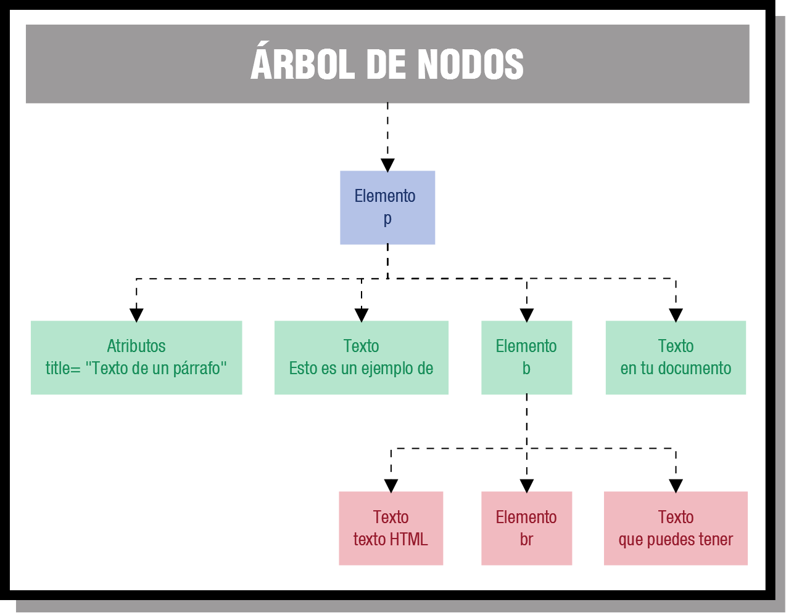

# 3. Buscar nodos en el DOM

Cuando ya se ha construido automáticamente el árbol de nodos del DOM, ya podemos comenzar a utilizar sus funciones para acceder a cualquier nodo del árbol. El acceder a un nodo del árbol, es lo equivalente a acceder a un fragmento de la página de nuestro documento. Así que, una vez que hemos accedido a esa parte del documento, ya podemos modificar valores, crear y añadir nuevos elementos, moverlos de sitio, etc.

Para acceder a un nodo específico lo podemos hacer empleando dos métodos: o bien a través de los nodos padre, o bien usando un método de acceso directo. A través de los nodos padre partiremos del nodo raíz e iremos accediendo a los nodos hijo, y así sucesivamente hasta llegar al elemento que deseemos. Y para el método de acceso directo, que por cierto es el método más utilizado, emplearemos funciones del DOM, que nos permiten ir directamente a un elemento sin tener que atravesar nodo a nodo.

Algo muy importante que tenemos que destacar es, que para que podamos acceder a todos los nodos de un árbol, el árbol tiene que estar completamente construido, es decir, cuando la página haya sido cargada por completo, en ese momento es cuando podremos acceder a cualquier elemento de dicha página.

Los métodos más comunes para encontrar nodos son:

- `getElementById(id)`: Encuentra un elemento por su ID.
- `getElementsByTagName(tag)`: Encuentra todos los elementos con un nombre de etiqueta específico.
- `getElementsByName(name)`: Encuentra todos los elementos con un nombre especificado.
- `querySelector(selector)`: Devuelve el primer elemento que coincide con un selector CSS o etiqueta HTML.
- `querySelectorAll(selector)`: Devuelve todos los elementos que coinciden con un selector CSS o etiqueta HTML.

## 3.1 Métodos más comunes

### 3.1.1 getElementById

La función `getElementById(identificados)` devuelve un elemento DOM del subárbol cuyo identificador sea el indicado en la cadena “identificador”.

??? example "Ejemplo 1: getElementById(identificador)"
    === "index.html"

        ```html
        <!DOCTYPE html>
        <html lang="es">
        <head>
            <meta charset="UTF-8">
            <title>Carrito de compra</title>
            <script src="app.js" defer></script>
            <style>
                body {
                    font-family: Arial;
                }

                .fila {
                    display: flex;
                    gap: 20px;
                    margin-bottom: 10px;
                }

                .col {
                    width: 120px;
                }

                .titulo {
                    font-weight: bold;
                }

                #total {
                    margin-top: 20px;
                    font-size: 18px;
                    font-weight: bold;
                }
            </style>
        </head>
        <body>

        <h2>Carrito de compra</h2>

        <!-- Cabecera -->
        <div class="fila titulo">
            <div class="col">Artículo</div>
            <div class="col">Cantidad</div>
            <div class="col">Precio (€)</div>
        </div>

        <!-- Producto 1 -->
        <div class="fila">
            <div class="col">Teclado</div>
            <div class="col"><input type="number" id="cantidad1" value="0"></div>
            <div class="col"><input type="number" id="precio1" value="20"></div>
        </div>

        <!-- Producto 2 -->
        <div class="fila">
            <div class="col">Ratón</div>
            <div class="col"><input type="number" id="cantidad2" value="0"></div>
            <div class="col"><input type="number" id="precio2" value="10"></div>
        </div>

        <!-- Producto 3 -->
        <div class="fila">
            <div class="col">Monitor</div>
            <div class="col"><input type="number" id="cantidad3" value="0"></div>
            <div class="col"><input type="number" id="precio3" value="150"></div>
        </div>

        <!-- Botón -->
        <button onclick="calcularTotal()">Calcular total</button>

        <!-- Resultado -->
        <div id="total">Total: 0 €</div>

        </body>
        </html>
        ```

    === "app.js"

        ```javascript
        function calcularTotal() {
            let myDiv = null;

            // Producto 1
            let elementC1 = document.getElementById("cantidad1");
            let elementP1 = document.getElementById("precio1");

            // Producto 2
            let elementC2 = document.getElementById("cantidad2");
            let elementP2 = document.getElementById("precio2");

            // Producto 3
            let elementC3 = document.getElementById("cantidad3");
            let elementP3 = document.getElementById("precio3");

            let cantidadC1 = parseInt(elementC1.value);
            let precioP1 = parseInt(elementP1.value);

            let cantidadC2 = parseInt(elementC2.value);
            let precioP2 = parseInt(elementP2.value);

            let cantidadC3 = parseInt(elementC3.value);
            let precioP3 = parseInt(elementP3.value);

            // Cálculo total
            let total = (cantidadC1 * precioP1) + (cantidadC2 * precioP2) + (cantidadC3 * precioP3);

            // Mostrar resultado
            document.getElementById("total").textContent = "Total: " + total + " €";
            
            myDiv = document.getElementById("total");
            console.log(myDiv.textContent);
        }
        ```
<!--
!!! example "Ejemplo 1: getElementById(identificador)"
    ```html
    <!DOCTYPE html>
    <html>
        <body>
            <h1>The Document Object</h1>
            <h2>The getElementById() Method</h2>
            <p id="demo"></p>
            <script>
                document.getElementById("demo").innerHTML = "Hello World";
            </script>
        </body>
    </html>
    ```
!!! example "Ejemplo 2: getElementById(identificador)"
    ```html
    <!DOCTYPE html>
    <html>
        <body>
            <h1>The Document Object</h1>
            <h2>The getElementById() Method</h2>
            <div id = "miDiv">
                <p id = "demo">Hello World</p>
            </div>
            <script>
                let myDiv = document.getElementById("miDiv");
                console.log("El html de miDiv es " + myDiv.innerHTML);
            </script>
        </body>
    </html>
    ```
-->

### 3.1.2 getElementsByTagName

La función `getElementsByTagName(etiqueta)` devuelve una array con todos los elementos DOM del subárbol cuya etiqueta HTML sea la indicada en la cadena **etiqueta**.

??? example "Ejemplo 1: getElementsByTagName(etiqueta)"
    === "index.html"

        ```html
        <!DOCTYPE html>
        <html>
            <body>
                <h1>DOM</h1>
                <script src="app.js" defer></script>
                <h2>Método getElementsByTagName()</h2>

                <div id = "miDiv">
                    <p>Una lista desordenada:</p>
                    <ul>
                        <li>Cafe</li>
                        <li>Tea</li>
                        <li>Leche</li>
                    </ul>

                    <p>El texto del segundo elemento li es:</p>
                    <p id="demo"></p>
                    <!-- Botón -->
                    <button onclick="metodogetElementsByTagName()">Ejecutar</button>
                </div>
            </body>
        </html>
        ```

    === "app.js"

        ```javascript
        function metodogetElementsByTagName() {
            let collection = document.getElementsByTagName("li");
            document.getElementById("demo").innerHTML = collection[1].innerHTML;

            let myDiv = document.getElementById("miDiv")
            let losP = myDiv.getElementsByTagName("p");
            let num = losP.length;
            console.log("Hay " + num + " <p> elementos en el elemento miDiv");
            console.log("En el primer P el HTML asociado es: " + losP[2].innerHTML);
        }
        ```

??? example "Ejemplo 2: getElementsByTagName(etiqueta)"
    === "index.html"

        ```html
        <!DOCTYPE html>
        <html lang="es">

        <head>
            <meta charset="UTF-8">
            <script src="app.js" defer></script>
            <title>Lista de compra</title>
        </head>

        <body>

            <h2>Lista de la compra</h2>

            <p>Pan: <input type="number" value="1.20"></p>
            <p>Leche: <input type="number" value="0.95"></p>
            <p>Huevos: <input type="number" value="2.50"></p>
            <p>Queso: <input type="number" value="3.10"></p>

            <button onclick="calcularTotal()">Calcular total</button>

            <p id="resultado">Total: 0 €</p>

        </body>

        </html>
        ```

    === "app.js"

        ```javascript
        function calcularTotal() {
            let total = 0;
            let i = 0;

            // Selecciona TODOS los input de la página
            let inputs = document.getElementsByTagName("input");

            // Recorremos todos los inputs
            while(i < inputs.length) {
                let valor = parseFloat(inputs[i].value);

                if(isNaN(valor)) {
                    valor = 0;
                }

                total = total + valor;

                i++;
            }

            document.getElementById("resultado").textContent = "Total: " + total + " €";
        }
        ```

<!--
!!! example "Ejemplo 1: getElementsByTagName(etiqueta)"
    ```html
    <!DOCTYPE html>
    <html>
        <body>
            <h1>The Document Object</h1>
            <h2>The getElementsByTagName() Method</h2>

            <p>An unordered list:</p>
            <ul>
                <li>Coffee</li>
                <li>Tea</li>
                <li>Milk</li>
            </ul>

            <p>The innerHTML of the second li element is:</p>
            <p id="demo"></p>

            <script>
                const collection = document.getElementsByTagName("li");
                document.getElementById("demo").innerHTML = collection[1].innerHTML;
            </script>
        </body>
    </html>
    ```

!!! example "Ejemplo 2: getElementsByTagName(etiqueta)"
    ```html
    <!DOCTYPE html>
    <html>
        <body>
            <h1>The Document Object</h1>
            <h2>The getElementsByTagName() Method</h2>

            <div id = "miDiv">
                <p>An unordered list:</p>
                <ul>
                    <li>Coffee</li>
                    <li>Tea</li>
                    <li>Milk</li>
                </ul>

                <p>The text of the second li element is:</p>
                <p>Tea</p>
            </div>

            <script>
                let myDiv = document.getElementById("miDiv")
                let losP = myDiv.getElementsByTagName("p");
                let num = losP.length;
                console.log("Hay " + num + " <p> elementos en el elemento miDiv");
                console.log("En el primer P el HTML asociado es " + losP[0].innerHTML);
            </script>
        </body>
    </html>
    ```
-->

### 3.1.3 getElementsByName

La función `getElementsByName(nombre)` devuelve una array con todos los elementos DOM del subárbol cuya atributo `name` sea el indicado en la cadena *nombre*.

??? example "Ejemplo 1: getElementsByName(nombre)"
    === "index.html"

        ```html
        <!DOCTYPE html>
        <html>
            <head>
                <meta charset="UTF-8">
                <script src="app.js" defer></script>
                <title>Método getElementsByName</title>
            </head>
            <body>
                <h1>Document Object Model</h1>
                <h2>Método getElementsByName</h2>

                <p>Nombre: <input name="fname" type="text" value="Michael"></p>
                <p>Nombre: <input name="fname" type="text" value="Doug"></p>

                <p>El nombre del primero elemento con el atributo name igual a "fname" es:</p>
                <button onclick="obtenerNombre()">Obtener Nombre</button>
                <p id="demo"></p>
            </body>
        </html>
        ```

    === "app.js"

        ```javascript
        function obtenerNombre() {
            let elements = document.getElementsByName("fname");
            document.getElementById("demo").innerHTML = elements[0].tagName;
        }
        ```

??? example "Ejemplo 2: getElementsByName(nombre)"
    === "index.html"

        ```html
        <!DOCTYPE html>
        <head>
            <meta charset="UTF-8">
            <script src="app.js" defer></script>
            <title>Método getElementsByName</title>
        </head>
        <html>
            <body>
                <h1>Document Object Model</h1>
                <h2>Método getElementsByName</h2>

                Gatos: <input name="animal" type="checkbox" value="Gatos">
                Baloncesto: <input name="deporte" type="checkbox" value="Baloncesto">
                Tenis: <input name="deporte" type="checkbox" value="Tenis">

                <button onclick="seleccionar()">Seleccionar</button>
            </body>
        </html>
        ```

    === "app.js"

        ```javascript
        function seleccionar() {
            let elementos = document.getElementsByName("deporte");
            let i = 0;

            // Todos los textbox que tengan de name deporte, los marcamos
            while(i < elementos.length) {
                if (elementos[i].type === "checkbox") {
                    elementos[i].checked = true;
                }

                i++;
            }
        }
        ```

### 3.1.4 querySelector

La función `querySelector(selector)` devuelve el primero elemento que coincida con el selector CSS o etiqueta HTML pasada por parámetro.

??? example "Ejemplo 1: querySelector(etiqueta)"
    === "index.html"

        ```html
        <!DOCTYPE html>
        <html>
            <head>
                <meta charset="UTF-8">
                <script src="app.js" defer></script>
                <title>Método querySelector</title>
            </head>
            <body>
                <h1>Document Object Model</h1>
                <h2>Método querySelector</h2>

                <h3>Añadir un color de fondo al primer elemento p:</h3>
                <p>Esto es un elemento p.</p>
                <p>Esto es un elemento p.</p>
                <button onclick="cambioColor()">Cambiar Color</button>
            </body>
        </html>
        ```

    === "app.js"

        ```javascript
        function cambioColor() {
            document.querySelector("p").style.backgroundColor = "red";
        }
        ```

??? example "Ejemplo 2: querySelector(selector)"
    === "index.html"

        ```html
        <!DOCTYPE html>
        <html>
            <head>
                <meta charset="UTF-8">
                <script src="app.js" defer></script>
                <title>Método querySelector</title>
            </head>
            <body>
                <h1>Document Object Model</h1>
                <h2>Método querySelector</h2>

                <h3>Añadir un color de fondo al primer elemento p:</h3>
                <p class="example">Esto es un elemento p.</p>
                <p class="example">Esto es un elemento p.</p>
                <button onclick="cambioColor()">Cambiar Color</button>
            </body>
        </html>
        ```

    === "app.js"

        ```javascript
        function cambioColor() {
            document.querySelector(".example").style.backgroundColor = "red";
        }
        ```

### 3.1.5 querySelectorAll

La función `querySelectorAll(selector)` todos los elementos que coincidan con el selector CSS o etiqueta HTML pasada por parámetro.

??? example "Ejemplo 1: querySelectorAll(selector)"
    === "index.html"

        ```html
        <!DOCTYPE html>
        <html>
            <head>
                <meta charset="UTF-8">
                <script src="app.js" defer></script>
                <title>Método querySelector</title>
            </head>
            <body>
                <h1>Document Object Model</h1>
                <h2>Método querySelector</h2>

                <p>Añade un color de fondo a todos los elementos con la clase class="example":</p>
                <h2 class="example">Un encabezado</h2>
                <p class="example">Un párrafo</p>
                <button onclick="cambioColor()">Cambiar Color</button>
            </body>
        </html>
        ```

    === "app.js"

        ```javascript
        function cambioColor() {
            let i = 0;
            let nodeList = document.querySelectorAll(".example");

            while(i < nodeList.length) {
                nodeList[i].style.backgroundColor = "red";

                i++;
            }
        }
        ```

## 3.2 Buscar nodos de tipo atributo

Para referenciar un atributo, como por ejemplo el atributo type=”text” del campo “apellidos”, emplearemos la colección **attributes**. Dependiendo del navegador, esta colección se podrá cubrir de diferentes maneras y podrán existir muchos pares en la colección, tantos como atributos tenga el elemento.

!!! example "Ejemplo 1: Imprimir todos los atributos del elemento *apellidos*"
    ```html
    <!DOCTYPE html>
    <html>
        <body>
            <input type="text" id="apellidos" name="apellidos" /> 
            <script>
                document.write("<br/>El elemento <b>apellidos</b> contiene los pares atributo -> valor: <br/>");
                for( let x = 0; x < document.getElementById("apellidos").attributes.length; x++) {
                    let atributo = document.getElementById("apellidos").attributes[x];
                    document.write(atributo.nodeName + " -> " + atributo.nodeValue+"<br/>");
                }
            </script>
        </body>
    </html>
    ```

!!! example "Ejemplo 2: Modificar los valores de un atributo"
    === "Opción 1"

        ```html
        <!DOCTYPE html>
        <html>
            <body>
                <input type="text" id="apellidos" name="apellidos" /> 
                <script>
                    // En este caso hemos modificado el type del campo apellidos y lo hemos puesto de tipo “password”.
                    document.getElementById("apellidos").attributes[0].nodeValue="password";
                </script>
            </body>
        </html>
        ```

    === "Opción 2"

        ```html
        <!DOCTYPE html>
        <html>
            <body>
                <input type="text" id="apellidos" name="apellidos" /> 
                <script>
                    // hemos puesto el nombre del atributo como referencia en el array de atributos.
                    document.getElementById("apellidos").attributes["type"].nodeValue="password";
                </script>
            </body>
        </html>
        ```

    === "Opción 3"

        ```html
        <!DOCTYPE html>
        <html>
            <body>
                <input type="text" id="apellidos" name="apellidos" /> 
                <script>
                    // hemos puesto el atributo como una propiedad del objeto apellidos y lo hemos modificado.
                    document.getElementById("apellidos").type="password";
                </script>
            </body>
        </html>
        ```

## 3.3 Buscar nodos de tipo texto

Para ver cómo podemos acceder a la información textual de un nodo, nos basaremos en el siguiente ejemplo:

!!! example
    ```html
    <!DOCTYPE html>
    <html>
        <body>
            <p title="Texto de un párrafo">Esto es un ejemplo de <b>texto HTML<br/> que puedes tener</b> en tu documento.</p>
        </body>
    </html>
    ```

Para poder referenciar el fragmento “texto HTML” del nodo `p`, lo que haremos será utilizar la colección `childNodes`. Con la colección childNodes accederemos a los nodos hijo de un elemento, ya sean de tipo elemento o texto.

Aquí puedes ver una imagen del árbol para ese elemento en cuestión:

{ width="700" style="display:block;margin:auto" }

Y el código de JavaScript para mostrar una alerta, con el contenido “texto HTML”, sería:

!!! example
    ```html
    <!DOCTYPE html>
    <html>
        <body>
            <p title="Texto de un párrafo">Esto es un ejemplo de <b>texto HTML<br/> que puedes tener</b> en tu documento.</p>

            <script>
                alert(document.getElementsByTagName("p")[0].childNodes[1].childNodes[0].nodeValue);
            </script>
        </body>
    </html>
    ```

- **childNodes[1]**: selecciona el segundo hijo de `<p>` que sería el elemento `<b>` (el primer hijo es un nodo de tipo Texto “Esto es un…”).
- **childNodes[0]**: selecciona el primer hijo del elemento `<b>` que es el nodo de texto “texto HTML”.
  
En lugar de *childNodes[0]* también podríamos haber utilizado **firstChild**, el cuál nos devuelve el primer hijo de un nodo.

!!! example
    ```html
    <!DOCTYPE html>
    <html>
        <body>
            <p title="Texto de un párrafo">Esto es un ejemplo de <b>texto HTML<br/> que puedes tener</b> en tu documento.</p>

            <script>
                alert(document.getElementsByTagName("p")[0].childNodes[1].firstChild.nodeValue);
            </script>
        </body>
    </html>
    ```

El tamaño máximo de lo que se puede almacenar en un nodo de texto, depende del navegador, por lo que muchas veces, si el texto es muy largo, tendremos que consultar varios nodos para ver todo el contenido.

## 3.4 Ejercicios

### 3.4.1 getElementById

!!! note "Ejercicios getElementById"

    ??? example "Ejercicio 1: Calculadora de gastos del hogar. Completar el fichero app.js para que al introducir todos los gatos muestre la suma de todos ellos."
                
        === "index.html"

            ```html
            <!DOCTYPE html>
            <html lang="es">

            <head>
                <meta charset="UTF-8">
                <script src="app.js" defer></script>
                <title>Gastos del hogar</title>
            </head>

            <body>
                <h2>Calculadora de gastos mensuales</h2>

                <p>Luz (€): <input type="number" id="luz"></p>
                <p>Agua (€): <input type="number" id="agua"></p>
                <p>Internet (€): <input type="number" id="internet"></p>
                <p>Supermercado (€): <input type="number" id="super"></p>

                <button onclick="calcularGastos()">Calcular total</button>

                <p id="resultado">Total: 0 €</p>
            </body>

            </html>
            ```
        === "app.js"

            ```javascript
            function calcularGastos() {
                // 1. Obtenemos el valor de la luz a partir del id = luz (getElementById)

                // 2. Obtenemos el valor del agua a partir del id = agua (getElementById)

                // 3. Obtenemos el valor del internet a partir del id = internet 

                // 4. Obtenemos el valor del super a partir del id = super 

                // 5. Sumamos todos los precios

                // 6. Mostramos el precio total en el elemento <p id = 'resultado'>
            }
            ```

        === "SOLUCIÓN"

            ```javascript
            function calcularGastos() {
                // 1. Obtenemos el valor de la luz a partir del id = luz (getElementById)
                let luz = parseFloat(document.getElementById("luz").value);

                // 2. Obtenemos el valor del agua a partir del id = agua (getElementById)
                let agua = parseFloat(document.getElementById("agua").value);

                // 3. Obtenemos el valor del internet a partir del id = internet 
                let internet = parseFloat(document.getElementById("internet").value);

                // 4. Obtenemos el valor del super a partir del id = super 
                let superm = parseFloat(document.getElementById("super").value);

                // 5. Sumamos todos los precios
                let total = luz + agua + internet + superm;

                // 6. Mostramos el precio total en el elemento <p id = 'resultado'>
                document.getElementById("resultado").textContent = "Total: " + total + " €";
            }
            ```

    ??? example "Ejercicio 2: Calculadora de propina en restaurante. Completar el fichero app.js para calcular la 'propina' y el 'total'. La 'propina' se calcula con la siguiente fórmula: cuenta * porcentaje / 100; El total se calcula con la siguiente fórmula: cuenta + propina"
                
        === "index.html"

            ```html
            <!DOCTYPE html>
            <html lang="es">

            <head>
                <meta charset="UTF-8">
                <script src="app.js" defer></script>
                <title>Propina</title>
            </head>

            <body>

                <h2>Calculadora de propina</h2>

                <p>Total de la cuenta (€): <input type="number" id="cuenta"></p>
                <p>Porcentaje de propina (%): <input type="number" id="propina" value="10"></p>

                <button onclick="calcularPropina()">Calcular</button>

                <p id="resultado">Propina: 0 €</p>
                <p id="totalFinal">Total a pagar: 0 €</p>

            </body>

            </html>
            ```
        === "app.js"

            ```javascript
            function calcularPropina() {
                // 1. Obtenemos el valor de cuenta

                // 2. Obtenemos el valor del porcentaje

                // 3. Calculamos la propina con la siguiente fórmula: cuenta * porcentaje / 100

                // 4. Obtenemos el total con la siguiente fórmula: cuenta + propina

                // 5. Mostramos en el elemento <p id = 'resultado'> la propina

                // 6. Mostramos en el elemento <p id = 'totalFinal'> el total.
            }
            ```

        === "SOLUCIÓN"

            ```javascript
            function calcularPropina() {
                // 1. Obtenemos el valor de cuenta
                let cuenta = parseFloat(document.getElementById("cuenta").value);

                // 2. Obtenemos el valor del porcentaje
                let porcentaje = parseFloat(document.getElementById("propina").value);

                // 3. Calculamos la propina con la siguiente fórmula: cuenta * porcentaje / 100
                let propina = cuenta * porcentaje / 100;

                //4. Obtenemos el total con la siguiente fórmula: cuenta + propina
                let total = cuenta + propina;

                // 5. Mostramos en el elemento <p id = 'resultado'> la propina
                document.getElementById("resultado").textContent = "Propina: " + propina + " €";

                // 6. Mostramos en el elemento <p id = 'totalFinal'> el total.
                document.getElementById("totalFinal").textContent = "Total a pagar: " + total + " €";
            }
            ```

    ??? example "Ejercicio 3: Calculadora de consumo de gasolina. Completar el fichero app.js para calcular los litros consumidos y coste total de un trayento en coche. Los **litros** se calculan con la siguiente fórmula: km * consumo / 100; El **coste total** se calcula con la siguiente fórmula: litros * precio."
                
        === "index.html"

            ```html
            <!DOCTYPE html>
            <html lang="es">

            <head>
                <meta charset="UTF-8">
                <script src="app.js" defer></script>
                <title>Consumo de gasolina</title>
            </head>

            <body>

                <h2>Calculadora de gasto en gasolina</h2>

                <p>Kilómetros recorridos: <input type="number" id="km"></p>
                <p>Consumo (litros cada 100 km): <input type="number" id="consumo"></p>
                <p>Precio gasolina (€/litro): <input type="number" id="precio"></p>

                <button onclick="calcularGasto()">Calcular gasto</button>

                <p id="litros">Litros consumidos: 0</p>
                <p id="resultado">Coste total: 0 €</p>

            </body>

            </html>
            ```
        === "app.js"

            ```javascript
            function calcularGasto() {
                // 1. Obtenemos el valor de los kilometros

                // 2. Obtenemos el valor del consumo

                // 3. Obtenemos el valor del precio gasolina

                // 4. Calculamos los litros con la siguiente fórmula: km * consumo / 100

                // 5. Calculamos el coste total con la siguiente fórmula: litros * precio

                // 6. Mostramos en el elemento <p id = 'litros'> los litros consumidos

                // 7. Mostramos en el elemento <p id = 'resultado'> el coste total
            }
            ```

        === "SOLUCIÓN"

            ```javascript
            function calcularGasto() {
                // 1. Obtenemos el valor de los kilometros
                let km = parseFloat(document.getElementById("km").value);

                // 2. Obtenemos el valor del consumo
                let consumo = parseFloat(document.getElementById("consumo").value);

                // 3. Obtenemos el valor del precio gasolina
                let precio = parseFloat(document.getElementById("precio").value);

                // 4. Calculamos los litros con la siguiente fórmula: km * consumo / 100
                let litros = (km * consumo) / 100;

                // 5. Calculamos el coste total con la siguiente fórmula: litros * precio
                let total = litros * precio;

                // 6. Mostramos en el elemento <p id = 'litros'> los litros consumidos
                document.getElementById("litros").textContent = 
                    "Litros consumidos: " + litros.toFixed(2);

                // 7. Mostramos en el elemento <p id = 'resultado'> el coste total
                document.getElementById("resultado").textContent = 
                    "Coste total: " + total.toFixed(2) + " €";
            }
            ```

### 3.4.2 getElementsByTagName

!!! note "Ejercicios getElementsByTagName"

    ??? example "Ejercicio 1: Cálculo de horas trabajadas. Completar el fichero app.js para que al introducir las horas trabajadas en cada uno de los días de la semana muestre la suma de todas ellas."
                
        === "index.html"

            ```html
            <!DOCTYPE html>
            <html lang="es">

            <head>
                <meta charset="UTF-8">
                <script src="app.js" defer></script>
                <title>Horas trabajadas</title>
            </head>

            <body>

                <h2>Control de horas semanales</h2>

                <p>Lunes: <input type="number"></p>
                <p>Martes: <input type="number"></p>
                <p>Miércoles: <input type="number"></p>
                <p>Jueves: <input type="number"></p>
                <p>Viernes: <input type="number"></p>

                <button onclick="calcularHoras()">Calcular total</button>

                <p id="resultado">Horas totales: 0</p>

            </body>

            </html>
            ```
        === "app.js"

            ```javascript
            function calcularHoras() {
                let total = 0, i = 0, horas = 0;

                // 1. Obtener todos los inputs a partir del nombre del tag = input (getElementsByTagName)

                // 2. Recorrer todos los inputs y sumar las horas de todos los días. Asignar la suma de las horas a la variable 'horas'

                // 3. Mostrar la suma de las horas en la etiqueta <p id='resultado'>
            }
            ```

        === "SOLUCIÓN"

            ```javascript
            function calcularHoras() {
                let total = 0, i = 0, horas = 0;

                // 1. Obtener todos los inputs a partir del nombre del tag = input (getElementsByTagName)
                let inputs = document.getElementsByTagName("input");

                // 2. Recorrer todos los inputs y sumar las horas de todos los días. Asignar la suma de las horas a la variable 'horas'
                while(i < inputs.length) {
                    horas = parseFloat(inputs[i].value);

                    if(isNaN(horas)) {
                        horas = 0;
                    }

                    total = total +  horas;

                    i++;
                }

                // 3. Mostrar la suma de las horas en la etiqueta <p id='resultado'>
                document.getElementById("resultado").textContent = "Horas totales: " + total;
            }
            ```

    ??? example "Ejercicio 2: Control horas extra. Completar el fichero app.js para que al introducir las horas trabajadas en cada uno de los días de la semana muestre la suma de todas ellas. Además, se debe indicar el mensaje '!Has hecho horas extra¡' si la suma de las horas es mayor/igual a 40 horas; o el mensaje '!No hay horas extra¡' si la suma de las horas es menor a 40 horas."
                
        === "index.html"

            ```html
            <!DOCTYPE html>
            <html lang="es">

            <head>
                <meta charset="UTF-8">
                <script src="app.js" defer></script>
                <title>Horas extra</title>
            </head>

            <body>

                <h2>Horas trabajadas</h2>

                <p>Día 1: <input type="number"></p>
                <p>Día 2: <input type="number"></p>
                <p>Día 3: <input type="number"></p>
                <p>Día 4: <input type="number"></p>
                <p>Día 5: <input type="number"></p>

                <button onclick="calcular()">Calcular</button>

                <p id="resultado"></p>
                <p id="extra"></p>

            </body>

            </html>
            ```
        === "app.js"

            ```javascript
            function calcular() {
                let total = 0, horas = 0, i = 0;

                // 1. Obtener todos los inputs a partir del nombre del tag = input (getElementsByTagName)

                // 2. Recorrer todos los inputs y sumar las horas de todos los días. Asignar la suma a la variable 'total'

                // 3. Mostrar la suma de las horas en la etiqueta <p id='resultado'>

                // 4. Si el total de horas el superior a 40 mostrar el mensaje: 'Has hecho horas extra', sino, mostrar 'No hay horas extra' en la etiqueta <p id = 'extra'>
            }
            ```

        === "SOLUCIÓN"

            ```javascript
            function calcular() {
                let total = 0, horas = 0, i = 0;

                // 1. Obtener todos los inputs a partir del nombre del tag = input (getElementsByTagName)
                let inputs = document.getElementsByTagName("input");

                // 2. Recorrer todos los inputs y sumar las horas de todos los días. Asignar la suma a la variable 'total'
                while(i < inputs.length) {
                    horas = parseFloat(inputs[i].value);

                    if(isNaN(horas)) {
                        horas = 0;
                    }

                    total = total +  horas;

                    i++;
                }

                // 3. Mostrar la suma de las horas en la etiqueta <p id='resultado'>
                document.getElementById("resultado").textContent = "Horas totales: " + total;

                // 4. Si el total de horas el superior a 40 mostrar el mensaje: 'Has hecho horas extra', sino, mostrar 'No hay horas extra' en la etiqueta <p id = 'extra'>
                if (total > 40) {
                    document.getElementById("extra").textContent = "Has hecho horas extra";
                } else {
                    document.getElementById("extra").textContent = "No hay horas extra";
                }
            }
            ```

    ??? example "Ejercicio 3: Cálculo de factura con IVA y descuento. Completar el fichero app.js para que calcule los siguientes valores: **Subtotal**: es la suma de todas las facturas; **IVA (21%)**: es el resultado de multiplicar el subtotal por el 0,21 (subtotal * 0,21); **Total**: se obtiene sumando el 'iva + subtotal'; **Descuento**: si el 'total' es mayor a 100 se decuenta el 10% del total (total - (total * 0,10))."
                
        === "index.html"

            ```html
            <!DOCTYPE html>
            <html lang="es">

            <head>
                <meta charset="UTF-8">
                <script src="app.js" defer></script>
                <title>Factura</title>
            </head>

            <body>

                <h2>Factura de productos</h2>

                <p>Producto 1 (€): <input type="number"></p>
                <p>Producto 2 (€): <input type="number"></p>
                <p>Producto 3 (€): <input type="number"></p>

                <button onclick="calcularFactura()">Calcular factura</button>

                <p id="subtotal">Subtotal: 0 €</p>
                <p id="iva">IVA (21%): 0 €</p>
                <p id="descuento"></p>
                <p id="total">Total: 0 €</p>

            </body>

            </html>
            ```
        === "app.js"

            ```javascript
            function calcularFactura() {
                let subtotal = 0, factura = 0, i = 0;

                // 1. Obtener todos los inputs a partir del nombre del tag = input (getElementsByTagName)

                // 2. Recorrer todos los inputs y sumar los precios. Guardar la suma en la variable subtotal.

                // 3. Calcular el iva aplicando la fórmula 'subtotal * 0.21' y guardar el resultado en una varibale llamada 'iva'

                // 4. Calcular el total con el iva aplicado aplicando la fórmula 'subtotal + iva'. Guardar el resultado en una varibale llamada 'total'.

                // 5. Si el total es mayor a 100, aplicar el 10% de descuento al total. Para ello aplicar la fórmula 'total - (total * 0,1)' y almacenar el resultado en la variable 'total'. 

                // 6. Mostrar el <p id = "subtotal"> la suma de todos los precios, es decir, mostrar la variable 'subtotal'.

                // 7. Mostrar en <p id = "iva"> el iva calculado, es decir, mostrar la variable 'iva'.

                // 8. Si el total es > a 100, mostrar en <p id = "descuento"> el mensaje: "Descuento aplicado + (total * 0.10)", en caso que total no sea mayor a 100, se debe mostrar el mensaje: 'Sin descuento'

                // 9. Mostrar en <p id = 'total'> el total.
            }
            ```

        === "SOLUCIÓN"

            ```javascript
            function calcularFactura() {
                let subtotal = 0, factura = 0, i = 0;

                // 1. Obtener todos los inputs a partir del nombre del tag = input (getElementsByTagName)
                let inputs = document.getElementsByTagName("input");

                // 2. Recorrer todos los inputs y sumar los precios. Guardar la suma en la variable subtotal.
                while(i < inputs.length) {
                    factura = parseFloat(inputs[i].value);

                    if(isNaN(factura)) {
                        factura = 0;
                    }

                    subtotal = subtotal +  factura;

                    i++;
                }

                // 3. Calcular el iva aplicando la fórmula 'subtotal * 0.21' y guardar el resultado en una varibale llamada 'iva'
                let iva = subtotal * 0.21;

                // 4. Calcular el total con el iva aplicado aplicando la fórmula 'subtotal + iva'. Guardar el resultado en una varibale llamada 'total'.
                let total = subtotal + iva;

                // 5. Si el total es mayor a 100, aplicar el 10% de descuento al total. Para ello aplicar la fórmula 'total - (total * 0,1)' y almacenar el resultado en la variable 'total'. 
                let descuento = 0;
                if (total > 100) {
                    descuento = total * 0.10; // 10% descuento
                    total = total - descuento;
                }

                // 6. Mostrar el <p id = "subtotal"> la suma de todos los precios, es decir, mostrar la variable 'subtotal'.
                document.getElementById("subtotal").textContent = "Subtotal: " + subtotal.toFixed(2) + " €";

                // 7. Mostrar en <p id = "iva"> el iva calculado, es decir, mostrar la variable 'iva'.
                document.getElementById("iva").textContent = "IVA (21%): " + iva.toFixed(2) + " €";

                // 8. Si el total es > a 100, mostrar en <p id = "descuento"> el mensaje: "Descuento aplicado + (total * 0.10)", en caso que total no sea mayor a 100, se debe mostrar el mensaje: 'Sin descuento'
                if (descuento > 0) {
                    document.getElementById("descuento").textContent = "Descuento aplicado: -" + descuento.toFixed(2) + " €";
                } else {
                    document.getElementById("descuento").textContent = "Sin descuento";
                }

                // 9. Mostrar en <p id = 'total'> el total.
                document.getElementById("total").textContent =
                    "Total final: " + total.toFixed(2) + " €";
            }
            ```

    ??? example "Ejercicio 4: Cálculo de nómina sencilla (salario + extras). Completar el fichero app.js para que calcule los siguientes valores: Horas Totales: es la suma de todas las horas; Salario Base: es el resultado de multiplicar las horas totales por el precio/hora; Bonus: tomará el valor 50 si el total de horas es mayor a 40 horas, sino, tomará el valor cero; Extra Total a Cobrar: es la suma del total y el bonús."
                
        === "index.html"

            ```html
            <!DOCTYPE html>
            <html lang="es">

            <head>
                <meta charset="UTF-8">
                <script src="app.js" defer></script>
                <title>Nómina</title>
            </head>

            <body>

                <h2>Cálculo de nómina</h2>

                <p>Precio por hora (€): <input type="number" id="precioHora" value="10"></p>

                <h3>Horas trabajadas en la semana</h3>

                <p>Lunes: <input type="number"></p>
                <p>Martes: <input type="number"></p>
                <p>Miércoles: <input type="number"></p>
                <p>Jueves: <input type="number"></p>
                <p>Viernes: <input type="number"></p>

                <button onclick="calcularNomina()">Calcular nómina</button>

                <p id="horas">Horas totales: 0</p>
                <p id="salario">Salario base: 0 €</p>
                <p id="extra">Bonus: 0 €</p>
                <p id="total">Total a cobrar: 0 €</p>

            </body>

            </html>
            ```
        === "app.js"

            ```javascript
            function calcularNomina() {
                let totalHoras = 0, horas = 0, i = 0;

                // 1. Obtener todos los inputs a partir del id = precioHora (getElementById)

                // 2. Obtener los inputs del elemento obtenido en el punto 1 (getElementsByTagName)

                // 3. Recorrer todos los inputs y sumar las horas. Se debe empezar en i = 1 para saltar el input del precio. La suma de las horas se debe almacenar en la variable 'totalHoras'

                // 4. Calcular el salario multiplicando el total de horas por el precio (totalHoras * precio). Almacenar el resultado 'total'.

                // 5. Si el total de horas el mayor a 40, se sumará al total un bonus de 50 euros (total + 50). Almacenar el resultado en la variable 'total'.

                // 6. Mostrar en <p id = 'horas'> el total de horas: "Horas totales + totalHoras".

                // 7. Mostrar en <p id = 'salario'> el salario: "Salario base + (totalHoras * precio)".

                // 8. Si el totalHoras es mayor a 50, se mostrará en <p id = 'extra'> el mensaje: 'Bonus por horas extra + 50', sino, se mostrará el mensaje: 'Sin bonus'

                // 9. Se mostrará en <p id = 'total'> el total
            }
            ```

        === "SOLUCIÓN"

            ```javascript
            function calcularNomina() {
                let totalHoras = 0, horas = 0, i = 0;

                // 1. Obtener todos los inputs a partir del id = precioHora (getElementById)
                let precio = parseFloat(document.getElementById("precioHora").value) || 0;

                // 2. Obtener los inputs del elemento obtenido en el punto 1 (getElementsByTagName)
                let inputs = document.getElementsByTagName("input");

                // 3. Recorrer todos los inputs y sumar las horas. Se debe empezar en i = 1 para saltar el input del precio. La suma de las horas se debe almacenar en la variable 'totalHoras'
                while(i < inputs.length) {
                    horas = parseFloat(inputs[i].value);

                    if(isNaN(horas)) {
                        horas = 0;
                    }

                    totalHoras = totalHoras +  horas;

                    i++;
                }

                // 4. Calcular el salario multiplicando el total de horas por el precio (totalHoras * precio). Almacenar el resultado 'total'.
                let salario = totalHoras * precio;
                let total = salario;

                // 5. Si el total de horas el mayor a 40, se sumará al total un bonus de 50 euros (total + 50). Almacenar el resultado en la variable 'total'.
                let bonus = 0;
                if (totalHoras > 40) {
                    bonus = 50;
                    total = total + bonus;
                }

                // 6. Mostrar en <p id = 'horas'> el total de horas: "Horas totales + totalHoras".
                document.getElementById("horas").textContent = "Horas totales: " + totalHoras;

                // 7. Mostrar en <p id = 'salario'> el salario: "Salario base + (totalHoras * precio)".
                document.getElementById("salario").textContent = "Salario base: " + salario.toFixed(2) + " €";

                // 8. Si el totalHoras es mayor a 50, se mostrará en <p id = 'extra'> el mensaje: 'Bonus por horas extra + 50', sino, se mostrará el mensaje: 'Sin bonus'
                if (bonus > 0) {
                    document.getElementById("extra").textContent = "Bonus por horas extra: +" + bonus + " €";
                } else {
                    document.getElementById("extra").textContent = "Sin bonus";
                }

                // 9. Se mostrará en <p id = 'total'> el total
                document.getElementById("total").textContent = "Total a cobrar: " + total.toFixed(2) + " €";
            }
            ```

    ??? example "Ejercicio 5: Carrito dentro de una sección. Completar el fichero app.js para que calcule la suma del precio de todos los productos. Sólo se puede recuperar los elementos del elemento `<div id = 'carrito'>`. Se deben obtener los hijos de tipo input del elemento `<div id='carrito'>`."
                
        === "index.html"

            ```html
            <!DOCTYPE html>
            <html lang="es">

            <head>
                <meta charset="UTF-8">
                <script src="app.js" defer></script>
                <title>Carrito por sección</title>
            </head>

            <body>

                <h2>Tienda</h2>

                <!-- SECCIÓN DEL CARRITO -->
                <div id="carrito">
                    <h3>Productos seleccionados</h3>

                    <p>Producto 1 (€): <input type="number" value="10"></p>
                    <p>Producto 2 (€): <input type="number" value="20"></p>
                    <p>Producto 3 (€): <input type="number" value="5"></p>
                </div>

                <!-- OTROS INPUTS (NO DEBEN CONTAR) -->
                <h3>Otros datos</h3>
                <p>Nombre: <input type="text" value="Pepe López"></p>
                <p>Dirección: <input type="text" value="C/ Constitución, Callosa de Segura"></p>
                <p>E-mail: <input type="text" value="pepe@hotmail.com"></p>

                <button onclick="calcularTotal()">Calcular total</button>

                <p id="resultado">Total: 0 €</p>

            </body>

            </html>
            ```
        === "app.js"

            ```javascript
            function calcularTotal() {
                let total = 0, precio = 0, i = 0;

                // 1. Seleccionamos el elemento con id = carrito (getElementById)

                // 2. Dentro del carrito buscamos los inputs a partir del nombre del tag = input (getElementsByTagName)

                // 3. Recorremos todos los inputs y sumamos los precios. Almacenamos la suma en la variable 'total'.

                // 4. Mostramos el total en el elemento <p id = "resultado"> con el siguiente mensaje: "Total: + total + €"
            }
            ```

        === "SOLUCIÓN"

            ```javascript
            function calcularTotal() {
                let total = 0, precio = 0, i = 0;

                // 1. Seleccionamos el elemento con id = carrito (getElementById)
                let carrito = document.getElementById("carrito");

                // 2. Dentro del carrito buscamos los inputs a partir del nombre del tag = input (getElementsByTagName)
                let inputs = carrito.getElementsByTagName("input");

                // 3. Recorremos todos los inputs y sumamos los precios. Almacenamos la suma en la variable 'total'.
                while(i < inputs.length) {
                    precio = parseFloat(inputs[i].value);

                    if(isNaN(precio)) {
                        precio = 0;
                    }

                    total = total +  precio;

                    i++;
                }

                // 4. Mostramos el total en el elemento <p id = "resultado"> con el siguiente mensaje: "Total: + total + €"
                document.getElementById("resultado").textContent = "Total: " + total + " €";
            }
            ```

### 3.4.3 getElementsByName

!!! note "Ejercicios getElementsByName"

    ??? example "Ejercicio 1: Cita médica con servicios. Completar el fichero app.js para que calcule el precio de una visita médico. El precio final dependerá del tipo de seguro mético. Si el tipo de seguro es 'público' se pagará la mitad del precio total de todos los servicios utilizados, pero si el seguro es 'privado', se pagará de forma completa todos los servicios utilizados."
                
        === "index.html"

            ```html
            <!DOCTYPE html>
            <html lang="es">

            <head>
                <meta charset="UTF-8">
                <script src="app.js" defer></script>
                <title>Cita médica</title>
            </head>

            <body>

                <h2>Servicios médicos</h2>

                <div id="servicios">
                    <p>Consulta (€): <input type="number" value="50"></p>
                    <p>Análisis (€): <input type="number" value="30"></p>
                    <p>Radiografía (€): <input type="number" value="40"></p>
                </div>

                <h3>Tipo de seguro</h3>
                <input type="radio" name="seguro" value="privado" checked> Privado <br>
                <input type="radio" name="seguro" value="publico"> Público <br>

                <button onclick="calcularTotal()">Calcular coste</button>

                <p id="resultado"></p>

            </body>

            </html>
            ```
        === "app.js"

            ```javascript
            function calcularTotal() {
                let total = 0, precio = 0, i = 0;

                // 1. Obtene el elemento con el id = 'Servicios' (getElementById)

                // 2. Obtener todos los input a partir del nombre del tag = 'input' (getElementsByTagName)

                // 3. Calcular el precio total. Para ello se deben recorrer todos los input y obtener su valor (value).
                // Almacenar en la variable 'total' la suma de precios de todos los productos.

                // 4. Obtener todos los seguros a partir del 'name = seguro' (getElementsByName)

                // 5. Recorrer todos los seguros y obtener el tipo seleccionado. Almacenar el valor (value) del tipo seleccionado en una variable llamada 'tipo'.

                // 6. Si el tipo es público, el total se reduce a la mitad (total * 0,5). Almacenar el resultado en la varibale 'total'.

                // 7. Se escribe en el <p> con id = 'resultado' el precio total con el siguiente mensaje: "Coste total + total + €"
            }
            ```

        === "SOLUCIÓN"

            ```javascript
            function calcularTotal() {
                let total = 0, precio = 0, i = 0;

                // 1. Obtene el elemento con el id = 'Servicios' (getElementById)
                let contenedor = document.getElementById("servicios");

                // 2. Obtener todos los input a partir del nombre del tag = 'input' (getElementsByTagName)
                let inputs = contenedor.getElementsByTagName("input");

                // 3. Calcular el precio total. Para ello se deben recorrer todos los input y obtener su valor (value).
                // Almacenar en la variable 'total' la suma de precios de todos los productos.
                while(i < inputs.length) {
                    precio = parseFloat(inputs[i].value);

                    if(isNaN(precio)) {
                        precio = 0;
                    }

                    total = total +  precio;

                    i++;
                }

                // 4. Obtener todos los seguros a partir del 'name = seguro' (getElementsByName)
                let seguros = document.getElementsByName("seguro");
                let tipo = "", indice = 0;

                // 5. Recorrer todos los seguros y obtener el tipo seleccionado. Almacenar el valor (value) del tipo seleccionado en una variable llamada 'tipo'.
                while(indice < seguros.length) {
                    if (seguros[indice].checked) {
                        tipo = seguros[indice].value;
                    }

                    indice++;
                }

                // 6. Si el tipo es público, el total se reduce a la mitad (total * 0,5). Almacenar el resultado en la varibale 'total'.
                if (tipo === "publico") {
                    total = total * 0.5; // paga la mitad
                }

                // 7. Se escribe en el <p> con id = 'resultado' el precio total con el siguiente mensaje: "Coste total + total + €"
                document.getElementById("resultado").textContent =
                    "Coste total: " + total.toFixed(2) + " €";
            }
            ```

    ??? example "Ejercicio 2: Pedido en restaurante. Completar el fichero app.js para que calcule el precio de una comida. El precio de la comida dependerá si el comensal come en el local y a domicilio. Si el comensal come en el local, el precio total será la suma del 'menú + bebida + postre', pero si come a domicilio se sumarán 3 euros al precio final. Además, se puede dejar propina, la cual se sumará al total a pagar."
                
        === "index.html"

            ```html
            <!DOCTYPE html>
            <html lang="es">

            <head>
                <meta charset="UTF-8">
                <script src="app.js" defer></script>
                <title>Pedido restaurante</title>
            </head>

            <body>

                <h2>Pedido</h2>

                <div id="platos">
                    <p>Menú (€): <input type="number" value="12"></p>
                    <p>Bebida (€): <input type="number" value="2"></p>
                    <p>Postre (€): <input type="number" value="4"></p>
                </div>

                <h3>Tipo de servicio</h3>
                <input type="radio" name="servicio" value="local" checked> Comer en local <br>
                <input type="radio" name="servicio" value="domicilio"> A domicilio <br>

                <p>Propina (€): <input type="number" id="propina" value="0"></p>

                <button onclick="calcularPedido()">Calcular total</button>

                <p id="resultado"></p>

            </body>

            </html>
            ```
        === "app.js"

            ```javascript
            function calcularPedido() {
                let total = 0, precio = 0, i = 0;

                // 1. Obtene el elemento con el id = 'platos'

                // 2. Obtener todos los input a partir del nombre del tag = 'input' (getElementsByTagName)

                // 3. Calcular el precio total. Para ello se deben recorrer todos los input y obtener su valor (value).
                // El precio total es igual a la suma de todos los precios. Almacenar la suma en la variable 'total'.

                // 4. Obtener el valor de la propina a partir del id, y almacenar el valor en una variable llamada 'propina'.

                // 5. Suma la propina al total (total + propina) y almacenar el valor en la variable 'total'.

                // 6. Obtener todos los servicios a partir del 'name = servicio' (getElementsByName)

                // 7. Recorrer todos los servicios y obtener el tipo seleccionado. Almacenar el valor (value) en una variable llamada 'tipo'.

                // 8. Si el tipo es 'domicilio' se suman 3 euros al total (total + 3). Almacenar la suma en la varibale 'total'.

                // 9. Se escribe en el <p> con id = 'resultado' el precio total con el mensaje: "Total a pagar + total + €"
            }
            ```

        === "SOLUCIÓN"

            ```javascript
            function calcularPedido() {
                let total = 0, precio = 0, i = 0;

                // 1. Obtene el elemento con el id = 'platos'
                let contenedor = document.getElementById("platos");

                // 2. Obtener todos los input a partir del nombre del tag = 'input' (getElementsByTagName)
                let inputs = contenedor.getElementsByTagName("input");

                // 3. Calcular el precio total. Para ello se deben recorrer todos los input y obtener su valor (value).
                // El precio total es igual a la suma de todos los precios. Almacenar la suma en la variable 'total'.
                while(i < inputs.length) {
                    precio = parseFloat(inputs[i].value);

                    if(isNaN(precio)) {
                        precio = 0;
                    }

                    total = total +  precio;

                    i++;
                }


                // 4. Obtener el valor de la propina a partir del id, y almacenar el valor en una variable llamada 'propina'.
                let propina = parseFloat(document.getElementById("propina").value);

                // 5. Suma la propina al total (total + propina) y almacenar el valor en la variable 'total'.
                if(isNaN(propina) === false) {
                    total = total + propina;
                }

                // 6. Obtener todos los servicios a partir del 'name = servicio' (getElementsByName)
                let servicios = document.getElementsByName("servicio");
                let tipo = "";
                let indice = 0;

                // 7. Recorrer todos los servicios y obtener el tipo seleccionado. Almacenar el valor (value) en una variable llamada 'tipo'.
                while(indice < servicios.length) {
                    if (servicios[indice].checked) {
                        tipo = servicios[indice].value;
                    }

                    indice++;
                }

                // 8. Si el tipo es 'domicilio' se suman 3 euros al total (total + 3). Almacenar la suma en la varibale 'total'.
                if (tipo === "domicilio") {
                    total = total +  3; // gasto envío
                }

                // 9. Se escribe en el <p> con id = 'resultado' el precio total con el mensaje: "Total a pagar + total + €"
                document.getElementById("resultado").textContent = "Total a pagar: " + total.toFixed(2) + " €";
            }
            ```

    ??? example "Ejercicio 3: Resolver los errores. Completar el fichero app.js para que calcule el precio de una comida. El precio de la comida dependerá si el comensal come en el local y a domicilio. Si el comensal come en el local, el precio total será la suma del 'menú + bebida + postre', pero si come a domicilio se sumarán 3 euros al precio final. Además, se puede dejar propina, la cual se sumará al total a pagar."
                
        === "index.html"

            ```html
            <!DOCTYPE html>
            <html lang="es">

            <head>
                <meta charset="UTF-8">
                <script src="app.js" defer></script>
                <title>Errores</title>
            </head>

            <body>

                <h2>Ventas</h2>

                <div id="ventas">
                    <p>Venta 1: <input type="number" value="10"></p>
                    <p>Venta 2: <input type="number" value="20"></p>
                </div>

                <input type="radio" name="tipo" value="normal" checked> Normal
                <input type="radio" name="tipo" value="vip"> VIP

                <button onclick="calcular()">Calcular</button>

                <p id="resultado"></p>

            </body>

            </html>
            ```
        === "app.js"

            ```javascript
            function calcular() {
                let contenedor = document.getElementById("venta"); // ERROR 1

                let inputs = contenedor.getElementsByTagName("input");

                let total = 0, precio = 0, i = 0;

                while(i <= inputs.length) { // ERROR 2
                    precio = parseFloat(inputs[i].value);

                    if(isNaN(precio)) {
                        precio = 0;
                    }

                    total = total +  precio;

                    i++;
                }

                let tipos = document.getElementsByName("tipo");
                let indice = 0;
                let tipo;

                while(indice < tipos.length) {
                    if (tipos[indice].checked = true) { // ERROR 3
                        tipo = tipos[indice].value;
                    }

                    indice++;
                }

                if (tipo == "vip") {
                    total * 0.8; // ERROR 4
                }

                document.getElementById("resultado").innerHTML =
                    "Total: " + total + " €";
            }
            ```

        === "SOLUCIÓN"

            ```javascript
            function calcular() {
                let contenedor = document.getElementById("ventas"); // ERROR 1

                let inputs = contenedor.getElementsByTagName("input");

                let total = 0, precio = 0, i = 0;

                while(i < inputs.length) { // ERROR 2
                    precio = parseFloat(inputs[i].value);

                    if(isNaN(precio)) {
                        precio = 0;
                    }

                    total = total +  precio;

                    i++;
                }

                let tipos = document.getElementsByName("tipo");
                let tipo;
                let indice = 0;


                while(indice < tipos.length) {
                    if (tipos[indice].checked === true) { // ERROR 3
                        tipo = tipos[indice].value;
                    }

                    indice++;
                }

                if (tipo == "vip") {
                    total = total * 0.8; // ERROR 4
                }

                document.getElementById("resultado").innerHTML =
                    "Total: " + total + " €";
            }
            ```

### 3.4.4 querySelector y querySelectorAll

!!! note "Ejercicios querySelector"

    ??? example "Ejercicio 1: Seleccionar el primer párrafo `<p>` y cambiar su texto para que aparezca: 'Texto modificado'"
                
        === "index.html"

            ```html
            <!DOCTYPE html>
            <html lang="es">
                <head>
                    <meta charset="UTF-8">
                    <script src="app.js" defer></script>
                    <title>Etiqueta</title>
                </head>
                <body>
                    <p>Texto original 1</p>
                    <p>Texto original 2</p>

                    <button onclick="cambiar()">Cambiar texto</button>
                </body>
            </html>
            ```
        === "app.js"

            ```javascript
            function cambiar() {
                
            }
            ```

        === "SOLUCIÓN"

            ```javascript
            function cambiar() {
                let elemento = document.querySelector("p"); // primer <p>
                elemento.textContent = "Texto modificado";
            }
            ```

    ??? example "Ejercicio 2: Cambiar el color del primer elemento que contenga la clase class='destacado'"
                
        === "index.html"

            ```html
            <!DOCTYPE html>
            <html lang="es">
                <head>
                    <meta charset="UTF-8">
                    <script src="app.js" defer></script>
                    <title>Clase</title>
                </head>
                <body>
                    <p class="destacado">Texto importante</p>
                    <p>Texto normal</p>
                    <button onclick="resaltar()">Resaltar</button>
                </body>
            </html>
            ```
        === "app.js"

            ```javascript
            function resaltar() {
                
            }
            ```

        === "SOLUCIÓN"

            ```javascript
            function resaltar() {
                let elemento = document.querySelector(".destacado");
                elemento.style.color = "red";
            }
            ```

    ??? example "Ejercicio 3: Leer el valor del elemento con id='resultado' y mostrarlo por pantalla el mensaje: 'Hola + valor'"
                
        === "index.html"

            ```html
            <!DOCTYPE html>
            <html lang="es">
                <head>
                    <meta charset="UTF-8">
                    <script src="app.js" defer></script>
                    <title>ID</title>
                </head>
                <body>
                    <p>Introduce tu nombre:</p>
                    <input type="text" id="nombre">

                    <button onclick="saludar()">Saludar</button>

                    <p id="resultado"></p>
                </body>
            </html>
            ```
        === "app.js"

            ```javascript
            function saludar() {
                
            }
            ```

        === "SOLUCIÓN"

            ```javascript
            function saludar() {
                let input = document.querySelector("#nombre");
                let nombre = input.value;

                document.querySelector("#resultado").textContent = "Hola " + nombre;
            }
            ```

!!! note "Ejercicios querySelector y querySelectorAll"

    ??? example "Ejercicio 4: Evaluación de alumnos. Calcular la media y el resultado de las notas de un alumno/a. Se debe mostrar la nota media a partir de las notas obtenidas por el alumno/a y el resultado. El resultado mostrará el mensaje 'Aprobado', si la nota media es mayor/igual a 5, o el mensaje 'Suspendo', si la nota media es menor a 5."
                
        === "index.html"

            ```html
            <!DOCTYPE html>
            <html lang="es">
                <head>
                    <meta charset="UTF-8">
                    <script src="app.js" defer></script>
                    <title>Notas</title>
                </head>
                <body>
                    <h2>Notas del alumno</h2>

                    <input type="number" class="nota" value="5">
                    <input type="number" class="nota" value="7">
                    <input type="number" class="nota" value="6">

                    <button onclick="evaluar()">Evaluar</button>

                    <p id="media"></p>
                    <p id="resultado"></p>
                </body>
            </html>
            ```
        === "app.js"

            ```javascript
            function evaluar() {
                let suma = 0, i = 0, nota = 0;

                // 1. Obtener todas las notas con querySelectorAll empleando el atributo class='nota'

                // 2. Recorrer todas las notas y obtener la suma de todas ellas.

                // 3. Calcular la media de las notas sumadas.

                // 4. Mostrar en '<p id="media"></p>' el mensaje: 'Media: + nota' empleando querySelector.

                // 5. Si la media en mayor/igual a 5, mostrar en '<p id="resultado"></p>' el mensaje 'Aprobado', sino, mostrar el mensaje 'Suspendo'. utilizar querySelector.
            }
            ```

        === "SOLUCIÓN"

            ```javascript
            function evaluar() {
                // 1. Obtener todas las notas con querySelectorAll
                let notas = document.querySelectorAll(".nota");

                let suma = 0, i = 0, nota = 0;

                // 2. Recorrer todas las notas y obtener la suma de todas ellas
                while(i < notas.length) {
                    nota = parseFloat(notas[i].value) || 0;

                    suma = suma + nota;

                    i++;
                }

                // 3. Calcular la media de las notas sumadas.
                let media = suma / notas.length;

                // 4. Mostrar en '<p id="media"></p>' el mensaje: 'Media: + nota' empleando querySelector
                document.querySelector("#media").textContent = "Media: " + media.toFixed(2);

                // 5. Si la media en mayor/igual a 5, mostrar en '<p id="resultado"></p>' el mensaje 'Aprobado', sino, mostrar el mensaje 'Suspendo'. utilizar querySelector.
                if (media >= 5) {
                    document.querySelector("#resultado").textContent = "Aprobado";
                } else {
                    document.querySelector("#resultado").textContent = "Suspenso";
                }
            }
            ```

    ??? example "Ejercicio 5: Control de pedidos en tienda. Calcular la venta de diversos pedidos de una tienda. El total se calculará sumando todos los precios de cada venta, además, se podrá aplicar un porcentaje de descuento sobre el total."
                
        === "index.html"

            ```html
            <!DOCTYPE html>
            <html lang="es">
                <head>
                    <meta charset="UTF-8">
                    <script src="app.js" defer></script>
                    <title>Tienda</title>
                </head>
                <body>
                    <h2>Pedidos</h2>

                    <div id="pedidos">
                        <p>Venta 1: <input class="precio" type="number" value="10"></p>
                        <p>Venta 2: <input class="precio" type="number" value="20"></p>
                        <p>Venta 3: <input class="precio" type="number" value="15"></p>
                    </div>

                    <p>Descuento (%): <input type="number" id="descuento" value="0"></p>

                    <button onclick="calcular()">Calcular total</button>

                    <p id="resultado"></p>
                </body>
            </html>
            ```
        === "app.js"

            ```javascript
            function calcular() {
                let total = 0, i = 0, precio = 0;

                // 1. Obtener todos los precios empleando querySelectorAll("#pedidos .precio")

                // 2. Recorrer todos los precios y obtener la suma de todos ellos.

                // 3. Obtener el descuento con querySelector.

                // 4. Si el descuento es mayor a cero, aplicar el descuento sobre el total.

                // 5. Mostrar en '<p id="resultado"></p>' el mensaje: 'Total final + total' con querySelector.
            }
            ```

        === "SOLUCIÓN"

            ```javascript
            function calcular() {
                // 1. Obtener todos los precios empleando querySelectorAll("#pedidos .precio")
                let precios = document.querySelectorAll("#pedidos .precio");

                let total = 0, i = 0, precio = 0;
                
                // 2. Recorrer todos los precios y obtener la suma de todos ellos.
                while(i < precios.length) {
                    precio = parseFloat(precios[i].value) || 0;

                    total = total + precio;

                    i++;
                }

                // 3. Obtener el descuento con querySelector.
                let descuento = parseFloat(document.querySelector("#descuento").value) || 0;

                // 4. Si el descuento es mayor a cero, aplicar el descuento sobre el total.
                if (descuento > 0) {
                    total = total - (total * descuento / 100);
                }

                // 5. Mostrar en '<p id="resultado"></p>' el mensaje: 'Total final + total' con querySelector.
                document.querySelector("#resultado").textContent = "Total final: " + total.toFixed(2) + " €";
            }
            ```

    ??? example "Ejercicio 6: Reserva de hotel. Completar el fichero app.js para que calcule el precio de la reserva de una habitación de hotel. El precio de la comida dependerá si el cliente es 'Normal' o 'VIP'. Si el cliente es 'Normal' el precio final será la suma de los precios de cada noche, sin embargo, si el cliente es 'VIP', al precio total se le descontará un 10%. Además, se puede aplicar un descuento al precio final (total - (total * descuelto / 100))."
                
        === "index.html"

            ```html
            <!DOCTYPE html>
            <html lang="es">
                <head>
                    <meta charset="UTF-8">
                    <script src="app.js" defer></script>
                    <title>Reserva hotel</title>
                </head>
                <body>
                    <h2>Reserva de habitación</h2>

                    <div id="habitaciones">
                        <p>Noche 1 (€): <input type="number" class="precio" value="50"></p>
                        <p>Noche 2 (€): <input type="number" class="precio" value="50"></p>
                        <p>Noche 3 (€): <input type="number" class="precio" value="50"></p>
                    </div>

                    <h3>Tipo de cliente</h3>
                    <input type="radio" name="cliente" value="normal" checked> Normal <br>
                    <input type="radio" name="cliente" value="vip"> VIP <br>

                    <p>Descuento adicional (%): <input type="number" id="descuento" value="0"></p>

                    <button onclick="calcular()">Calcular precio</button>

                    <p id="resultado"></p>
                </body>
            </html>
            ```
        === "app.js"

            ```javascript
            function calcular() {
                let total = 0, i = 0, precio = 0;

                // 1. Obtener todos los precios con querySelectorAll("#habitaciones .precio")

                // 2. Recorrer todos los precios y obtener la suma de todos ellos.

                // 3. Obtener todos los tipos de clientes con getElementsByName

                // 4. Recorrer todos los tipos de clientes y guardar el value del cliente que está chequeado.

                // 5. Si el tipo de clientes es igual a 'vip', aplicar al total un 10% de descuento.

                // 6. Obtener el descuento con getElementById

                // 7. Aplicar al total el descuento obtenido (total - (total * descuento / 100))

                // 8. Mostrar en '<p id="resultado"></p>' el mensaje: 'recio final + total' utilizando querySelector.
            }
            ```

        === "SOLUCIÓN"

            ```javascript
            function calcular() {
                // 1. Obtener todos los precios con querySelectorAll("#habitaciones .precio")
                let precios = document.querySelectorAll("#habitaciones .precio");

                let total = 0, i = 0, precio = 0;

                // 2. Recorrer todos los precios y obtener la suma de todos ellos.
                while(i < precios.length){
                    precio = parseFloat(precios[i].value) || 0;
                    total = total + precio;

                    i++;
                }

                // 3. Obtener todos los tipos de clientes con getElementsByName
                let clientes = document.getElementsByName("cliente");
                let tipo = "", indice = 0;

                // 4. Recorrer todos los tipos de clientes y guardar el value del cliente que está chequeado.
                while(indice < clientes.length){
                    if (clientes[indice].checked) {
                        tipo = clientes[indice].value;
                    }

                    indice++;
                }

                // 5. Si el tipo de clientes es igual a 'vip', aplicar al total un 10% de descuento.
                if (tipo === "vip") {
                    total = total * 0.9;
                }

                // 6. Obtener el descuento con getElementById
                let descuento = parseFloat(document.getElementById("descuento").value) || 0;

                // 7. Aplicar al total el descuento obtenido (total - (total * descuento / 100))
                total = total - (total * descuento / 100);

                // 8. Mostrar en '<p id="resultado"></p>' el mensaje: 'recio final + total' utilizando querySelector.
                document.querySelector("#resultado").textContent = "Precio final: " + total.toFixed(2) + " €";
            }
            ```

    ??? example "Ejercicio 7: Ejercicio con Errores. Compra en supermercado."
                
        === "index.html"

            ```html
            <!DOCTYPE html>
            <html lang="es">
                <head>
                    <meta charset="UTF-8">
                    <script src="app.js" defer></script>
                    <title>Supermercado</title>
                </head>
                <body>
                    <h2>Compra</h2>

                    <div id="productos">
                        <p>Tomates: <input class="precio" type="number" value="10"></p>
                        <p>Peras: <input class="precio" type="number" value="20"></p>
                    </div>

                    <input type="radio" name="tipo" value="normal" checked> Normal
                    <input type="radio" name="tipo" value="cliente"> Cliente habitual

                    <button onclick="calcular()">Calcular</button>

                    <p id="resultado"></p>
                </body>
            </html>
            ```
        === "app.js"

            ```javascript
            function calcular() {
                let precios = document.querySelectorAll("productos .precio"); // ERROR 1

                let total = 0, i = 0, precio = 0;

                while(i <= precios.length) {                // ERROR 2
                    precio = parseFloat(precios[i].value);  // ERROR 3
                    total = total + precio;

                    i++;
                }

                let tipos = document.getElementsByName("tipo");

                let tipo, indice = 0;

                while(indice <= tipos.length) {                
                    if (tipos[indice].checked = true) { // ERROR 4
                        tipo = tipos[indice].value;
                    }

                    indice++;
                }

                if (tipo === "cliente") {
                    total * 0.85; // ERROR 5
                }

                document.getElementById("resultado").textContent = "Total: " + total + " €";
            }
            ```

        === "SOLUCIÓN"

            ```javascript
            function calcular() {
                let precios = document.querySelectorAll("#productos .precio"); // ERROR 1

                let total = 0, i = 0, precio = 0;

                while(i < precios.length) {                // ERROR 2
                    precio = parseFloat(precios[i].value) || 0;  // ERROR 3
                    total = total + precio;

                    i++;
                }
                
                let tipos = document.getElementsByName("tipo");

                let tipo, indice = 0;
                
                while(indice < tipos.length) {                
                    if (tipos[indice].checked) { // ERROR 4
                        tipo = tipos[indice].value;
                    }

                    indice++;
                }

                if (tipo === "cliente") {
                    total = total * 0.85; // ERROR 5
                }

                document.getElementById("resultado").textContent = "Total: " + total + " €";
            }
            ```