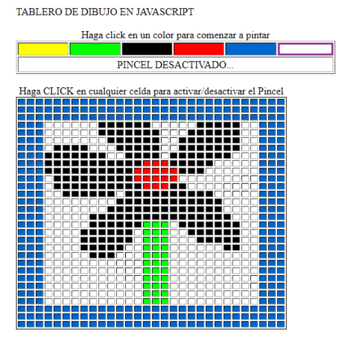

# 5. Ejemplos y Ejercicios

## 5.1 Ejemplos

!!! note "Ejemplos: Eventos de ratón"

    ??? example "Ejemplo 1: Evento click"
                    
        === "index.html"

            ```html
            <!DOCTYPE html>
            <html lang="es">
                <head>
                    <meta charset="UTF-8">
                    <script src="app.js" defer></script>
                    <link rel="stylesheet" href="estilos.css">
                    <title>Click</title>
                </head>
                <body>
                    <h2>❤️ Producto favorito</h2>

                    <div class="card">
                        <p>Producto A</p>
                        <div id="fav">Añadir a favoritos</div>
                    </div>

                    <p id="msg"></p>
                </body>
            </html>
            ```
        
        === "estilos.css"

            ```css
            body {
                font-family: Arial;
                text-align: center;
            }
            .card {
                width: 200px;
                margin: auto;
                padding: 20px;
                background: #fff;
                border-radius: 10px;
                box-shadow: 0 4px 10px rgba(0, 0, 0, 0.2);
            }
            div {
                padding: 10px;
                background: pink;
                border: none;
                cursor: pointer;
            }
            .caja {
                width: 200px; margin: auto; padding: 20px;
                background: lightblue; cursor: pointer;
            }
            ```

        === "app.js"

            ```javascript
            // ENUNCIADO: Añadir un evento click en el elemento div con id="card" de forma que se muestre el mensaje: ✔ Añadido a favoritos, en el párrafo con id="msg" cuando se haga click sobre el div con id="card"

            let elementoDiv, mensaje;

            //1. Obtener el elemento con id='fav' y almacenarlo en la variable llamada 'elementoDiv'
            elementoDiv = document.querySelector("#fav");

            //2. Obtener el elemento con id='msg' y almacenarlo en la variable llamada 'mensaje'
            mensaje = document.querySelector("#msg");

            //3. Añadir a la variable 'elementoDiv' el evento click.
            // La función del evento debe realizar las siguientes tareas:
            //  a) Asignar a la variable 'mensaje' el siguiente texto: "✔ Añadido a favoritos"
            elementoDiv.addEventListener("click", function() {
                mensaje.textContent = "✔ Añadido a favoritos";
            });
            ```

    ??? example "Ejemplo 2: Evento dblclick"
                    
        === "index.html"

            ```html
            <!DOCTYPE html>
            <html>
                <head>
                    <meta charset="UTF-8">
                    <title>Doble click</title>
                    <script src="app.js" defer></script>
                    <link rel="stylesheet" href="estilos.css">
                </head>
                <body>
                    <h2>🔍 Doble click para ver detalle</h2>

                    <div class="caja" id="item">Producto B</div>

                    <p id="msg"></p>
                </body>
            </html>
            ```
        
        === "estilos.css"

            ```css
            .caja {
                width: 200px; margin: auto; padding: 20px;
                background: lightblue; cursor: pointer;
            }
            ```

        === "app.js"

            ```javascript
            // ENUNCIADO: Añadir un evento doble-click en el elemento div con id="item" de forma que cuando se haga doble-click sobre el div 
            // se muestre el mensaje: "Mostrando detalles...", en el párrafo con id="msg"

            let elementoItem, mensaje;

            //1. Obtener el elemento con id="item" y almacenarlo en la variable 'elementoItem'
            elementoItem = document.querySelector("#item");

            //2. Obtener el elemento con id="msg" y almacenarlo en la variable 'mensaje'
            mensaje = document.querySelector("#msg");

            //3. Añadir a la variable 'elementoItem' el evento dblclick.
            // La función del evento debe realizar las siguientes tareas:
            //      a) Asignar a la variable 'mensaje' el siguiente texto: "✔ Añadido a favoritos"
            elementoItem.addEventListener("dblclick", function() {
                mensaje.textContent = "Mostrando detalles...";
            });
            ```

    ??? example "Ejemplo 3: Eventos mouseout y mouseover"
                    
        === "index.html"

            ```html
            <!DOCTYPE html>
            <html>
                <head>
                    <meta charset="UTF-8">
                    <title>MouseOut</title>
                    <script src="app.js" defer></script>
                    <link rel="stylesheet" href="estilos.css">
                </head>
                <body>
                    <h2>Salir del elemento</h2>

                    <div class="card" id="card">Pasa y sal</div>
                </body>
            </html>
            ```
        
        === "estilos.css"

            ```css
            .card {
                width: 200px; margin: auto; padding: 20px;
                background: rgb(156, 144, 238);
            }
            ```

        === "app.js"

            ```javascript
            // ENUNCIADO: Añadir los siguiente eventos:
            // 1) Evento 1: Crear un evento en el div con id="card" de forma que cuando el ratón entre dentro del div, 
            //              el propio div cambiará de color de fondo a 'darkgreen'
            // 2) Evento 2: Crear un evento en el div con id="card" de forma que cuando el ratón salga del div, 
            //              el propio div cambiará de color de fondo a 'lightgreen'

            let elemento;

            // Obtener el elemento con id = 'card' y almacenarlo en la variable 'elemento'
            elemento = document.querySelector("#card");

            // ENUNCIADO: Crear un evento en el div con id="card" de forma que cuando el ratón entre dentro del div, 
            //   el propio div cambiará de color de fondo a 'darkgreen'
            elemento.addEventListener("mouseover", function() {
                elemento.style.background = "darkgreen";
            });

            // ENUNCIADO: Crear un evento en el div con id="card" de forma que cuando el ratón salga del div, 
            // el propio div cambiará de color de fondo a 'lightgreen'
            elemento.addEventListener("mouseout", function() {
                elemento.style.background = "lightgreen";
            });
            ```

    ??? example "Ejemplo 4: Todos los eventos de ratón"
                    
        === "index.html"

            ```html
            <!DOCTYPE html>
            <html lang="es">
                <head>
                    <meta charset="UTF-8">
                    <title>Panel de productos</title>
                    <script src="app.js" defer></script>
                    <link rel="stylesheet" href="estilos.css">
                </head>
                <body>
                    <h2>🛒 Panel de productos interactivo</h2>

                    <div class="contenedor">

                        <div class="productos" id="productos">
                            <div class="producto">Producto 1</div>
                            <div class="producto">Producto 2</div>
                            <div class="producto">Producto 3</div>
                            <div class="producto">Producto 4</div>
                            <div class="producto">Producto 5</div>
                            <div class="producto">Producto 6</div>
                        </div>

                        <div class="info">
                            <h3>Información</h3>
                            <p id="mensaje">Interactúa con los productos</p>
                        </div>
                    </div>
                </body>
            </html>
            ```
        
        === "estilos.css"

            ```css
            body {
                font-family: Arial;
                background: #eef2f7;
                margin: 0;
                padding: 20px;
            }

            h2 {
                text-align: center;
            }

            .contenedor {
                display: flex;
                gap: 20px;
            }

            .productos {
                width: 60%;
                display: grid;
                grid-template-columns: repeat(3, 1fr);
                gap: 10px;
            }

            .producto {
                background: white;
                padding: 20px;
                text-align: center;
                border-radius: 10px;
                cursor: pointer;
                transition: 0.3s;
            }

            .producto:hover {
                background: #dbeafe;
            }

            .seleccionado {
                border: 3px solid blue;
            }

            .info {
                width: 40%;
                background: white;
                padding: 20px;
                border-radius: 10px;
            }

            #zonaMouse {
                height: 100px;
                background: #ddd;
                margin-top: 20px;
                text-align: center;
                line-height: 100px;
            }
            ```

        === "app.js"

            ```javascript
            let productos, mensaje;
            let i = 0, j=0;

            // Obtener todos los elementos que tengan la clase: class="producto", y almacenarlos en la variable 'productos'.
            productos = document.querySelectorAll(".producto");

            // Obtener el elemento con el id="mensaje" y almacenarlo en la variable 'productos'.
            mensaje = document.querySelector("#mensaje");

            //ENUNCIADO: Crear un evento para cada elemento div que tenga la clase: class:"producto". Cuando se haga click sobre uno de los div, se debe resaltar solo el div pulsado y al resto de div se le debe eliminar el color del resalto.
            // Para resaltar un div, se debe añadir la clase: "seleccionado" y para quitar el resaldo de un div, se debe eliminar la clase 'seleccionado'. Además se deberá mostrar el texto: "Seleccionado: " + this.textContent, en el elemento con id="parrafo"
            // CONSEJO: Primero eliminar la clase 'seleccionado' de todos los div, y a continuación, resaltar el div que ha sido pulsado.
   


            //ENUNCIADO: Crear un evento para cada elemento div que tenga la clase: class:"producto". Cuando se haga doble-click sobre uno de los div, se debe
            // asignar al elemento con id='parrafo' el texto: "🔍 Viendo detalles de " + this.textContent.
     


            //ENUNCIADO: Crear un evento para cada elemento div que tenga la clase: class:"producto". Cuando el ratón se pase por encima de uno de los div, se debe
            // asignar el color "#c7d2fe" a la propiedad background del propio div -> this.style.background = "#c7d2fe";
            i = 0;
     


            //ENUNCIADO: Crear un evento para cada elemento div que tenga la clase: class:"producto". Cuando el ratón salga de uno de los div, se debe
            // asignar el color "white" a la propiedad background del propio producto.
            i = 0;
      
            ```

        === "SOLUCIÓN"

            ```javascript
            let productos, mensaje,;
            let i = 0, j=0;

            // Obtener todos los elementos que tengan la clase: class="producto", y almacenarlos en la variable 'productos'.
            productos = document.querySelectorAll(".producto");

            // Obtener el elemento con el id="mensaje" y almacenarlo en la variable 'productos'.
            mensaje = document.querySelector("#mensaje");

            //ENUNCIADO: Crear un evento para cada elemento div que tenga la clase: class:"producto". Cuando se haga click sobre uno de los div, se debe resaltar solo  el div pulsado y al resto de div se le debe eliminar el color del resalto.
            // Para resaltar un div, se debe añadir la clase: "seleccionado" y para quitar el resaldo de un div, se debe eliminar la clase 'seleccionado'. Además se deberá mostrar el texto: "Seleccionado: " + this.textContent, en el elemento con id="parrafo"
            // CONSEJO: Primero eliminar la clase 'seleccionado' de todos los div, y a continuación, resaltar el div que ha sido pulsado.
            while(i < productos.length)
            {
                productos[i].addEventListener("click", function() {
                    j = 0;
                    while(j < productos.length){
                        productos[j].classList.remove("seleccionado");
                        j++;
                    }

                    this.classList.add("seleccionado");

                    mensaje.textContent = "Seleccionado: " + this.textContent;
                });

                i++;
            }


            //ENUNCIADO: Crear un evento para cada elemento div que tenga la clase: class:"producto". Cuando se haga doble-click sobre uno de los div, se debe
            // asignar al elemento con id='parrafo' el texto: "🔍 Viendo detalles de " + this.textContent.
            i = 0;
            while(i < productos.length)
            {
                productos[i].addEventListener("dblclick", function() {
                    mensaje.textContent = "🔍 Viendo detalles de " + this.textContent;
                });

                i++;
            }

            //ENUNCIADO: Crear un evento para cada elemento div que tenga la clase: class:"producto". Cuando el ratón se pase por encima de uno de los div, se debe
            // asignar el color "#c7d2fe" a la propiedad background del propio div -> this.style.background = "#c7d2fe";
            i = 0;
            while(i < productos.length)
            {
                productos[i].addEventListener("mouseover", function() {
                    this.style.background = "#c7d2fe";
                });

                i++;
            }

            //ENUNCIADO: Crear un evento para cada elemento div que tenga la clase: class:"producto". Cuando el ratón salga de uno de los div, se debe
            // asignar el color "white" a la propiedad background del propio producto.
            i = 0;
            while(i < productos.length){
                productos[i].addEventListener("mouseout", function() {
                    this.style.background = "white";
                });

                i++;
            }
            ```

!!! note "Ejemplos: Eventos de teclado"

    ??? example "Ejemplo 1: Escribiendo en tiempo real (keydown)"
                    
        === "index.html"

            ```html
            <!DOCTYPE html>
            <html lang="es">
                <head>
                    <meta charset="UTF-8">
                    <title>Ejemplo keydown</title>
                    <script src="app.js" defer></script>
                    <link rel="stylesheet" href="estilos.css">
                </head>
                <body>
                    <h2>⌨️ Escribe algo</h2>

                    <input type="text" id="texto" placeholder="Escribe aquí...">

                    <div class="caja" id="salida"></div>
                </body>
            </html>
            ```
        
        === "estilos.css"

            ```css
            body {
                font-family: Arial;
                text-align: center;
                background: #eef2f7;
            }
            input {
                padding: 10px;
                width: 200px;
            }
            .caja {
                margin-top: 20px;
                font-size: 18px;
            }
            ```

        === "app.js"

            ```javascript
            /*
                ENUNCIADO: Añadir un evento al elemento con id= "texto", de forma que cuando se mantenga pulsada una tecla, aparezca el mensaje '"Estás escribiendo..."'
                en el elemento con id="salida"
            */
            document.getElementById("texto").addEventListener("keydown", function() {
                document.getElementById("salida").textContent = "Estás escribiendo...";
            });
            ```

    ??? example "Ejemplo 2: Mostrar tecla pulsada (keypress)"
                    
        === "index.html"

            ```html
            <!DOCTYPE html>
            <html lang="es">
                <head>
                    <meta charset="UTF-8">
                    <title>Ejemplo keypress</title>
                    <script src="app.js" defer></script>
                    <link rel="stylesheet" href="estilos.css">
                </head>
                <body>
                    <h2>🔤 Pulsa una tecla</h2>

                    <input type="text" id="campo">

                    <p id="letra"></p>
                </body>
            </html>
            ```
        
        === "estilos.css"

            ```css
            body {
                font-family: Arial;
                text-align: center;
            }
            input {
                padding: 10px;
            }
            p {
                font-size: 20px;
                color: blue;
            }
            ```

        === "app.js"

            ```javascript
            /*
                ENUNCIADO: Añadir un evento al elemento con id= "campo", de forma que cuando se pulse una tecla, aparezca el mensaje 'Has pulsado:' + letra_pulsada
                en el elemento con id="letra"
            */
            document.getElementById("campo").addEventListener("keypress", function(e) {
                document.getElementById("letra").textContent = "Has pulsado: " + e.key;
            });
            ```

    ??? example "Ejemplo 3: Detectar cuando terminas (keyup)"
                    
        === "index.html"

            ```html
            <!DOCTYPE html>
            <html lang="es">
                <head>
                    <meta charset="UTF-8">
                    <title>Ejemplo keyup</title>
                    <script src="app.js" defer></script>
                    <link rel="stylesheet" href="estilos.css">
                </head>
                <body>
                    <h2>✍️ Escribe tu nombre</h2>

                    <input type="text" id="nombre" placeholder="Nombre">

                    <p id="msg"></p>
                </body>
            </html>
            ```
        
        === "estilos.css"

            ```css
            body {
                font-family: Arial;
                text-align: center;
            }
            input {
                padding: 10px;
            }
            #msg {
                margin-top: 20px;
                color: green;
            }
            ```

        === "app.js"

            ```javascript
            /*
                ENUNCIADO: Añadir un evento al elemento con id= "nombre", de forma que cuando se suelte la tecla pulsada, aparezca el mensaje '"Has terminado de escribir' en el elemento con id="msg"
            */
            document.getElementById("nombre").addEventListener("keyup", function() {
                document.getElementById("msg").textContent = "Has terminado de escribir";
            });
            ```

    ??? example "Ejemplo 4: Buscador en tiempo real (keyup)"
                    
        === "index.html"

            ```html
            <!DOCTYPE html>
            <html lang="es">
                <head>
                    <meta charset="UTF-8">
                    <title>Buscador</title>
                    <script src="app.js" defer></script>
                    <link rel="stylesheet" href="estilos.css">
                </head>
                <body>
                    <h2>🔍 Buscador</h2>

                    <input type="text" id="buscador" placeholder="Buscar...">

                    <p id="resultado"></p>
                </body>
            </html>
            ```
        
        === "estilos.css"

            ```css
            body {
                font-family: Arial;
                text-align: center;
                background: #f9fafb;
            }
            input {
                padding: 10px;
                width: 200px;
            }
            #resultado {
                margin-top: 20px;
                font-weight: bold;
            }
            ```

        === "app.js"

            ```javascript
            /*
                ENUNCIADO: Añadir un evento al elemento con id= "buscador", de forma que cuando se suelte la tecla pulsada, aparezca en el elemento con id="resultado" el mensaje: "Buscando: " + (todo el texto escrito en el elemento con id="buscador") .
            */
            document.getElementById("buscador").addEventListener("keyup", function() {
                let texto = this.value;
                document.getElementById("resultado").textContent = "Buscando: " + texto;
            });
            ```

    ??? example "Ejemplo 5: Control con teclado (keydown)"
                    
        === "index.html"

            ```html
            <!DOCTYPE html>
            <html lang="es">
                <head>
                    <meta charset="UTF-8">
                    <title>Control con teclado</title>
                    <script src="app.js" defer></script>
                    <link rel="stylesheet" href="estilos.css">
                </head>
                <body>
                    <h2>🎮 Control con teclado</h2>

                    <p id="mensaje">Pulsa una flecha</p>
                </body>
            </html>
            ```
        
        === "estilos.css"

            ```css
            body {
                font-family: Arial;
                text-align: center;
            }
            #mensaje {
                margin-top: 20px;
                font-size: 22px;
                font-weight: bold;
            }
            ```

        === "app.js"

            ```javascript
             /*
                ENUNCIADO: Añadir un evento a todo la página web, de forma que cuando se mantenga pulsada una de las flechas, aparezca en el elemento con id="mensaje" el mensaje: "Arriba ↑", "Abajo ↓", "Izquierda ←", "Derecha →", en función de la flecha pulsada.
            */
            document.addEventListener("keydown", function(e) {

                if (e.key === "ArrowUp") {
                    document.getElementById("mensaje").textContent = "Arriba ↑";
                }
                if (e.key === "ArrowDown") {
                    document.getElementById("mensaje").textContent = "Abajo ↓";
                }
                if (e.key === "ArrowLeft") {
                    document.getElementById("mensaje").textContent = "Izquierda ←";
                }
                if (e.key === "ArrowRight") {
                    document.getElementById("mensaje").textContent = "Derecha →";
                }

            });
            ```

!!! note "Ejemplos: Eventos Drag && Drop"

    ??? example "Ejemplo 1: Eventos Drag && Drop"
                    
        === "index.html"

            ```html
            <!DOCTYPE html>
            <html lang="es">
            <head>
                <meta charset="UTF-8">
                <title>Drag & Drop Animado</title>
                <script src="app.js" defer></script>
                <link rel="stylesheet" href="estilos.css">
            </head>
            <body>
                <div class="container">
                <!-- Bloque -->
                <div id="drag" class="draggable" draggable="true">
                    Drag
                </div>

                <!-- Zona 1 -->
                <div class="box"></div>

                <!-- Zona 2 -->
                <div class="box"></div>

                <!-- Zona 3 -->
                <div class="box"></div>
                </div>

                <p id="accion"></p>
            </body>
            </html>
            ```
        
        === "estilos.css"

            ```css
            body {
                font-family: Arial, sans-serif;
                display: flex;
                gap: 40px;
                padding: 40px;
            }

            .container {
                display: flex;
                gap: 40px;
            }

            .box {
                width: 220px;
                height: 220px;
                border: 2px dashed #333;
                border-radius: 12px;
                display: flex;
                align-items: center;
                justify-content: center;
                transition: background-color 0.3s ease, transform 0.2s ease;
            }

            .box.over {
                background-color: #d4f8d4;
                transform: scale(1.05);
            }

            .draggable {
                width: 100px;
                height: 100px;
                background-color: #4da6ff;
                border-radius: 10px;
                display: flex;
                align-items: center;
                justify-content: center;
                cursor: grab;
                color: white;
                font-weight: bold;
                transition: transform 0.2s ease, box-shadow 0.2s ease;
            }

            .dragging {
                opacity: 0.6;
                transform: scale(1.1) rotate(3deg);
                box-shadow: 0 8px 20px rgba(0, 0, 0, 0.2);
                cursor: grabbing;
            }

            .drop-animation {
                animation: dropBounce 0.4s ease;
            }

            @keyframes dropBounce {
                0% {
                    transform: scale(1.2);
                }

                50% {
                    transform: scale(0.9);
                }

                100% {
                    transform: scale(1);
                }
            }
            ```

        === "app.js"

            ```javascript
            let drag = document.querySelector("#drag");
            let zonas = document.querySelectorAll(".box");
            let parrafo = document.querySelector("#accion");
            let i = 0;

            ///------------LOS EVENTOS: dragstart - drop - dragover, SON LOS ÚNICOS NECESARIOS PARA QUE FUNCIONE DRAG && DROP  -----------------------///

            // El evento: dragstart, se dispara cuando empiezas a arrastrar un elemento.
            drag.addEventListener("dragstart", (e) => {
                parrafo.textContent = "Bloque arrastrando......";
                e.dataTransfer.setData("text", e.target.id);
            });


            while (i < zonas.length) {
                // El evento: drop, se dispara cuando sueltas el elemento en la zona de destino.
                zonas[i].addEventListener("drop", (e) => {
                    let id = e.dataTransfer.getData("text");
                    let elemento = document.getElementById(id);
                    e.preventDefault();
                    e.target.appendChild(elemento);

                    parrafo.textContent = "Elemento soltado en la zona destino......";
                });

                //El evento: dragover, se dispara mientras el elemento está encima de la zona de destino.
                zonas[i].addEventListener("dragover", (e) => {
                    e.preventDefault();
                    parrafo.textContent = "Elemento encima de zona destino......";
                });

                ///--------------- LOS SIGUIENTES EVENTOS NO SON NECESARIOS PARA QUE FUNCIONE DRAG && DROP  -----------------------///

                //El evento: dragend, se dispara cuando sueltas el elemento (termina el arrastre).
                drag.addEventListener("dragend", () => {
                    parrafo.textContent = "Bloque soltado......";
                });

                //El evento: dragenter, se dispara mientras el elemento entra en la zona de destino.
                zonas[i].addEventListener("dragenter", () => {
                    parrafo.textContent = "Elemento entra en zona destino......";
                });

                //El evento: dragleave, se ejecuta cuando el elemento sale de la zona de destino.
                zonas[i].addEventListener("dragleave", () => {
                    parrafo.textContent = "Elemento saliendo de la zona destino......";
                });

                i++;
            }
            ```


## 5.2 Ejercicios

!!! note "Ejercicios: Eventos de ratón Parte_1"

    ??? example "Ejercicio 1: Al pulsar el botón debe aparecer: “Producto añadido”"
                    
        === "index.html"

            ```html
            <!DOCTYPE html>
            <html>
                <head>
                    <meta charset="UTF-8">
                    <title>MouseOut</title>
                    <script src="app.js" defer></script>
                    <link rel="stylesheet" href="estilos.css">
                </head>
                <body>
                    <button id="btn">Comprar</button>
                    <p id="msg"></p>

                    <script>
                    let boton = document.querySelector("#btn");
                    let mensaje = document.querySelector("#msg");
                    
                    // ENUNCIADO: Especificar el nombre evento para que cuando se pulse con el ratón sobre el botón se ejecute el evento.
                    boton.addEventListener("__________", function() {
                        mensaje.textContent = "Producto añadido";
                    });
                    </script>
                </body>
            </html>
            ```

    ??? example "Ejercicio 2: Al pasar el ratón por el elemento con id="oferta" cambiar a color amarillo y cuando el ratón salga, vuelver al color original"
                    
        === "index.html"

            ```html
            <!DOCTYPE html>
            <html>
                <head>
                    <meta charset="UTF-8">
                    <script src="app.js" defer></script>
                    <link rel="stylesheet" href="estilos.css">
                </head>
                <body>
                <div id="oferta">OFERTA</div>

                <script>
                    let oferta = document.querySelector("#oferta");

                    // ENUNCIADO: Especificar el nombre evento para que cuando el ratón entre dentro del div con id = 'oferta' el color de fondo del div cambie a color amarillo.
                    oferta.addEventListener("__________", function() {
                        this.style.background = "yellow";
                    });

                    // ENUNCIADO: Especificar el nombre evento para que cuando el ratón salga del div con id = 'oferta' el color de fondo del div cambie a color blanco.
                    oferta.addEventListener("__________", function() {
                        this.style.background = "white";
                    });
                </script>
                </body>
            </html>
            ```

    ??? example "Ejercicio 3: Gestión de documentos"
                    
        === "index.html"

            ```html
            <!DOCTYPE html>
            <html lang="es">
                <head>
                    <meta charset="UTF-8">
                    <script src="app.js" defer></script>
                    <link rel="stylesheet" href="estilos.css">
                    <title>Documentos</title>
                </head>
                <body>
                    <h2>📄 Mis documentos</h2>

                    <div class="doc">Factura.pdf</div>
                    <div class="doc">Contrato.docx</div>
                    <div class="doc">Informe.xlsx</div>

                    <p id="mensaje">Selecciona un documento</p>
                </body>
            </html>
            ```
        
        === "estilos.css"

            ```css
            body {
                font-family: Arial;
                text-align: center;
            }

            .doc {
                width: 200px;
                margin: 10px auto;
                padding: 15px;
                background: #f1f5f9;
                border-radius: 8px;
                cursor: pointer;
            }

            .seleccionado {
                border: 2px solid blue;
                background: #dbeafe;
            }
            ```

        === "app.js"

            ```javascript
            let docs, mensaje;
            let i = 0, j = 0;

            // Obtener todos los div que tengan la clase: class="doc" y almacenarlos en la clase 'docs'.
            docs = document.querySelectorAll(".doc");

            // Obtener el elemento que tenga el id="mensaje" y almacenarlo en la clase 'mensaje'.
            mensaje = document.querySelector("#mensaje");

            /*
                ENUNCIADO: Crear un evento para cada elemento div que tenga la clase: class:"doc". Cuando se pulse sobre uno de los div, se debe resaltar solo el div pulsado y al resto de div se le debe eliminar el color del resalto.
                - Para resaltar un div, se debe añadir la clase: "seleccionado" y para quitar el resaldo de un div, se debe eliminar la clase 'seleccionado'. Además se deberá mostrar el texto: "Seleccionado: " + this.textContent, en el elemento con id="mensaje"
                - CONSEJO: Primero eliminar la clase 'seleccionado' de todos los div, y a continuación, añadir resaltar el div que ha sido pulsado.
            */
     

            /*
                ENUNCIADO: Crear un evento para cada elemento div que tenga la clase: class:"doc". Cuando se hago doble-click pulse sobre uno de los div, se debe mostrar el texto: "Abriendo " + (texto mostrado en el div) en el elemento con id="mensaje"
            */
    

            ```

        === "SOLUCIÓN"

            ```javascript
            let docs, mensaje;
            let i = 0, j = 0;

            // Obtener todos los div que tengan la clase: class="doc" y almacenarlos en la clase 'docs'.
            docs = document.querySelectorAll(".doc");

            // Obtener el elemento que tenga el id="mensaje" y almacenarlo en la clase 'mensaje'.
            mensaje = document.querySelector("#mensaje");

            /*
                ENUNCIADO: Crear un evento para cada elemento div que tenga la clase: class:"doc". Cuando se pulse sobre uno de los div, se debe resaltar solo el div pulsado y al resto de div se le debe eliminar el color del resalto.
                - Para resaltar un div, se debe añadir la clase: "seleccionado" y para quitar el resaldo de un div, se debe eliminar la clase 'seleccionado'. Además se deberá mostrar el texto: "Seleccionado: " + this.textContent, en el elemento con id="mensaje"
                - CONSEJO: Primero eliminar la clase 'seleccionado' de todos los div, y a continuación, añadir resaltar el div que ha sido pulsado.
            */
            while(i < docs.length)
            {
                docs[i].addEventListener("click", function() 
                {
                    j = 0;
                    while(j < docs.length){
                        docs[j].classList.remove("seleccionado");
                        j++;
                    }

                    this.classList.add("seleccionado");

                    mensaje.textContent = "Seleccionado: " + this.textContent;
                });

                i++;
            }

            /*
                ENUNCIADO: Crear un evento para cada elemento div que tenga la clase: class:"doc". Cuando se hago doble-click pulse sobre uno de los div, se debe mostrar el texto: "Abriendo " + (texto mostrado en el div) en el elemento con id="mensaje"
            */
            i = 0;
            while(i < docs.length)
            {
                docs[i].addEventListener("dblclick", function() {
                    mensaje.textContent = "📂 Abriendo " + this.textContent;
                });

                i++;
            }
            ```

    ??? example "Ejercicio 4: Tarjetas de oferta"
                    
        === "index.html"

            ```html
            <!DOCTYPE html>
            <html lang="es">
                <head>
                    <meta charset="UTF-8">
                    <script src="app.js" defer></script>
                    <link rel="stylesheet" href="estilos.css">
                    <title>Ofertas</title>
                </head>
                <body>
                    <h2>🏷️ Ofertas especiales</h2>

                    <div class="contenedor">
                        <div class="tarjeta">Producto A</div>
                        <div class="tarjeta">Producto B</div>
                        <div class="tarjeta">Producto C</div>
                    </div>
                </body>
            </html>
            ```
        
        === "estilos.css"

            ```css
            body {
                font-family: Arial;
                text-align: center;
                background: #f9fafb;
            }

            .contenedor {
                display: flex;
                justify-content: center;
                gap: 20px;
                margin-top: 20px;
            }

            .tarjeta {
                width: 150px;
                padding: 20px;
                background: white;
                border-radius: 10px;
                transition: 0.3s;
            }
            ```

        === "app.js"

            ```javascript
            let tarjetas;
            let i = 0;

            // 1. Obtener todos los div que tengan la clase: class='tarjeta' y almacenarlos en la variable 'tarjetas'
            tarjetas = document.querySelectorAll(".tarjeta");
            
            /*
                ENUNCIADO: Crear un evento para cada elemento div que tenga la clase: class:"tarjeta". Cuando se pase el ratón sobre uno de los div, se debe resaltar solo el div por el cual el ratón ha pasado.
                - Para resaltar un div, se debe añadir los siguientes estilos:
                    a) 'background = "#fef3c7"
                    b) 'transform = "scale(1.1)"'
            */
            
                
    

            /*
                ENUNCIADO: Crear un evento para cada elemento div que tenga la clase: class:"tarjeta". Cuando el ratón salga del div, se debe cambiar el estilo del div de la siguiente forma:
                  a) background = "white"
                  b) transform = "scale(1)"
            */
      

            ```

        === "SOLUCIÓN"

            ```javascript
            let tarjetas;
            let i = 0;

            // 1. Obtener todos los div que tengan la clase: class='tarjeta' y almacenarlos en la variable 'tarjetas'
            tarjetas = document.querySelectorAll(".tarjeta");

            /*
                ENUNCIADO: Crear un evento para cada elemento div que tenga la clase: class:"tarjeta". Cuando se pase el ratón sobre uno de los div, se debe resaltar solo el div por el cual el ratón ha pasado.
                - Para resaltar un div, se debe añadir los siguientes estilos:
                    a) 'background = "#fef3c7"
                    b) 'transform = "scale(1.1)"'
            */
            while(i < tarjetas.length){
                tarjetas[i].addEventListener("mouseover", function() {
                    this.style.background = "#fef3c7";
                    this.style.transform = "scale(1.1)";
                });

                i++;
            }


            /*
                ENUNCIADO: Crear un evento para cada elemento div que tenga la clase: class:"tarjeta". Cuando el ratón salga del div, se debe cambiar el estilo del div de la siguiente forma:
                  a) background = "white"
                  b) transform = "scale(1)"
            */
            i = 0;
            while(i < tarjetas.length){
                tarjetas[i].addEventListener("mouseout", function() {
                    this.style.background = "white";
                    this.style.transform = "scale(1)";
                });

                i++;
            }
            ```

    ??? example "Ejercicio 5: Pintar manteniendo el ratón pulsado"
                    
        === "index.html"

            ```html
            <!DOCTYPE html>
            <html lang="es">
                <head>
                    <meta charset="UTF-8">
                    <title>Pintar con ratón</title>
                    <script src="app.js" defer></script>
                    <link rel="stylesheet" href="estilos.css">
                </head>
                <body>
                    <h2>🖱️ Mantén pulsado para pintar</h2>

                    <div class="tablero" id="tablero"></div>
                </body>
            </html>
            ```
        
        === "estilos.css"

            ```css
            .tablero {
                display: grid;
                grid-template-columns: repeat(10, 30px);
                gap: 2px;
                justify-content: center;
            }

            .celda {
                width: 30px;
                height: 30px;
                background: lightgray;
            }

            .pintado {
                background: red;
            }
            ```

        === "app.js"

            ```javascript
            let i = 0;
            let celda;

            // Obtener el elemento con la clase: class = 'tablero', y almacenarlo en la variable 'tablero'
            let tablero = document.querySelector("#tablero");

            // Variable para comprobar si se tiene pulsado el ratón
            let pulsado = false;


            //Recorremos 100 casillas. El tablero tiene un tamaño de 10x10, que son en total 100 casillas.
            while(i < 100){
                // Creamos un elemento de tipo 'div' y lo asignamos a la variable 'celda.
                celda = document.createElement("div");

                // Añadimos a la variable 'celda' la clase CSS llamada 'celda'.
                celda.classList.add("celda");

                /*
                    ENUNCUADO: Para cada celda (elemento div) añadir un evento de forma que cuando se pase el ratón por encima del div se realice la siguiente comprobación:
                          a) Si 'pulsado' es igual a true, al objeto 'this' (al propio div) añadir la clase css 'pintado'
                */
                


                // Añadir a la variable 'tablero' la variable celda. Las celdas se añadirán al final del tablero. (append)
                tablero.append(celda);

                i++;
            }

            // Añadir un evento de ratón (mousedown), de forma que cuando se pulse el ratón, a la variable 'pulsado' se le asignará el valor 'true'.
            document.addEventListener("mousedown", () => pulsado = true);

            // Añadir un evento de ratón (mouseup), de forma que cuando se suelte el ratón, a la variable 'pulsado' se le asignará el valor 'false'.
            document.addEventListener("mousedown", () => pulsado = true);
            ```

        === "SOLUCIÓN"

            ```javascript
            let i = 0;
            let celda;

            // Obtener el elemento con la clase: class = 'tablero', y almacenarlo en la variable 'tablero'
            let tablero = document.querySelector("#tablero");

            // Variable para comprobar si se tiene pulsado el ratón
            let pulsado = false;


            //Recorremos 100 casillas. El tablero tiene un tamaño de 10x10, que son en total 100 casillas.
            while(i < 100){
                // Creamos un elemento de tipo 'div' y lo asignamos a la variable 'celda.
                celda = document.createElement("div");

                // Añadimos a la variable 'celda' la clase CSS llamada 'celda'.
                celda.classList.add("celda");
                
                /*
                    ENUNCUADO: Para cada celda (elemento div) añadir un evento de forma que cuando se pase el ratón por encima del div se realice la siguiente comprobación:
                          a) Si 'pulsado' es igual a true, al objeto 'this' (al propio div) añadir la clase css 'pintado'
                */
                celda.addEventListener("mouseover", function() {
                    if (pulsado) {
                        this.classList.add("pintado");
                    }
                });


                // Añadir a la variable 'tablero' la variable celda. Las celdas se añadirán al final del tablero. (append)
                tablero.append(celda);

                i++;
            }

            // Añadir un evento de ratón (mousedown), de forma que cuando se pulse el ratón, a la variable 'pulsado' se le asignará el valor 'true'.
            document.addEventListener("mousedown", () => pulsado = true);

            // Añadir un evento de ratón (mouseup), de forma que cuando se suelte el ratón, a la variable 'pulsado' se le asignará el valor 'false'.
            document.addEventListener("mousedown", () => pulsado = true);
            ```

    ??? example "Ejercicio 6: Realiza un programa que tenga 3 elementos `<p>`, al hacer clic sobre ellos desaparezcan (se oculten) y al pasar el ratón por encima de ellos cambie de color de fondo. También deberá tener un botón 'Reaparecer' que hará que aparezcan todos los elementos desaparecidos."

        === "index.html"

            ```html
            <!DOCTYPE html>
            <html lang="es">
                <head>
                    <meta charset="UTF-8">
                    <title>Párrafos interactivos</title>
                    <script src="app.js" defer></script>
                    <link rel="stylesheet" href="estilos.css">
                </head>
                <body>
                    <h2>Haz clic o doble clic en los párrafos</h2>

                    <p class="parrafo">Elemento 1</p>
                    <p class="parrafo">Elemento 2</p>
                    <p class="parrafo">Elemento 3</p>

                    <button id="reaparecer">Reaparecer</button>
                </body>
            </html>
            ```
        
        === "estilos.css"

            ```css
            body {
                font-family: Arial, sans-serif;
                text-align: center;
                margin-top: 50px;
            }

            p {
                background-color: #f0f0f0;
                padding: 15px;
                margin: 10px auto;
                width: 300px;
                cursor: pointer;
                border-radius: 8px;
                transition: 0.3s;
            }

            p:hover {
                background-color: #dcdcdc;
            }

            button {
                margin-top: 20px;
                padding: 10px 20px;
                font-size: 16px;
                cursor: pointer;
            }
            ```

        === "app.js"

            ```javascript
            let i = 0;
            let parrafos = document.querySelectorAll(".parrafo");

            /*
                ENUNCIADO: Crear un evento para cada elemento 'p' que tenga la clase: class:"parrafo". Cuando se haga click con el ratón sobre uno de los párrafos, éste debe desaparecer, es decir, ocultar.
                Además, se debe crear un segundo evento para cada párrafo de forma que cuando se pase el ratón por encima de los párrafos, el párrafo por el cual se ha pasado el ratón debe cambiar de color de fondo.
            */


            /*
                ENUNCIADO: Crear un evento para el elemento con id="reaparecer". Cuando se haga click con el ratón sobre el elemento con id="reaparecer" se deben mostrar todos los párrafos: style.display = "block";
            */
            
            ```

        === "SOLUCIÓN"

            ```javascript
            let i = 0;
            let parrafos = document.querySelectorAll(".parrafo");

            /*
                ENUNCIADO: Crear un evento para cada elemento 'p' que tenga la clase: class:"parrafo". Cuando se haga click con el ratón sobre uno de los párrafos,éste debe desaparecer, es decir, ocultar (this.style.display = "none";).
                Además, se debe crear un segundo evento para cada párrafo de forma que cuando se pase el ratón por encima de los párrafos, el párrafo por el cual se ha pasado el ratón debe cambiar de color de fondo.
            */
            while (i < parrafos.length) {
                parrafos[i].addEventListener("click", function () {
                    this.style.display = "none";
                });

                parrafos[i].addEventListener("mouseover", function () {
                    this.style.background = "orange";
                });

                i++;
            }

            /*
                ENUNCIADO: Crear un evento para el elemento con id="reaparecer". Cuando se haga click con el ratón sobre el elemento con id="reaparecer" se deben mostrar todos los párrafos: style.display = "block";
            */
            document.querySelector("#reaparecer").addEventListener("click", function () {
                i = 0;
                while (i < parrafos.length) {
                    parrafos[i].style.display = "block";
                    i++;
                }
            });
            ```

!!! note "Ejercicios: Eventos de ratón Parte_2"

    ??? example "Ejercicio 1: Mostrar/Ocultar elementos"
                    
        === "index.html"

            ```html
            <!DOCTYPE html>
            <html lang="es">
                <head>
                    <title>Ejercicio 4</title>
                    <script src="app.js" defer></script>
                    <link rel="stylesheet" href="estilos.css">
                </head>
                <body>
                    <span id="link">▶ ▼ Sweeties (click me)!</span>
                    <ul id="lista">
                        <li>Cake</li>
                        <li>Donut</li>
                        <li>Honey</li>
                    </ul>
                </body>
            </html>
            ```

        === "estilos.css"

            ```css
            /* Estilo general */
            body {
                font-family: Arial, sans-serif;
                background: #f5f7fa;
                padding: 40px;
            }

            /* Botón tipo enlace */
            #link {
                display: inline-block;
                cursor: pointer;
                font-weight: bold;
                color: #333;
                background: #ffffff;
                padding: 10px 15px;
                border-radius: 8px;
                box-shadow: 0 2px 6px rgba(0,0,0,0.1);
                transition: all 0.3s ease;
            }

            #link:hover {
                background: #e8f0ff;
                color: #1a73e8;
            }

            /* Lista contenedor */
            #lista {
                list-style: none;
                padding: 0;
                margin-top: 15px;

                max-height: 0;
                opacity: 0;
                transform: translateY(-10px);
                overflow: hidden;

                transition: all 0.4s ease;
            }

            /* Estado visible */
            #lista.visible {
                max-height: 200px;
                opacity: 1;
                transform: translateY(0);
            }

            /* Elementos de la lista */
            #lista li {
                background: white;
                margin: 8px 0;
                padding: 12px 15px;
                border-radius: 6px;
                box-shadow: 0 2px 4px rgba(0,0,0,0.08);
                transition: all 0.2s ease;
            }

            /* Hover en elementos */
            #lista li:hover {
                background: #f0f4ff;
                transform: translateX(5px);
            }
            ```

        === "app.js"

            ```javascript
            /*
              ENUNCIADO: Crear un evento en el elemento 'span' con id="link". Cuando se haga click con el ratón sobre el elemento span,
                         se debe mostrar/ocultar la lista de productos. 
                         Para mostra/ocultar la lista de elementos se debe añadir/quitar la clase 'visible' al elemento ul con id="lista". Emplear el método toggle.
            */

            
            ```

        === "SOLUCIÓN"

            ```javascript
            /*
              ENUNCIADO: Crear un evento en el elemento 'span' con id="link". Cuando se haga click con el ratón sobre el elemento span,
                         se debe mostrar/ocultar la lista de productos. 
                         Para mostra/ocultar la lista de elementos se debe añadir/quitar la clase 'visible' al elemento ul con id="lista". Emplear el método toggle.
            */

            document.querySelector("#link").addEventListener("click", function (){
                let lista = document.querySelector("#lista");
                lista.classList.toggle("visible");
            });
            ```

    ??? example "Ejercicio 2: Carrusel de imágenes"
                    
        === "index.html"

            ```html
            <!DOCTYPE html>
            <html lang="es">
                <head>
                    <meta charset="UTF-8">
                    <title>Carrusel de Fotos</title>
                    <script src="app.js" defer></script>
                    <link rel="stylesheet" href="estilos.css">
                </head>
                <body>
                    <h2>Carrusel de fotos</h2>

                    <div class="carrusel">
                        
                    </div>

                    <div>
                        <button id="anterior">⟵ Anterior</button>
                        <button id="siguiente">Siguiente ⟶</button>
                    </div>
                </body>
            </html>
            ```

        === "estilos.css"

            ```css
            body {
                font-family: Arial, sans-serif;
                text-align: center;
                background: #f5f7fa;
                padding: 40px;
            }

            .carrusel {
                position: relative;
                width: 400px;
                margin: auto;
            }

            .carrusel img {
                width: 100%;
                height: 250px;
                object-fit: cover;
                border-radius: 10px;
                box-shadow: 0 4px 10px rgba(0,0,0,0.2);
            }

            button {
                margin: 15px;
                padding: 10px 20px;
                font-size: 16px;
                border: none;
                border-radius: 8px;
                cursor: pointer;
                background: #1a73e8;
                color: white;
                transition: 0.3s;
            }

            button:hover {
                background: #1557b0;
            }
            ```

        === "app.js"

            ```javascript
            /*
              ENUNCIADO: Crear dos eventos: 
                  1) El primer evento está asociado al elemento con id = "anterior". Cuando se haga click con el ratón sobre el elemento con id="anterior", se debe mostrar la imagen anterior.
                  2) El segundo evento está asociado al elemento con id = "siguiente". Cuando se haga click con el ratón sobre el elemento con id="siguiente", se debe mostrar la imagen siguiente.
              NOTA: Para cambiar las imágenes, se debe emplear la propiedad 'src' del elemento img. Y para acceder a las imágenes, se debe emplear la siguiente expresión: imagenes[indice]
            */

            
            ```

        === "SOLUCIÓN"

            ```javascript
            /*
             * ENUNCIADO: Crear dos eventos: 
                1) El primer evento está asociado al elemento con id = "anterior". Cuando se haga click con el ratón sobre el elemento con id="anterior", se debe mostrar la imagen anterior.
                2) El segundo evento está asociado al elemento con id = "siguiente". Cuando se haga click con el ratón sobre el elemento con id="siguiente", se debe mostrar la imagen siguiente.
            */

            let imagenes = [
                "https://picsum.photos/id/1015/600/400",
                "https://picsum.photos/id/1025/600/400",
                "https://picsum.photos/id/1035/600/400",
                "https://picsum.photos/id/1045/600/400"
            ];

            let indice = 0;

            document.querySelector("#siguiente").addEventListener("click", function () {
                if (indice === (imagenes.length - 1)) {
                    indice = 0;
                }
                else {
                    indice++;
                }

                document.querySelector("#imagen").src = imagenes[indice];
            });

            document.querySelector("#anterior").addEventListener("click", function () {
                if (indice <= 0) {
                    indice = (imagenes.length - 1);
                }
                else {
                    indice--;
                }

                document.querySelector("#imagen").src = imagenes[indice];
            });
            ```

    ??? example "Ejercicio 3: Seleccionar color"
                    
        === "index.html"

            ```html
            <!DOCTYPE html>
            <html lang="es">
                <head>
                    <meta charset="UTF-8">
                    <title>Mini Paint</title>
                    <script src="app.js" defer></script>
                    <link rel="stylesheet" href="estilos.css">
                </head>
                <body>
                    <div class="contenedor">
                        <h2>Haga click en un color para comenzar a pintar</h2>

                        <div class="colores">
                            <div class="color" id="yellow"></div>
                            <div class="color" id="lime"></div>
                            <div class="color" id="black"></div>
                            <div class="color" id="red"></div>
                            <div class="color" id="steelblue"></div>
                            <div class="color" id="purple"></div>
                            <div id="white"></div>
                        </div>

                        <div id="estado" class="estado">
                            PINCEL DESACTIVADO...
                        </div>
                    </div>
                </body>
            </html>
            ```

        === "estilos.css"

            ```css
            body {
                font-family: Arial, sans-serif;
                background: #f0f0f0;
                text-align: center;
                padding: 30px;
            }

            .contenedor {
                display: inline-block;
                background: #ffffff;
                padding: 20px;
                border: 2px solid #ccc;
                border-radius: 10px;
                box-shadow: 0 4px 10px rgba(0, 0, 0, 0.1);
            }

            h2 {
                margin-bottom: 15px;
                color: #333;
            }

            .colores {
                display: flex;
                gap: 10px;
                justify-content: center;
                margin-bottom: 15px;
            }

            .color {
                width: 80px;
                height: 30px;
                cursor: pointer;
                border-radius: 5px;
                border: 2px solid #999;
                transition:
                    transform 0.2s,
                    box-shadow 0.2s;
            }

            .color:hover {
                transform: scale(1.1);
                box-shadow: 0 2px 6px rgba(0, 0, 0, 0.3);
            }

            .estado {
                padding: 10px;
                background: #eaeaea;
                border-radius: 5px;
                font-weight: bold;
                color: #555;
            }

            /* Colores específicos */
            #yellow {
                background: yellow;
            }

            #lime {
                background: lime;
            }

            #black {
                background: black;
            }

            #red {
                background: red;
            }

            #steelblue {
                background: steelblue;
            }

            #purple {
                background: purple;
            }

            #white {
                background: white;
            }
            ```

        === "app.js"

            ```javascript
            /*
             * ENUNCIADO: Crear un evento para todos los div que tengan la clase: class="color". Cuando se haga click sobre uno de los div con la clase: class="color", se debe recuperar el valor del atributo 'id' del div que ha sido pulsado. Además, se debe modificar las siguientes propiedades del elemento div con id="estado":
               * 1) textContent = "Pincel activado " + id del div pulsado.
               * 2) background = id del div pulsado.
               * 3) color = "white"
            */

            
              /*
               * ENUNCIADO: Crear un evento para el elemento con id="white". Cuando se haga click sobre dicho div, se debe modificar las siguientes propiedades del elemento div con id="estado":
                 * 1) style = ""
                 * 2) textContent = "PINCEL DESACTIVADO..."
            */
            ```

        === "SOLUCIÓN"

            ```javascript
            /*
             * ENUNCIADO: Crear un evento para todos los div que tengan la clase: class="color". Cuando se haga click sobre uno de los div con la clase: class="color", se debe recuperar el valor del atributo 'id' del div que ha sido pulsado. Además, se debe modificar las siguientes propiedades del elemento div con id="estado":
               * 1) textContent = "Pincel activado " + id del div pulsado.
               * 2) background = id del div pulsado.
               * 3) color = "white"
            */

            let i = 0;
            let colores = document.querySelectorAll(".color");
            let estado = document.querySelector("#estado");
            let blanco = document.querySelector("#white");
            let colorSeleccionado = "";

            while (i < colores.length) {
                colores[i].addEventListener("click", function () {
                    colorSeleccionado = this.id;
                    estado.textContent = "Pincel activado: " + colorSeleccionado;
                    estado.style.background = colorSeleccionado;
                    estado.style.color = "white";
                });

                i++;
            }


            /*
             * ENUNCIADO: Crear un evento para el elemento con id="white". Cuando se haga click sobre dicho div, se debe modificar las siguientes propiedades del elemento div con id="estado":
               * 1) style = ""
               * 2) textContent = "PINCEL DESACTIVADO..."
            */

            blanco.addEventListener("click", function () {
                estado.style = "";
                estado.textContent = "PINCEL DESACTIVADO...";
            });
            ```

    ??? example "Ejercicio 4: Colorear texto"
                    
        === "index.html"

            ```html
            <!DOCTYPE html>
            <html lang="es">
                <head>
                    <meta charset="UTF-8">
                    <title>Mini Paint</title>
                    <script src="app.js" defer></script>
                    <link rel="stylesheet" href="estilos.css">
                </head>
                <body>
                    <div class="contenedor">
                        <h2>Haga click en un color para comenzar a pintar</h2>

                        <div class="colores">
                            <div class="color" id="yellow"></div>
                            <div class="color" id="lime"></div>
                            <div class="color" id="black"></div>
                            <div class="color" id="red"></div>
                            <div class="color" id="steelblue"></div>
                            <div class="color" id="purple"></div>
                            <div class="color" id="white"></div>
                        </div>

                        <div id="estado" class="estado">
                            PINCEL DESACTIVADO...
                        </div>
                        <input type="text" id="texto" placeholder="Escribe aquí...">
                    </div>
                </body>
            </html>
            ```

        === "estilos.css"

            ```css
            body {
                font-family: Arial, sans-serif;
                background: #f0f0f0;
                text-align: center;
                padding: 30px;
            }

            .contenedor {
                display: inline-block;
                background: #ffffff;
                padding: 20px;
                border: 2px solid #ccc;
                border-radius: 10px;
                box-shadow: 0 4px 10px rgba(0, 0, 0, 0.1);
            }

            h2 {
                margin-bottom: 15px;
                color: #333;
            }

            .colores {
                display: flex;
                gap: 10px;
                justify-content: center;
                margin-bottom: 15px;
            }

            .color {
                width: 80px;
                height: 30px;
                cursor: pointer;
                border-radius: 5px;
                border: 2px solid #999;
                transition:
                    transform 0.2s,
                    box-shadow 0.2s;
            }

            .color:hover {
                transform: scale(1.1);
                box-shadow: 0 2px 6px rgba(0, 0, 0, 0.3);
            }

            .estado {
                padding: 10px;
                background: #eaeaea;
                border-radius: 5px;
                font-weight: bold;
                color: #555;
            }

            /* Colores específicos */
            #yellow {
                background: yellow;
            }

            #lime {
                background: lime;
            }

            #black {
                background: black;
            }

            #red {
                background: red;
            }

            #steelblue {
                background: steelblue;
            }

            #purple {
                background: purple;
            }

            #white {
                background: white;
            }
            ```

        === "app.js"

            ```javascript
            /*
             * ENUNCIADO: Idéntico al ejercicio anterior, pero se debe añadir el código necesario para que el texto escrito en el elemento con id="texto" cambie al color seleccionado.
            */

            
            ```

        === "SOLUCIÓN"

            ```javascript
            /*
             * ENUNCIADO: Idéntico al ejercicio anterior, pero se debe añadir el código necesario para que el texto escrito en el elemento con id="texto" cambie al color seleccionado.
            */

            let i = 0;
            let colores = document.querySelectorAll(".color");
            let estado = document.querySelector("#estado");
            let blanco = document.querySelector("#white");
            let texto = document.querySelector("#texto");
            let colorSeleccionado = "";

            while (i < colores.length) {
                colores[i].addEventListener("click", function () {
                    colorSeleccionado = this.id;
                    estado.textContent = "Pincel activado: " + colorSeleccionado;
                    estado.style.background = colorSeleccionado;
                    estado.style.color = "white";

                    texto.style.color = colorSeccionado;
                });

                i++;
            }

            blanco.addEventListener("click", function () {
                estado.style = "";
                estado.textContent = "PINCEL DESACTIVADO...";
                texto.style.color = "black";
            });
            ```

    ??? example "Ejercicio 5: Tablero de dibujo"
                    
        === "captura"
            { width="400" style="display:block;margin:auto" }
        
        === "index.html"

            ```html
            <!DOCTYPE html>
            <html lang="es">

            <head>
                <meta charset="UTF-8">
                <title>Tablero de dibujo</title>
                <script src="app.js" defer></script>
                <link rel="stylesheet" href="estilos.css">
            </head>

            <body>
                <h2>Haga click en un color para comenzar a pintar</h2>

                <div class="colores">
                    <div class="color" id="yellow"></div>
                    <div class="color" id="lime"></div>
                    <div class="color" id="black"></div>
                    <div class="color" id="red"></div>
                    <div class="color" id="steelblue"></div>
                    <div class="color" id="purple"></div>
                    <div class="color" id="white"></div>
                </div>

                <div id="estado" class="estado">
                    PINCEL DESACTIVADO...
                </div>

                <p>Haz CLICK en cualquier celda para activar/desactivar el pincel</p>

                <div id="tablero" class="tablero"></div>
            </body>

            </html>
            ```

        === "estilos.css"

            ```css
            body {
                font-family: Arial, sans-serif;
                text-align: center;
                background: #f0f0f0;
            }

            h2 {
                margin: 10px;
            }

            .colores {
                display: flex;
                justify-content: center;
                gap: 5px;
                margin: 10px;
            }

            .color {
                width: 60px;
                height: 25px;
                cursor: pointer;
                border: 2px solid #999;
            }

            .estado {
                border: 1px solid #999;
                padding: 5px;
                margin: 10px auto;
                width: 300px;
                background: #ddd;
            }

            .tablero {
                display: grid;
                grid-template-columns: repeat(30, 15px);
                justify-content: center;
                gap: 1px;
            }

            .celda {
                width: 15px;
                height: 15px;
                background: #fff;
                border: 1px solid #ccc;
            }

            .celda:hover {
                outline: 1px solid #000;
            }

            /* Colores específicos */
            #yellow {
                background: yellow;
            }

            #lime {
                background: lime;
            }

            #black {
                background: black;
            }

            #red {
                background: red;
            }

            #steelblue {
                background: steelblue;
            }

            #purple {
                background: purple;
            }

            #white {
                background: white;
            }
            ```

        === "app.js"

            ```javascript
            /*
                ENUNCIADO: Utilizar el código desarrollado en la Actividad 3.
            */

                // ESCRIBIR MISMO CÓDIGO QUE EN LA ACTIVIDAD 3.

            i = 0;
            while(i < 900) {
                let celda = document.createElement("div");
                celda.className = "celda";

                tablero.appendChild(celda);

                /*
                  ENUNCIADO - 1) El primer evento está asociado a cada una de las 'celdas' creadas, de forma que cuando se haga click en alguna de las celdas la variable 'pincelActivo' cambiará de valor. Si el valor de 'pincelActivo' es igual a true, pasará a valer 'false, sino, pasará a valer 'true'.
                */
                


                /*
                   ENUNCIADO - 2) El segundo evento está asociado a cada una de las celdas, de forma que cuando se pase el cursor por encima de la celda, se comprobar el valor de la variable 'pincelActivo'. Si 'pincen activo es igual a 'true', se debe cambiar el valor de la propiedad background de la celda, asignando el color seleccionado de la paleta de colores.
                */
                

                i++;
            }

            
            ```

        === "SOLUCIÓN"

            ```javascript
            /*
                ENUNCIADO: Utilizar el código desarrollado en la Actividad 3.
            */

            let i = 0;
            let colorSeleccionado;
            let pincelActivo = false;
            let colores = document.querySelectorAll(".color");
            let estado = document.querySelector("#estado");
            let blanco = document.querySelector("#white");

            while (i < colores.length) {
                colores[i].addEventListener("click", function () {
                    colorSeleccionado = this.id;
                    estado.textContent = "Pincel activado: " + colorSeleccionado;
                    estado.style.background = colorSeleccionado;
                    estado.style.color = "white";
                });

                i++;
            }

            blanco.addEventListener("click", function () {
                estado.style = "";
                estado.textContent = "PINCEL DESACTIVADO...";
            });

            i = 0;
            while(i < 900) {
                let celda = document.createElement("div");
                celda.className = "celda";

                tablero.appendChild(celda);

                /*
                  ENUNCIADO - 1) El primer evento está asociado a cada una de las 'celdas' creadas, de forma que cuando se haga click en alguna de las celdas la variable 'pincelActivo' cambiará de valor. Si el valor de 'pincelActivo' es igual a true, pasará a valer 'false, sino, pasará a valer 'true'.
                */
                celda.addEventListener("click", function () {
                    pincelActivo = !pincelActivo;
                });

                /*
                   ENUNCIADO - 2) El segundo evento está asociado a cada una de las celdas, de forma que cuando se pase el cursor por encima de la celda, se comprobar el valor de la variable 'pincelActivo'. Si 'pincen activo es igual a 'true', se debe cambiar el valor de la propiedad background de la celda, asignando el color seleccionado de la paleta de colores.
                */
                celda.addEventListener("mouseover", function () {
                    if (pincelActivo) {
                        this.style.background = colorSeleccionado;
                    }
                });

                i++;
            }
            ```

    
    ??? example "Extra: Carrusel tipo Netflix"
                    
        === "index.html"

            ```html
            <!DOCTYPE html>
            <html lang="es">
                <head>
                    <meta charset="UTF-8">
                    <title>Carrusel tipo Netflix</title>
                    <script src="app.js" defer></script>
                    <link rel="stylesheet" href="estilos.css">
                </head>
                <body>
                    <h2>Carrusel tipo Netflix</h2>

                    <div class="contenedor">
                        <div id="slider" class="slider">
                            
                            
                            
                            
                        </div>
                    </div>
                </body>
            </html>
            ```

        === "estilos.css"

            ```css
            body {
                font-family: Arial, sans-serif;
                text-align: center;
                background: #111;
                color: white;
                padding: 30px;
            }

            h2 {
                margin-bottom: 20px;
            }

            .contenedor {
                width: 400px;
                margin: auto;
                overflow: hidden; /* oculta lo que se sale */
                border-radius: 10px;
            }

            .slider {
                display: flex;
                transition: transform 0.5s ease; /* animación */
            }

            .slider img {
                width: 400px;
                height: 250px;
                object-fit: cover;
                flex-shrink: 0;
            }
            ```

        === "app.js"

            ```javascript
            let indice = 0;
            let slider = document.querySelector("#slider");
            let total = 4;

            function moverCarrusel() {
                indice++;

                if (indice >= total) {
                    indice = 0;
                }

                // Mueve el contenedor
                slider.style.transform = "translateX(-" + (indice * 400) + "px)";
            }

            // Cambia cada 3 segundos
            setInterval(moverCarrusel, 1000);
            ```


!!! note "Ejercicios: Eventos de ratón Parte_3"

    ??? example "Ejercicio 1: Colorear textos"
                    
        === "index.html"

            ```html
            <!DOCTYPE html>
            <html lang="es">
                <head>
                    <meta charset="UTF-8">
                    <title>Mini Paint</title>
                    <script src="app.js" defer></script>
                    <link rel="stylesheet" href="estilos.css">
                </head>
                <body>
                    <div class="contenedor">
                        <h2>Haga click en un color para comenzar a pintar</h2>

                        <div class="colores">
                            <div class="color" id="yellow"></div>
                            <div class="color" id="lime"></div>
                            <div class="color" id="black"></div>
                            <div class="color" id="red"></div>
                            <div class="color" id="steelblue"></div>
                            <div class="color" id="purple"></div>
                            <div class="color" id="white"></div>
                        </div>

                        <div id="pincel" class="estado">
                            COLOR PINCEL
                        </div>
                        <br>
                        <textArea id="texto" cols="50" rows="10" placeholder="Escribe aquí..."></textArea>
                    </div>
                </body>
            </html>
            ```

        === "estilos.css"

            ```css
            body {
                font-family: Arial, sans-serif;
                background: #f0f0f0;
                text-align: center;
                padding: 30px;
            }

            .contenedor {
                display: inline-block;
                background: #ffffff;
                padding: 20px;
                border: 2px solid #ccc;
                border-radius: 10px;
                box-shadow: 0 4px 10px rgba(0, 0, 0, 0.1);
            }

            h2 {
                margin-bottom: 15px;
                color: #333;
            }

            .colores {
                display: flex;
                gap: 10px;
                justify-content: center;
                margin-bottom: 15px;
            }

            .color {
                width: 80px;
                height: 30px;
                cursor: pointer;
                border-radius: 5px;
                border: 2px solid #999;
                transition:
                    transform 0.2s,
                    box-shadow 0.2s;
            }

            .color:hover {
                transform: scale(1.1);
                box-shadow: 0 2px 6px rgba(0, 0, 0, 0.3);
            }

            .estado {
                padding: 10px;
                background: #eaeaea;
                border-radius: 5px;
                font-weight: bold;
                color: #555;
            }

            /* Colores específicos */
            #yellow {
                background: yellow;
            }

            #lime {
                background: lime;
            }

            #black {
                background: black;
            }

            #red {
                background: red;
            }

            #steelblue {
                background: steelblue;
            }

            #purple {
                background: purple;
            }

            #white {
                background: white;
            }
            ```

        === "app.js"

            ```javascript
            /*
            * ENUNCIADO: Recuperar cada color y almacenar cada color en una variable diferente.
            */
            let amarillo = document.querySelector("#yellow");
            let verde = document.querySelector("#lime");
            let negro = document.querySelector("#black");
            let rojo = document.querySelector("#red");
            let azul = document.querySelector("#steelblue");
            let morado = document.querySelector("#purple");
            let blanco = document.querySelector("#white");


            /*
            * ENUNCIADO: Recuperar el texto y almacenar el elemento en una variable llamada 'textArea'.
            */
            let textoArea = document.querySelector("#texto");

            /*
            * ENUNCIADO: Recuperar el pincel y almacenar el elemento en una variable llamada 'pincel'.
            */
            

            /*
            * ENUNCIADO: Crear un evento por cada color. De forma que cuando se haga click en un color determinado, el color del texto de 
            *            la variable 'textArea'  y el color de fondo de la variable 'pincel' cambiarán al color pulsado.
            */
            
            ```

        === "SOLUCIÓN"

            ```javascript
            /*
            * ENUNCIADO: Recuperar cada color y almacenar cada color en una variable diferente.
            */
            let amarillo = document.querySelector("#yellow");
            let verde = document.querySelector("#lime");
            let negro = document.querySelector("#black");
            let rojo = document.querySelector("#red");
            let azul = document.querySelector("#steelblue");
            let morado = document.querySelector("#purple");
            let blanco = document.querySelector("#white");


            /*
            * ENUNCIADO: Recuperar el texto y almacenar el elemento en una variable llamada 'textArea'.
            */
            let textoArea = document.querySelector("#texto");

            /*
            * ENUNCIADO: Recuperar el pincel y almacenar el elemento en una variable llamada 'pincel'.
            */
            let pincel = document.querySelector("#pincel");

            /*
            * ENUNCIADO: Crear un evento por cada color. De forma que cuando se haga click en un color determinado, el color del texto de 
            *            la variable 'textArea'  y el color de fondo de la variable 'pincel' cambiarán al color pulsado.
            */

            amarillo.addEventListener("click", function() {
                textoArea.style.color = "yellow";
                pincel.style.backgroundColor = "yellow";
            });

            verde.addEventListener("click", function() {
                textoArea.style.color = "lime";
                pincel.style.backgroundColor = "lime";
            });

            negro.addEventListener("click", function() {
                textoArea.style.color = "black";
                pincel.style.backgroundColor = "black";
            });

            rojo.addEventListener("click", function() {
                textoArea.style.color = "red";
                pincel.style.backgroundColor = "red";
            });

            azul.addEventListener("click", function() {
                textoArea.style.color = "steelblue";
                pincel.style.backgroundColor = "steelblue";
            });

            morado.addEventListener("click", function() {
                textoArea.style.color = "purple";
                pincel.style.backgroundColor = "purple";
            });

            blanco.addEventListener("click", function() {
                textoArea.style.color = "white";
                pincel.style.backgroundColor = "white";
            });
            ```

    ??? example "Ejercicio 2: Mostrar textos"
                    
        === "index.html"

            ```html
            <!DOCTYPE html>
            <html lang="es">
                <head>
                    <meta charset="UTF-8">
                    <title>Mini Paint</title>
                    <script src="app.js" defer></script>
                    <link rel="stylesheet" href="estilos.css">
                </head>
                <body>
                    <div class="contenedor">
                        <h2>Haga click en un color para comenzar a pintar</h2>

                        <div class="bloque">
                            <div class="apartados" id="documentos">Documentos</div>
                            <div class="apartados" id="gastos">Gastos</div>
                            <div class="apartados" id="nominas">Nóminas</div>
                        </div>

                        <div id="mensaje" class="estado">
                            HAS PULSADO ...
                        </div>
                    </div>
                </body>
            </html>
            ```

        === "estilos.css"

            ```css
            body {
                font-family: Arial, sans-serif;
                background: #f0f0f0;
                text-align: center;
                padding: 30px;
            }

            .contenedor {
                display: inline-block;
                background: #ffffff;
                padding: 20px;
                border: 2px solid #ccc;
                border-radius: 10px;
                box-shadow: 0 4px 10px rgba(0, 0, 0, 0.1);
            }

            h2 {
                margin-bottom: 15px;
                color: #333;
            }

            .bloque {
                display: flex;
                gap: 10px;
                justify-content: center;
                margin-bottom: 15px;
            }

            .apartados {
                width: 150px;
                height: 30px;
                cursor: white;
                border-radius: 5px;
                background: steelblue;
                padding-top: 10px;
                color: white;
                transition:
                    transform 0.2s,
                    box-shadow 0.2s;
            }
            ```

        === "app.js"

            ```javascript
            /*
            * ENUNCIADO: Recuperar cada botón y almacenar cada uno de ellos en una variable.
            */
            let documentos = document.querySelector("#documentos");
            let gastos = document.querySelector("#gastos");
            let nominas = document.querySelector("#nominas");


            /*
            * ENUNCIADO: Recuperar el texto y almacenar el elemento en una variable llamada 'mensaje'.
            */
            let mensaje = document.querySelector("#mensaje");


            /*
            * ENUNCIADO: Crear un evento por cada botón. De forma que cuando se haga click en un botón determinado, el textContent de la variable 'mensaje' 
                        tendrá el siguiente mensaje: "Has pulsado " + texto del botón.
            */

            
            ```

        === "SOLUCIÓN"

            ```javascript
            /*
            * ENUNCIADO: Recuperar cada botón y almacenar cada uno de ellos en una variable.
            */
            let documentos = document.querySelector("#documentos");
            let gastos = document.querySelector("#gastos");
            let nominas = document.querySelector("#nominas");


            /*
            * ENUNCIADO: Recuperar el texto y almacenar el elemento en una variable llamada 'mensaje'.
            */
            let mensaje = document.querySelector("#mensaje");


            /*
            * ENUNCIADO: Crear un evento por cada botón. De forma que cuando se haga click en un botón determinado, el textContent de la variable 'mensaje' 
                        tendrá el siguiente mensaje: "Has pulsado " + texto del botón.
            */

            documentos.addEventListener("click", function() {
                mensaje.textContent = this.textContent;
            });

            gastos.addEventListener("click", function() {
                mensaje.textContent = this.textContent;
            });

            nominas.addEventListener("click", function() {
                mensaje.textContent = this.textContent;
            });
            ```

    ??? example "Ejercicio 3: Ocultar carrusel"
                    
        === "index.html"

            ```html
            <!DOCTYPE html>
            <html lang="es">
                <head>
                    <meta charset="UTF-8" />
                    <meta name="viewport" content="width=device-width, initial-scale=1.0" />
                    <title>Lemmon Studio — Ejercicio Eventos JS</title>
                    <script src="app.js" defer></script>
                    <link rel="stylesheet" href="estilos.css">
                </head>
                <body>
                    <section class="hero" id="seccion">
                        <div class="carrusel" id="carrusel">
                            <div class="slide">
                                <p>Bienvenido al estudio</p>
                                <h1>Diseño que<br />cuenta historias</h1>
                            </div>
                            <div class="slide">
                                <p>Nuestra pasión</p>
                                <h1>Creatividad sin<br />límites</h1>
                            </div>
                            <div class="slide">
                                <p>Cada proyecto</p>
                                <h1>Una obra<br />única</h1>
                            </div>
                        </div>

                        <!-- Flechas de navegación -->
                        <button class="flecha" id="flechaIzq">&#8592;</button>
                        <button class="flecha" id="flechaDer">&#8594;</button>
                    </section>
                    <button class="btn-hero" id="btnOcultar">Mostar/Ocultar</button>
                </body>
            </html>
            ```

        === "estilos.css"

            ```css
            /* ===== RESET Y VARIABLES ===== */
            *,
            *::before,
            *::after {
                margin: 0;
                padding: 0;
                box-sizing: border-box;
            }

            :root {
                --negro: #1a1a1a;
                --blanco: #f5f0e8;
                --dorado: #c8a96e;
                --gris: #6b6b6b;
                --claro: #ede8dc;
                --oscuro: #2c2c2c;
            }

            body {
                font-family: "Lato", sans-serif;
                font-weight: 300;
            }

            /* ===== HERO / CARRUSEL ===== */
            .hero {
                margin-top: 72px;
                position: relative;
                height: 50vh;
                overflow: hidden;
            }

            .carrusel {
                display: flex;
                height: 100%;
                transition: transform 0.7s ease;
            }

            .slide {
                min-width: 100%;
                height: 100%;
                display: flex;
                align-items: center;
                justify-content: center;
                flex-direction: column;
                text-align: center;
                padding: 2rem;
            }

            .slide:nth-child(1) {
                background: #1a1a1a;
            }
            .slide:nth-child(2) {
                background: #2c3e50;
            }
            .slide:nth-child(3) {
                background: #3d2b1f;
            }

            .slide h1 {
                font-family: "Playfair Display", serif;
                font-size: clamp(2.5rem, 6vw, 5rem);
                color: var(--blanco);
                line-height: 1.1;
                margin-bottom: 1.5rem;
                letter-spacing: 2px;
            }

            .slide p {
                color: var(--dorado);
                font-size: 1rem;
                letter-spacing: 3px;
                text-transform: uppercase;
                margin-bottom: 2.5rem;
            }

            .btn-hero {
                padding: 1rem 2.5rem;
                background: black;
                border: 1px solid var(--dorado);
                color: white;
                font-family: "Lato", sans-serif;
                font-size: 0.85rem;
                letter-spacing: 2px;
                text-transform: uppercase;
                cursor: pointer;
                transition:
                    background 0.3s,
                    color 0.3s;
                margin-top: 5%;
                margin-left: 42%;
                position: relative;
            }

            /* Flechas del carrusel */
            .flecha {
                position: absolute;
                top: 50%;
                transform: translateY(-50%);
                background: rgba(200, 169, 110, 0.15);
                border: 1px solid var(--dorado);
                color: var(--dorado);
                width: 50px;
                height: 50px;
                font-size: 1.4rem;
                cursor: pointer;
                display: flex;
                align-items: center;
                justify-content: center;
                z-index: 10;
                transition: background 0.3s;
            }

            #flechaIzq {
                left: 1.5rem;
            }
            #flechaDer {
                right: 1.5rem;
            }

            .visible {
                display: none;
            }
            ```

        === "app.js"

            ```javascript
            /*
              * ENUNCIADO: Recuperar cada botón y almacenar cada uno de ellos en una variable.
            */
            let flechaIzq = document.querySelector("#flechaIzq");
            let flechaDer = document.querySelector("#flechaDer");
            let btnOcultar = document.querySelector("#btnOcultar");

            /*
            * ENUNCIADO: Recuperar el carrusel y la sección. Almacenar ambos en una variable
            */
            let carrusel = document.querySelector("#carrusel");
            let seccion = document.querySelector("#seccion");


            let indice = 0;
            let total = 3;


            /*
            * ENUNCIADO: Crear un evento para el botón 'feclaIzq'. Cuando se pulse el botón 'feclaIzq', a la variable carrusel se le asignará el siguiente estilo: 
                        carrusel.style.transform = "translateX(-" + (indice * 100) + "%)";
            .
            */

            


            /*
            * ENUNCIADO: Crear un evento para el botón 'flechaDer'. Cuando se pulse el botón 'flechaDer', a la variable carrusel se le asignará el siguiente estilo: 
                        carrusel.style.transform = "translateX(-" + (indice * 100) + "%)";
            .
            */

            


            /*
            * ENUNCIADO: Crear un evento para el botón 'btnOcultar'. Cuando se pulse el botón 'btnOcultar', debe mostrar/ocultar la seccion.
                        Para ello, sobre la variable 'seccion', añadir/borrar la clase CSS 'visible'. Emplear el método toggle.
            .
            */
            
            ```

        === "SOLUCIÓN"

            ```javascript
            /*
            * ENUNCIADO: Recuperar cada botón y almacenar cada uno de ellos en una variable.
            */
            let flechaIzq = document.querySelector("#flechaIzq");
            let flechaDer = document.querySelector("#flechaDer");
            let btnOcultar = document.querySelector("#btnOcultar");

            /*
            * ENUNCIADO: Recuperar el carrusel y la sección. Almacenar ambos en una variable
            */
            let carrusel = document.querySelector("#carrusel");
            let seccion = document.querySelector("#seccion");


            let indice = 0;
            let total = 3;


            /*
            * ENUNCIADO: Crear un evento para el botón 'feclaIzq'. Cuando se pulse el botón 'feclaIzq', a la variable carrusel se le asignará el siguiente estilo: 
                        carrusel.style.transform = "translateX(-" + (indice * 100) + "%)";
            .
            */

            flechaIzq.addEventListener('click', function () {
                if (indice <= 0) {
                    indice = (total - 1);
                }
                else {
                    indice--;
                }

                carrusel.style.transform = "translateX(-" + (indice * 100) + "%)";
            });


            /*
            * ENUNCIADO: Crear un evento para el botón 'flechaDer'. Cuando se pulse el botón 'flechaDer', a la variable carrusel se le asignará el siguiente estilo: 
                        carrusel.style.transform = "translateX(-" + (indice * 100) + "%)";
            .
            */

            flechaDer.addEventListener('click', function () {
                if (indice === (total - 1)) {
                    indice = 0;
                }
                else {
                    indice++;
                }

                carrusel.style.transform = "translateX(-" + (indice * 100) + "%)";
            });


            /*
            * ENUNCIADO: Crear un evento para el botón 'btnOcultar'. Cuando se pulse el botón 'btnOcultar', debe mostrar/ocultar la seccion.
                        Para ello, sobre la variable 'seccion', añadir/borrar la clase CSS 'visible'. Emplear el método toggle.
            .
            */
            btnOcultar.addEventListener('click', function () {
                seccion.classList.toggle("visible");
            });
            ```

    ??? example "Ejercicio 4: Repetir el ejercicio-1 pero empleando bucle while"
                    
        === "index.html"

            ```html
            <!DOCTYPE html>
            <html lang="es">

            <head>
                <meta charset="UTF-8">
                <title>Mini Paint</title>
                <script src="app.js" defer></script>
                <link rel="stylesheet" href="estilos.css">
            </head>

            <body>
                <div class="contenedor">
                    <h2>Haga click en un color para comenzar a pintar</h2>

                    <div class="colores">
                        <div class="color" id="yellow"></div>
                        <div class="color" id="lime"></div>
                        <div class="color" id="black"></div>
                        <div class="color" id="red"></div>
                        <div class="color" id="steelblue"></div>
                        <div class="color" id="purple"></div>
                        <div class="color" id="white"></div>
                    </div>

                    <div id="pincel" class="estado">
                        COLOR PINCEL
                    </div>
                    <br>
                    <textArea id="texto" cols="50" rows="10" placeholder="Escribe aquí..."></textArea>
                </div>
            </body>

            </html>
            ```

        === "estilos.css"

            ```css
            /* ===== RESET Y VARIABLES ===== */
            *,
            *::before,
            *::after {
                margin: 0;
                padding: 0;
                box-sizing: border-box;
            }

            :root {
                --negro: #1a1a1a;
                --blanco: #f5f0e8;
                --dorado: #c8a96e;
                --gris: #6b6b6b;
                --claro: #ede8dc;
                --oscuro: #2c2c2c;
            }

            body {
                font-family: "Lato", sans-serif;
                font-weight: 300;
            }

            /* ===== HERO / CARRUSEL ===== */
            .hero {
                margin-top: 72px;
                position: relative;
                height: 50vh;
                overflow: hidden;
            }

            .carrusel {
                display: flex;
                height: 100%;
                transition: transform 0.7s ease;
            }

            .slide {
                min-width: 100%;
                height: 100%;
                display: flex;
                align-items: center;
                justify-content: center;
                flex-direction: column;
                text-align: center;
                padding: 2rem;
            }

            .slide:nth-child(1) {
                background: #1a1a1a;
            }
            .slide:nth-child(2) {
                background: #2c3e50;
            }
            .slide:nth-child(3) {
                background: #3d2b1f;
            }

            .slide h1 {
                font-family: "Playfair Display", serif;
                font-size: clamp(2.5rem, 6vw, 5rem);
                color: var(--blanco);
                line-height: 1.1;
                margin-bottom: 1.5rem;
                letter-spacing: 2px;
            }

            .slide p {
                color: var(--dorado);
                font-size: 1rem;
                letter-spacing: 3px;
                text-transform: uppercase;
                margin-bottom: 2.5rem;
            }

            .btn-hero {
                padding: 1rem 2.5rem;
                background: black;
                border: 1px solid var(--dorado);
                color: white;
                font-family: "Lato", sans-serif;
                font-size: 0.85rem;
                letter-spacing: 2px;
                text-transform: uppercase;
                cursor: pointer;
                transition:
                    background 0.3s,
                    color 0.3s;
                margin-top: 5%;
                margin-left: 42%;
                position: relative;
            }

            /* Flechas del carrusel */
            .flecha {
                position: absolute;
                top: 50%;
                transform: translateY(-50%);
                background: rgba(200, 169, 110, 0.15);
                border: 1px solid var(--dorado);
                color: var(--dorado);
                width: 50px;
                height: 50px;
                font-size: 1.4rem;
                cursor: pointer;
                display: flex;
                align-items: center;
                justify-content: center;
                z-index: 10;
                transition: background 0.3s;
            }

            #flechaIzq {
                left: 1.5rem;
            }
            #flechaDer {
                right: 1.5rem;
            }

            .visible {
                display: none;
            }
            ```

        === "app.js"

            ```javascript
            /*
            * ENUNCIADO: Recuperar cada color y almacenar todos los colores en una variable.
            */
            let colores = document.querySelectorAll(".color");

            /*
            * ENUNCIADO: Recuperar el texto y almacenar el elemento en una variable llamada 'textArea'.
            */
            let textoArea = document.querySelector("#texto");

            /*
            * ENUNCIADO: Recuperar el pincel y almacenar el elemento en una variable llamada 'pincel'.
            */
            let pincel = document.querySelector("#pincel");

            /*
            * ENUNCIADO: Recorrer todos los colores. Para cada color crear un evento. De forma que cuando se haga click en un color determinado, el color del texto de 
            *            la variable 'textArea'  y el color de fondo de la variable 'pincel' cambiarán al color pulsado.
                        Para recuperar el color del botón pulsado, se debe emplear: this.id
            */
            let i = 0;

         
            ```

        === "SOLUCIÓN"

            ```javascript
            /*
            * ENUNCIADO: Recuperar cada color y almacenar todos los colores en una variable.
            */
            let colores = document.querySelectorAll(".color");

            /*
            * ENUNCIADO: Recuperar el texto y almacenar el elemento en una variable llamada 'textArea'.
            */
            let textoArea = document.querySelector("#texto");

            /*
            * ENUNCIADO: Recuperar el pincel y almacenar el elemento en una variable llamada 'pincel'.
            */
            let pincel = document.querySelector("#pincel");

            /*
            * ENUNCIADO: Recorrer todos los colores. Para cada color crear un evento. De forma que cuando se haga click en un color determinado, el color del texto de 
            *            la variable 'textArea'  y el color de fondo de la variable 'pincel' cambiarán al color pulsado.
                        Para recuperar el color del botón pulsado, se debe emplear: this.id
            */
            let i = 0;

            while(i < colores.length){
                colores[i].addEventListener("click", function () {
                    textoArea.style.color = this.id;
                    pincel.style.backgroundColor = this.id;
                });

                i++;
            }
            ```

    ??? example "Ejercicio 5: Repetir el ejercicio-2 pero empleando bucle while"
                    
        === "index.html"

            ```html
            <!DOCTYPE html>
            <html lang="es">

            <head>
                <meta charset="UTF-8">
                <title>Mini Paint</title>
                <script src="app.js" defer></script>
                <link rel="stylesheet" href="estilos.css">
            </head>

            <body>
                <div class="contenedor">
                    <h2>Haga click en un color para comenzar a pintar</h2>

                    <div class="bloque">
                        <div class="apartados" id="documentos">Documentos</div>
                        <div class="apartados" id="gastos">Gastos</div>
                        <div class="apartados" id="nominas">Nóminas</div>
                    </div>

                    <div id="mensaje" class="estado">
                        HAS PULSADO ...
                    </div>
                </div>
            </body>

            </html>
            ```

        === "estilos.css"

            ```css
            body {
                font-family: Arial, sans-serif;
                background: #f0f0f0;
                text-align: center;
                padding: 30px;
            }

            .contenedor {
                display: inline-block;
                background: #ffffff;
                padding: 20px;
                border: 2px solid #ccc;
                border-radius: 10px;
                box-shadow: 0 4px 10px rgba(0, 0, 0, 0.1);
            }

            h2 {
                margin-bottom: 15px;
                color: #333;
            }

            .bloque {
                display: flex;
                gap: 10px;
                justify-content: center;
                margin-bottom: 15px;
            }

            .apartados {
                width: 150px;
                height: 30px;
                cursor: white;
                border-radius: 5px;
                background: steelblue;
                padding-top: 10px;
                color: white;
                transition:
                    transform 0.2s,
                    box-shadow 0.2s;
            }
            ```

        === "app.js"

            ```javascript
            /*
            * ENUNCIADO: Recuperar todos los botones y almacenarlos en una variable llamada 'apartados'.
            */
            let apartados = document.querySelectorAll(".apartados");


            /*
            * ENUNCIADO: Recuperar el texto y almacenar el elemento en una variable llamada 'mensaje'.
            */
            let mensaje = document.querySelector("#mensaje");


            /*
            * ENUNCIADO: Recorrer todos los apartados. Para cada apartado crear un evento, de forma que cuando se haga click en uno de los apartaos, el textContent de la variable 'mensaje' tendrá el siguiente mensaje: "Has pulsado " + texto del apartado.
            */
            let i = 0;

 
            ```

        === "SOLUCIÓN"

            ```javascript
            /*
            * ENUNCIADO: Recuperar todos los botones y almacenarlos en una variable llamada 'apartados'.
            */
            let apartados = document.querySelectorAll(".apartados");


            /*
            * ENUNCIADO: Recuperar el texto y almacenar el elemento en una variable llamada 'mensaje'.
            */
            let mensaje = document.querySelector("#mensaje");


            /*
            * ENUNCIADO: Recorrer todos los apartados. Para cada apartado crear un evento, de forma que cuando se haga click en uno de los apartaos, el textContent de la variable 'mensaje' tendrá el siguiente mensaje: "Has pulsado " + texto del apartado.
            */
            let i = 0;

            while(i < apartados.length){
                apartados[i].addEventListener("click", function () {
                    mensaje.textContent = this.textContent;
                });

                i++;
            }
            ```

    ??? example "Ejercicio 6: Hacer una calculadora científica que permita hacer sumas, restas, multiplicaciones y divisiones entre dos números"
                    
        === "index.html"

            ```html
            <!DOCTYPE html>
            <html lang="es">
                <head>
                    <meta charset="UTF-8">
                    <title>Calculadora</title>
                    <script src="app.js" defer></script>
                    <link rel="stylesheet" href="estilos.css">
                </head>
                <body>

                    <div class="calculadora">
                        <h2>Calculadora</h2>

                        <!-- Inputs -->
                        <input type="text" id="mostrar1" placeholder="Número 1" readonly>
                        <input type="text" id="mostrar2" placeholder="Número 2" readonly>
                        <input type="text" id="resultado" class="resultado" placeholder="Resultado" readonly>

                        <!-- Teclado -->
                        <div class="teclado">
                            <button id="num7">7</button>
                            <button id="num8">8</button>
                            <button id="num9">9</button>
                            <button id="opDiv">÷</button>

                            <button id="num4">4</button>
                            <button id="num5">5</button>
                            <button id="num6">6</button>
                            <button id="opProd">*</button>

                            <button id="num1">1</button>
                            <button id="num2">2</button>
                            <button id="num3">3</button>
                            <button id="opResta">-</button>

                            <button id="num0">0</button>
                            <button></button>
                            <button id="reset">C</button>
                            <button id="opSuma">+</button>
                            <button id="igual" class="igual">=</button>
                        </div>
                    </div>
                </body>
            </html>
            ```

        === "estilos.css"

            ```css
            body {
                font-family: Arial, sans-serif;
                background: #f4f4f4;
                display: flex;
                justify-content: center;
                align-items: center;
                height: 100vh;
            }

            .calculadora {
                background: white;
                padding: 20px;
                border-radius: 10px;
                box-shadow: 0 0 10px rgba(0, 0, 0, 0.2);
                width: 260px;
                text-align: center;
            }

            input {
                width: 90%;
                padding: 10px;
                margin: 5px 0;
                font-size: 18px;
                text-align: right;
            }

            .resultado {
                background: #e9e9e9;
            }

            .teclado {
                display: grid;
                grid-template-columns: repeat(4, 1fr);
                gap: 5px;
                margin-top: 10px;
            }

            button {
                padding: 15px;
                font-size: 16px;
                cursor: pointer;
            }

            .igual {
                grid-column: span 4;
                background: #4caf50;
                color: white;
            }
            ```

        === "app.js"

            ```javascript
            let usandoSegundo = false;
            let operacion = "";

            // Recuperar los input donde se muestran los número 1 y 2. Almacenar cada uno de ellos en una variable.
            let mostrarNumero1 = document.querySelector("#mostrar1");
            let mostrarNumero2 = document.querySelector("#mostrar2");

            // Recuperar los input donde se muestre el resultado de la calculadora.
            let resultado = document.querySelector("#resultado");

            // Recuperar todos los número y almacenar cada uno de ellos en una variable.
            let num1 = document.querySelector("#num1");
            let num2 = document.querySelector("#num2");
            let num3 = document.querySelector("#num3");
            let num4 = document.querySelector("#num4");
            let num5 = document.querySelector("#num5");
            let num6 = document.querySelector("#num6");
            let num7 = document.querySelector("#num7");
            let num8 = document.querySelector("#num8");
            let num9 = document.querySelector("#num9");
            let num0 = document.querySelector("#num0");

            // Recuperar todas las operaciones (sumar, restar, dividir, restar) y almacer cada uno de ellos en una variable.
            let suma = document.querySelector("#opSuma");
            let resta = document.querySelector("#opResta");
            let division = document.querySelector("#opDiv");
            let multiplicacion = document.querySelector("#opProd");

            // Recuperar la operación igual y almacenarlo en una variable.
            let igual = document.querySelector("#igual");

            // Recuperar la operación 'reset' y almacenarlo en una variable
            let reset = document.querySelector("#reset");

            /*
                ENUNCIADO: Añadir a cada número un evento de forma que cuando se haga click en el número se realice la siguiente opeación:
                            1) Si la variable  'usandoSegundo' es igual a false, el número de mostrará en value de la variable mostrarNumero1.
                            2) Sino, el número de mostrará en el value de la variable mostrarNumero2.
            */
   


            /*
                ENUNCIADO: Añadir a cada operación un evento de forma que cuando se haga click en la operación se realice la siguiente operación:
                            3) A la variable 'operacion' se le asignará el valor textContent del botón en el que se ha hecho click. Emplear this.textContent.
                            4) Si la variable 'usandoSegundo' es igual a false, a la variable 'usandoSegundo' se le asignará el valor true.

            */
  


            /*
                ENUNCIADO: Añadir a la variable 'igual' un evento de forma que cuando se haga click realice las siguientes operaciones:
                            3) Si la variable 'operacion' es igual a '+', se sumaran los número almacenados en las variables mostrarNumero1.value y mostrarNumero2.value
                            El resultado se mostrará en la propiedad value de la variable resultado.

                            4) Si la variable 'operacion' es igual a '-', se restarán los número almacenados en las variables mostrarNumero1.value y mostrarNumero2.value
                            El resultado se mostrará en la propiedad value de la variable resultado.

                            5) Si la variable 'operacion' es igual a '*', se multiplicar los número almacenados en las variables mostrarNumero1.value y mostrarNumero2.value
                            El resultado se mostrará en la propiedad value de la variable resultado.

                            6) Si la variable 'operacion' es igual a '/', se dividen los número almacenados en las variables mostrarNumero1.value y mostrarNumero2.value
                            El resultado se mostrará en la propiedad value de la variable resultado.

            */
     
            ```

        === "SOLUCIÓN"

            ```javascript
            let usandoSegundo = false;
            let operacion = "";

            // Recuperar los input donde se muestran los número 1 y 2. Almacenar cada uno de ellos en una variable.
            let mostrarNumero1 = document.querySelector("#mostrar1");
            let mostrarNumero2 = document.querySelector("#mostrar2");

            // Recuperar los input donde se muestre el resultado de la calculadora.
            let resultado = document.querySelector("#resultado");

            // Recuperar todos los número y almacenar cada uno de ellos en una variable.
            let num1 = document.querySelector("#num1");
            let num2 = document.querySelector("#num2");
            let num3 = document.querySelector("#num3");
            let num4 = document.querySelector("#num4");
            let num5 = document.querySelector("#num5");
            let num6 = document.querySelector("#num6");
            let num7 = document.querySelector("#num7");
            let num8 = document.querySelector("#num8");
            let num9 = document.querySelector("#num9");
            let num0 = document.querySelector("#num0");

            // Recuperar todas las operaciones (sumar, restar, dividir, restar) y almacer cada uno de ellos en una variable.
            let suma = document.querySelector("#opSuma");
            let resta = document.querySelector("#opResta");
            let division = document.querySelector("#opDiv");
            let multiplicacion = document.querySelector("#opProd");

            // Recuperar la operación igual y almacenarlo en una variable.
            let igual = document.querySelector("#igual");

            // Recuperar la operación 'reset' y almacenarlo en una variable
            let reset = document.querySelector("#reset");

            /*
                ENUNCIADO: Añadir a cada número un evento de forma que cuando se haga click en el número se realice la siguiente opeación:
                            7) Si la variable  'usandoSegundo' es igual a false, el número de mostrará en value de la variable mostrarNumero1.
                            8) Sino, el número de mostrará en el value de la variable mostrarNumero2.
            */
            num0.addEventListener("click", function () {
                if (usandoSegundo === false) {
                    mostrarNumero1.value = 0;
                }
                else {
                    mostrarNumero2.value = 0;
                }
            });

            num1.addEventListener("click", function () {
                if (usandoSegundo === false) {
                    mostrarNumero1.value = 1;
                }
                else {
                    mostrarNumero2.value = 1;
                }
            });

            num2.addEventListener("click", function () {
                if (usandoSegundo === false) {
                    mostrarNumero1.value = 2;
                }
                else {
                    mostrarNumero2.value = 2;
                }
            });

            num3.addEventListener("click", function () {
                if (usandoSegundo === false) {
                    mostrarNumero1.value = 3;
                }
                else {
                    mostrarNumero2.value = 3;
                }
            });

            num4.addEventListener("click", function () {
                if (usandoSegundo === false) {
                    mostrarNumero1.value = 4;
                }
                else {
                    mostrarNumero2.value = 4;
                }
            });

            num5.addEventListener("click", function () {
                if (usandoSegundo === false) {
                    mostrarNumero1.value = 5;
                }
                else {
                    mostrarNumero2.value = 5;
                }
            });

            num6.addEventListener("click", function () {
                if (usandoSegundo === false) {
                    mostrarNumero1.value = 6;
                }
                else {
                    mostrarNumero2.value = 6;
                }
            });

            num7.addEventListener("click", function () {
                if (usandoSegundo === false) {
                    mostrarNumero1.value = 7;
                }
                else {
                    mostrarNumero2.value = 7;
                }
            });

            num8.addEventListener("click", function () {
                if (usandoSegundo === false) {
                    mostrarNumero1.value = 8;
                }
                else {
                    mostrarNumero2.value = 8;
                }
            });

            num9.addEventListener("click", function () {
                if (usandoSegundo === false) {
                    mostrarNumero1.value = 9;
                }
                else {
                    mostrarNumero2.value = 9;
                }
            });


            /*
                ENUNCIADO: Añadir a cada operación un evento de forma que cuando se haga click en la operación se realice la siguiente operación:
                            1) A la variable 'operacion' se le asignará el valor textContent del botón en el que se ha hecho click. Emplear this.textContent.
                            2) Si la variable 'usandoSegundo' es igual a false, a la variable 'usandoSegundo' se le asignará el valor true.

            */
            suma.addEventListener("click", function () {
                operacion = this.textContent;

                if (usandoSegundo === false) {
                    usandoSegundo = true;
                }
            });

            resta.addEventListener("click", function () {
                operacion = this.textContent;

                if (usandoSegundo === false) {
                    usandoSegundo = true;
                }
            });

            division.addEventListener("click", function () {
                operacion = this.textContent;

                if (usandoSegundo === false) {
                    usandoSegundo = true;
                }
            });

            multiplicacion.addEventListener("click", function () {
                operacion = this.textContent;

                if (usandoSegundo === false) {
                    usandoSegundo = true;
                }
            });


            /*
                ENUNCIADO: Añadir a la variable 'igual' un evento de forma que cuando se haga click realice las siguientes operaciones:
                            1) Si la variable 'operacion' es igual a '+', se sumaran los número almacenados en las variables mostrarNumero1.value y mostrarNumero2.value
                            El resultado se mostrará en la propiedad value de la variable resultado.

                            2) Si la variable 'operacion' es igual a '-', se restarán los número almacenados en las variables mostrarNumero1.value y mostrarNumero2.value
                            El resultado se mostrará en la propiedad value de la variable resultado.

                            3) Si la variable 'operacion' es igual a '*', se multiplicar los número almacenados en las variables mostrarNumero1.value y mostrarNumero2.value
                            El resultado se mostrará en la propiedad value de la variable resultado.

                            4) Si la variable 'operacion' es igual a '/', se dividen los número almacenados en las variables mostrarNumero1.value y mostrarNumero2.value
                            El resultado se mostrará en la propiedad value de la variable resultado.

            */
            igual.addEventListener("click", function () {
                    if (operacion === '+') {
                        resultado.value = parseFloat(mostrarNumero1.value) + parseFloat(mostrarNumero2.value);
                    }

                    if (operacion === '-') {
                        resultado.value = parseFloat(mostrarNumero1.value) - parseFloat(mostrarNumero2.value);
                    }

                    if (operacion === '/') {
                        resultado.value = parseFloat(mostrarNumero1.value) / parseFloat(mostrarNumero2.value);
                    }

                    if (operacion === '*') {
                        resultado.value = parseFloat(mostrarNumero1.value) * parseFloat(mostrarNumero2.value);
                    }
            });
            ```


!!! note "Ejercicios: Eventos de teclado Parte_1"

    ??? example "Ejercicio 1: Mueve el personaje con el teclado"
                    
        === "index.html"

            ```html
            <!DOCTYPE html>
            <html lang="es">
                <head>
                    <meta charset="UTF-8">
                    <title>Mover con teclado</title>
                    <script src="app.js" defer></script>
                    <link rel="stylesheet" href="estilos.css">
                </head>
                <body>
                    <h2>⌨️ Mueve el cuadrado con las flechas</h2>

                    <div id="zona">
                        <div id="caja"></div>
                    </div>
                </body>
            </html>
            ```
        
        === "estilos.css"

            ```css
            #zona {
                width: 400px;
                height: 300px;
                border: 2px solid black;
                position: relative;
                margin: auto;
            }

            #caja {
                width: 50px;
                height: 50px;
                background: blue;
                position: absolute;
                top: 100px;
                left: 150px;
            }
            ```

        === "app.js"

            ```javascript
            let caja = document.querySelector("#caja");
            let x = 150;
            let y = 100;

            /*
                ENUNCIADO: Añadir un evento a toda la página web de forma que cuando se mantenga pulsada una de las cuatro flechas se deben realizar las siguientes tareas:
                    1) Si la tecla pulsada en la fecha-derecha, a la variable x se le suma 10 unidades.
                    2) Si la tecla pulsada en la fecha-izquierda, a la variable x se le resta 10 unidades.
                    3) Si la tecla pulsada en la fecha-arriba, a la variable y se le resta 10 unidades.
                    4) Si la tecla pulsada en la fecha-abajo, a la variable y se le suma 10 unidades.
                    5) Finalmente asignar a la variable caja los sigientes estilos:
                          1) style.left = x + "px";
                          2) style.top = y + "px";
            */

            ```

        === "SOLUCIÓN"

            ```javascript
            let caja = document.getElementById("caja");

            let x = 150;
            let y = 100;

            document.addEventListener("keydown", function(e) {

                if (e.key === "ArrowRight") x += 10;
                if (e.key === "ArrowLeft") x -= 10;
                if (e.key === "ArrowUp") y -= 10;
                if (e.key === "ArrowDown") y += 10;

                caja.style.left = x + "px";
                caja.style.top = y + "px";
            });
            ```

    ??? example "Ejercicio 2: Escribe letras"
                    
        === "index.html"

            ```html
            <!DOCTYPE html>
            <html lang="es">
                <head>
                    <meta charset="UTF-8">
                    <title>Texto interactivo</title>
                    <script src="app.js" defer></script>
                    <link rel="stylesheet" href="estilos.css">
                </head>
                <body>
                    <h2>⌨️ Escribe</h2>

                    <div id="caja"></div>
                </body>
            </html>
            ```
        
        === "estilos.css"

            ```css
            #caja {
                width: 300px;
                height: 100px;
                border: 2px solid black;
                margin: auto;
                padding: 10px;
                font-size: 20px;
            }
            ```

        === "app.js"

            ```javascript
            let caja = document.getElementById("caja");

            /*
                ENUNCIADO: Crear un evento a toda la página web. El evento se ejecutará cuando se mantenga pulsada una tecla.
                 Cuando se pulse una tecla, la letra de la tecla pulsada aparecerá en la propiedad textContent de la variable 'caja'.
                 
            */
            ```

        === "SOLUCIÓN"

            ```javascript
            let caja = document.getElementById("caja");

            /*
                ENUNCIADO: Crear un evento a toda la página web. El evento se ejecutará cuando se mantenga pulsada una tecla.
                 Cuando se pulse una tecla, la letra de la tecla pulsada aparecerá en la propiedad textContent de la variable 'caja'.
                 
            */
            document.addEventListener("keydown", function (e) {
                caja.textContent = e.key;
            });
            ```

    ??? example "Ejercicio 3: Escribe frases"
                    
        === "index.html"

            ```html
            <!DOCTYPE html>
            <html lang="es">
                <head>
                    <meta charset="UTF-8">
                    <title>Texto interactivo</title>
                    <script src="app.js" defer></script>
                    <link rel="stylesheet" href="estilos.css">
                </head>

                <body>
                    <h2>⌨️ Escribe frases</h2>

                    <div id="caja"></div>
                </body>
            </html>
            ```
        
        === "estilos.css"

            ```css
            #caja {
                width: 300px;
                height: 100px;
                border: 2px solid black;
                margin: auto;
                padding: 10px;
                font-size: 20px;
            }
            ```

        === "app.js"

            ```javascript
            let caja = document.getElementById("caja");

            /*
                ENUNCIADO: Crear un evento a toda la página web. El evento se ejecutará cuando se mantenga pulsada una tecla.
                Cuando se pulse una tecla, la letra de la tecla pulsada aparecerá en la propiedad textContent de la variable 'caja'.
                Deben aparecer todas las teclas pulsadas, no solo la última que se ha pulsado.  
            */
 
            ```

        === "SOLUCIÓN"

            ```javascript
            let caja = document.getElementById("caja");

            /*
                ENUNCIADO: Crear un evento a toda la página web. El evento se ejecutará cuando se mantenga pulsada una tecla.
                Cuando se pulse una tecla, la letra de la tecla pulsada aparecerá en la propiedad textContent de la variable 'caja'.
                Deben aparecer todas las teclas pulsadas, no solo la última que se ha pulsado.  
            */
            document.addEventListener("keydown", function (e) {
                caja.textContent = caja.textContent + e.key;
            });
            ```

!!! note "Ejercicios: Eventos de Drag && Drop"

    ??? example "Ejercicio 1: Organizar tareas (tipo Trello)"
                    
        === "index.html"

            ```html
            <!DOCTYPE html>
            <html lang="es">
                <head>
                    <meta charset="UTF-8">
                    <title>Tablero tipo Trello</title>
                    <script src="app.js" defer></script>
                    <link rel="stylesheet" href="estilos.css">
                </head>
                <body>
                    <!-- PENDIENTE -->
                    <div class="columna" id="pendiente">
                        <h3>Pendiente</h3>
                        <div class="tarea" draggable="true" id="t1">Ver series</div>
                    </div>

                    <!-- EN PROGRESO -->
                    <div class="columna" id="progreso">
                        <h3>En progreso</h3>
                    </div>

                    <!-- HECHO -->
                    <div class="columna" id="hecho">
                        <h3>Hecho</h3>
                    </div>
                </body>
            </html>
            ```

        === "estilos.css"

            ```css
            body {
                font-family: Arial, sans-serif;
                display: flex;
                gap: 20px;
                padding: 20px;
                background: #f0f2f5;
            }

            .columna {
                flex: 1;
                min-height: 300px;
                background: #ffffff;
                border-radius: 10px;
                padding: 10px;
                box-shadow: 0 4px 10px rgba(0, 0, 0, 0.1);
                transition: background 0.3s;
            }

            .tarea {
                background: #4da6ff;
                color: white;
                padding: 10px;
                margin: 8px 0;
                border-radius: 6px;
                cursor: grab;
                transition: transform 0.2s, opacity 0.2s;
            }

            .tarea.dragging {
                opacity: 0.5;
                transform: scale(1.05);
            }

            .columna.over {
                background: #e6ffe6;
            }
            ```

        === "app.js"

            ```javascript
            // ENUNCIADO: Añadir el código necesario para que la tarea 'Ver Series' pueda arrastrarse en cada una de las columnas.
            ```

        === "SOLUCIÓN"

            ```javascript
            let i = 0;

            // Seleccionar tarea
            let tarea = document.querySelector("#t1");

            //Seleccionar Columnas
            let columnas = document.querySelectorAll(".columna");

            // Evento de la tarea al empezar a arrastar.
            tarea.addEventListener("dragstart", (e) => {
                e.dataTransfer.setData("id", e.target.id);
            });


            i = 0;
            while (i < columnas.length) {
                // Eventos de las columnas
                columnas[i].addEventListener("dragover", (e) => {
                    e.preventDefault();
                });

                // Soltar tarea dentro de las columnas
                columnas[i].addEventListener("drop", (e) => {
                    let id = e.dataTransfer.getData("id");
                    let tarea = document.getElementById(id);

                    e.preventDefault();
                    e.target.appendChild(tarea);
                });

                i++;
            }
            ```

    ??? example "Ejercicio 2: Organizar tareas (tipo Trello) - v2"
                    
        === "index.html"

            ```html
            <!DOCTYPE html>
            <html lang="es">
            <head>
                <meta charset="UTF-8">
                <title>Tablero tipo Trello</title>
                <script src="app.js" defer></script>
                <link rel="stylesheet" href="estilos.css">
            </head>
            <body>
                <!-- PENDIENTE -->
                <div class="columna" id="pendiente">
                    <h3>Pendiente</h3>
                    <div class="tarea" draggable="true" id="t1">Hacer la compra</div>
                    <div class="tarea" draggable="true" id="t2">Estudiar JavaScript</div>
                </div>

                <!-- EN PROGRESO -->
                <div class="columna" id="progreso">
                    <h3>En progreso</h3>
                </div>

                <!-- HECHO -->
                <div class="columna" id="hecho">
                    <h3>Hecho</h3>
                </div>
            </body>
            </html>
            ```

        === "estilos.css"

            ```css
            body {
                font-family: Arial, sans-serif;
                display: flex;
                gap: 20px;
                padding: 20px;
                background: #f0f2f5;
            }

            .columna {
                flex: 1;
                min-height: 300px;
                background: #ffffff;
                border-radius: 10px;
                padding: 10px;
                box-shadow: 0 4px 10px rgba(0, 0, 0, 0.1);
                transition: background 0.3s;
            }

            .tarea {
                background: #4da6ff;
                color: white;
                padding: 10px;
                margin: 8px 0;
                border-radius: 6px;
                cursor: grab;
                transition: transform 0.2s, opacity 0.2s;
            }

            .tarea.dragging {
                opacity: 0.5;
                transform: scale(1.05);
            }

            .columna.over {
                background: #e6ffe6;
            }
            ```
        === "app.js"

            ```javascript
            // ENUNCIADO: Añadir el código necesario para que las tareas 'Hacer la compra' y 'Estudiar JavaScript' pueda arrastrarse en cada una de las columnas.

            ```

        === "SOLUCIÓN"

            ```javascript
            // ENUNCIADO: Añadir el código necesario para que las tareas 'Hacer la compra' y 'Estudiar JavaScript' pueda arrastrarse en cada una de las columnas.

            let i = 0;

            // Seleccionar las tareas
            let tareas = document.querySelectorAll(".tarea");

            // Seleccionar las columnas
            let columnas = document.querySelectorAll(".columna");

            // Eventos de las tareas
            while (i < tareas.length) {
                tareas[i].addEventListener("dragstart", (e) => {
                    e.dataTransfer.setData("id", e.target.id);
                });

                i++;
            }

            i = 0;
            while (i < columnas.length) {
                // Eventos de las columnas
                columnas[i].addEventListener("dragover", (e) => {
                    e.preventDefault();
                });

                // Soltar tarea
                columnas[i].addEventListener("drop", (e) => {
                    let id = e.dataTransfer.getData("id");
                    let tarea = document.getElementById(id);

                    e.preventDefault();
                    e.target.appendChild(tarea);
                });

                i++;
            }
            ```
<!--
    ??? example "Ejercicio 2: Organizar menú semanal. Crear un web donde se pueda especificar un menú semanal de Lunes a Viernes. Deben aparecer 6 columnas. En la primera columna aparecerán tantos platos como se desee: tostadas, carne, ensalada, etc, en el resto de columnas se especificará el día: Menú Lunes, Menú Martes, Menú Miércoles, Menú Jueves, Menú Viernes. El OBJETIVO el ejercicios es ir pasando los platos disponibles a los días deseados."
-->
<!-- SOLUCIÓN EJERCICIO 2
    <!DOCTYPE html>
<html lang="es">

<head>
<meta charset="UTF-8">
<title>Organizar menú</title>

<style>
    body {
    font-family: Arial, sans-serif;
    display: flex;
    gap: 40px;
    padding: 40px;
    background: #f4f6f8;
    }

    .columna {
    width: 220px;
    min-height: 250px;
    background: white;
    border: 2px solid #333;
    border-radius: 10px;
    padding: 10px;
    }

    .columna h3 {
    text-align: center;
    }

    .plato {
    background: #ff944d;
    color: white;
    padding: 10px;
    margin: 8px 0;
    border-radius: 6px;
    cursor: grab;
    }

    .over {
    background: #fff3e6;
    }
</style>

</head>

<body>

<div class="columna" id="disponibles">
    <h3>📝 Disponibles</h3>
    <div class="plato" draggable="true" id="p1">🍝 Pasta</div>
    <div class="plato" draggable="true" id="p2">🍗 Pollo</div>
    <div class="plato" draggable="true" id="p3">🥗 Ensalada</div>
    <div class="plato" draggable="true" id="p4">☕ Café</div>
    <div class="plato" draggable="true" id="p5">🍞 Tostada</div>
</div>

<div class="columna">
    <h3>🍽️ Menú Lunes</h3>
</div>
<div class="columna">
    <h3>🍽️ Menú Martes</h3>
</div>
<div class="columna">
    <h3>🍽️ Menú Miércoles</h3>
</div>
<div class="columna">
    <h3>🍽️ Menú Jueves</h3>
</div>
<div class="columna">
    <h3>🍽️ Menú Viernes</h3>
</div>


<script>
    let i = 0;
    // Seleccionar elementos
    let platos = document.querySelectorAll(".plato");
    let columnas = document.querySelectorAll(".columna");

    // DRAG
    while (i < platos.length) {
    platos[i].addEventListener("dragstart", (e) => {
        e.dataTransfer.setData("id", e.target.id);
    });

    i++;
    }

    i = 0;
    while (i < columnas.length) {
    // COLUMNAS
    columnas[i].addEventListener("dragover", (e) => {
        e.preventDefault();
    });

    columnas[i].addEventListener("drop", (e) => {
        let id = e.dataTransfer.getData("id");
        let plato = document.getElementById(id);

        e.preventDefault();
        e.target.appendChild(plato);
    });

    i++;

    }
</script>

</body>

</html>
-->


!!! note "Mini-Proyeto"

    ??? example "Parte 1"
                    
        === "index.html"

            [Descargar index.html](../assets/files/index.html)

        === "estilos.css"

            [Descargar estilos.css](../assets/files/estilos.css)

        === "app.js"

            ```javascript
            /* ══════════════════════════════════════════
            SESIÓN 1: BOTONES DEL MENÚ DE NAVEGACIÓN
            ══════════════════════════════════════════ */
            /*
                ENUNCIADO: Recuperar los botones del menú de navegación. Los botones del menú de navegación tienen como clase la class="menu".
                        Para cada botón recuperado añadir tres eventos:
                                1) El primer evento se ejecutará cuando se pase el ratón por encima del botón. Cuando se ejecute el evento, se añadirá la clase "resalto"
                                    al botón sobre el que se pasa el ratón.
                                2) El segundo evento se ejecutará cuando el ratón salga del botón. Cuando se ejecute el evento, se eliminará la clase "resalto" del botón
                                    del cual sale el ratón.
                                3) El tercer evento se ejecutará cuando se haga click sobre el botón. Al hacer click sobre un botón, primero se deberá eliminar la clase
                                    CSS llamada 'seleccionado' de todos los botones, a continuación, en el botón sobre el que se ha hecho click, se añadirá la clase 
                                    CSS llamada 'seleccionado'.
            */


            /* ══════════════════════════════════════════
                SECCIÓN 2: CARRUSEL DE MENSAJES
                ══════════════════════════════════════════ */
            const carrusel = document.querySelector('#carrusel');
            const flechaIzq = document.querySelector('#flechaIzq');
            const flechaDer = document.querySelector('#flechaDer');


            let slideActual = 0;
            const totalSlides = 3;

            /*
                ENUNCIADO: Asignar un evento a la variable flechaIzq (la variable flechaIzq se corresponde al elemento (botón) con id="flechaIzq") de forma que cuando se haga 
                click al botón, se pase al mensaje anterior. Para pasar de mensaje se debe emplear la propiedad 'transform' = "translateX(-" + (slideActual * 100) + "%)".
                La propiedad transform pertenece a style.
            */


            /*
                ENUNCIADO: Asignar un evento a la variable flechaDer (la variable flechaDer se corresponde al elemento (botón) con id="flechaDer") de forma que cuando se haga 
                click al botón, se pase al mensaje siguiente. Para pasar de mensaje se debe emplear la propiedad 'transform' = "translateX(-" + (slideActual * 100) + "%)".
                La propiedad transform pertenece a style.
            */


            /*
                ENUNCIADO: automatizar el carrusel para que los mensajes pasen cada 5 segundos hacia la derecha;
            */
            setInterval(function () {
                
            }, 5000);


            /* ══════════════════════════════════════════
            SECCIÓN 3: TARJETAS — TOOLTIP CON RATÓN
            ══════════════════════════════════════════ */
            /*
                ENUNCIADO: Recuperar todos los elementos que contengan la clase = "tarjeta". 
                        Para cada elemento recuperado añadir dos eventos:
                            1) El primer evento se ejecutará cuando se pase el ratón por encima del elemento. Cuando se ejecute el evento se aplicarán los siguientes estilos:
                                this.style.borderColor = '#c8a96e';
                                this.style.transform = 'translateY(-6px)';
                                this.style.boxShadow = '0 10px 30px rgba(200,169,110,0.15)';
                            2) El segundo evento se ejecutará cuando el ratón salga del elemento. Cuando se ejecute el evento se aplicarán los siguientes estilos:
                                this.style.borderColor = 'transparent';
                                this.style.transform = 'translateY(0)';
                                this.style.boxShadow = 'none';
            */

            let tarjetas = document.querySelectorAll('.tarjeta');
            i = 0;


            /* ══════════════════════════════════════════
            SECCIÓN 4: BOTONES PRINCIPALES
            ══════════════════════════════════════════ */
            /*
                ENUNCIADO: Recuperar los botones que tengan los siguientes id: "btnReservar", "btnPortfolio", "btnCancelar". Cada botón se debe almacenar en una variable.
                        Recuperar el elemento div que tenga el id="mensaje-btn" para mostrar diferentes mensajes de texto.

                        Para cada botón recuperado añadir un evento que se ejecute cuando se haga click sobre él:
                            1) Cuando se pulse sobre el botón con id="btnReservar", el div con id="mensaje-btn" mostrará el siguiente mensaje: ¡Reserva realizada! Nos ponemos en contacto pronto.
                            2) Cuando se pulse sobre el botón con id="btnPortfolio", el div con id="mensaje-btn" mostrará el siguiente mensaje: Abriendo portfolio... ¡Gracias por tu interés!.
                            3) Cuando se pulse sobre el botón con id="btnCancelar", el div con id="mensaje-btn" mostrará el siguiente mensaje: Acción cancelada.
            */


            /* ══════════════════════════════════════════
                SECCIÓN 5: DESPLEGABLE
            ══════════════════════════════════════════ */
            /*
                ENUNCIADO: Sobre el botón con id="link", añadir tres eventos:
                            1) El primer evento se ejecutará cuando se haga click sobre el botón. Cuando se haga click sobre el botón se realizarán dos acciones:
                                    a) Recuperar el elemento con id="lista"
                                    b) Añadir al elemento con id="lista" la clase CSS 'abierto'. (Emplear toggle)
                            2) El segundo evento se ejecutará cuando se pase el cursor por encima del botón con id="link". En ese caso se añadirá la clase CSS 'hover'
                            al botón.
                            3) El tercer evento se ejecutará cuando el cursor salga del botón con id="link". En ese caso se eliminará la clase CSS 'hover'.
                            al botón.

            */


            ```

        === "Solución"

            [Descargar solucion.js](../assets/files/solucion.js)

    